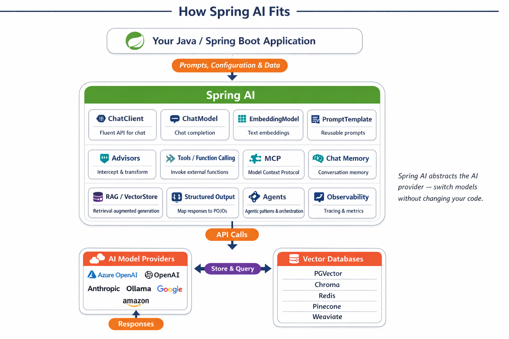

# Module 00: Quick Start

## Table of Contents

- [Introduction](#introduction)
- [What is Spring AI?](#what-is-spring-ai)
- [Prerequisites](#prerequisites)
- [Setup](#setup)
  - [1. Get Your GitHub Token](#1-get-your-github-token)
  - [2. Set Your Token](#2-set-your-token)
- [Run the Examples](#run-the-examples)
  - [1. Basic Chat](#1-basic-chat)
  - [2. Prompt Patterns](#2-prompt-patterns)
  - [3. Function Calling](#3-function-calling)
  - [4. Document Q&A](#4-document-qa)
  - [5. Responsible AI](#5-responsible-ai)
- [What Each Example Shows](#what-each-example-shows)
- [Next Steps](#next-steps)
- [Troubleshooting](#troubleshooting)

## Introduction

This quickstart is meant to get you up and running with Spring AI as quickly as possible. It covers the absolute basics of building AI applications with Spring AI and GitHub Models. In the next modules you'll switch to Microsoft Foundry and GPT-5.2 and dive deeper into each concept.

## What is Spring AI?

Spring AI is a Java framework that simplifies building AI-powered applications. It provides a consistent API across different AI providers — so you can switch between OpenAI, Microsoft Foundry, GitHub Models, and others without changing your application code.

It includes features like:
- Chat and prompt management
- Tool and function calling
- Document-grounded question answering
- Responsible AI guardrails
- And more...



*Spring AI provides a unified API across AI providers — this course covers these capabilities one module at a time.*

In this quickstart you'll get hands-on with five fundamentals: chat, prompt templates, tool calling, document Q&A, and safety guardrails. Later modules will build on these basics to show you how to build real-world applications with Spring AI and Microsoft Foundry.

## Prerequisites

**Using the Dev Container?** Java and Maven are already installed. You only need a GitHub Personal Access Token.

**Local Development:**
- Java 25, Maven 3.9+ (Spring AI itself supports Java 17+, but this repo targets Java 25 via Spring Boot 4)
- GitHub Personal Access Token (instructions below)

> **Note:** This module uses `gpt-4.1-nano` from GitHub Models. Do not modify the model name in the code - it's configured to work with GitHub's available models.
>
> **Note:** Spring AI 2.0.0-M6 (milestone) is used. The Spring Milestones repository is configured in the root `pom.xml`.

This module's [`pom.xml`](pom.xml) already includes the dependency below — if you're building your own project, add the same to your `<dependencies>` block:

```xml
<!-- Spring AI OpenAI SDK (Official OpenAI Java SDK integration) -->
<dependency>
  <groupId>org.springframework.ai</groupId>
  <artifactId>spring-ai-openai</artifactId>
</dependency>
```

The version is managed by the parent [`pom.xml`](../pom.xml) via the Spring AI BOM (`spring-ai-bom` 2.0.0-M6), and the Spring Milestones repository is configured there as well.

## Setup

### 1. Get Your GitHub Token

1. Go to [GitHub Settings → Personal Access Tokens](https://github.com/settings/personal-access-tokens)
2. Click "Generate new token"
3. Set a descriptive name (e.g., "Spring AI Demo")
4. Set expiration (7 days recommended)
5. Under "Account permissions", find "Models" and set to "Read-only"
6. Click "Generate token"
7. Copy and save your token - you won't see it again

### 2. Set Your Token

**Option 1: Using VS Code (Recommended)**

If you're using VS Code, add your token to the `.env` file in the project root:

If the `.env` file does not exist, copy `.env.example` to `.env` or create a new `.env` file in the project root.

**Example `.env` file:**
```bash
# In /workspaces/Spring-AI-for-Beginners/.env
GITHUB_TOKEN=your_token_here
```

Then you can simply right-click on any demo file (e.g., `BasicChatDemo.java`) in the Explorer and select **"Run Java"** or use the launch configurations from the Run and Debug panel.

**Option 2: Using Terminal**

Set the token as an environment variable:

**Bash:**
```bash
export GITHUB_TOKEN=your_token_here
```

**PowerShell:**
```powershell
$env:GITHUB_TOKEN=your_token_here
```

## Run the Examples

**Using VS Code:** Simply right-click on any demo file in the Explorer and select **"Run Java"**, or use the launch configurations from the Run and Debug panel (make sure you've added your token to the `.env` file first).

**Using Maven:** Alternatively, you can run from the command line:

### 1. Basic Chat

**Bash:**
```bash
mvn compile exec:java -Dexec.mainClass=com.example.springai.quickstart.BasicChatDemo
```

**PowerShell:**
```powershell
mvn --% compile exec:java -Dexec.mainClass=com.example.springai.quickstart.BasicChatDemo
```

### 2. Prompt Patterns

**Bash:**
```bash
mvn compile exec:java -Dexec.mainClass=com.example.springai.quickstart.PromptEngineeringDemo
```

**PowerShell:**
```powershell
mvn --% compile exec:java -Dexec.mainClass=com.example.springai.quickstart.PromptEngineeringDemo
```

Shows zero-shot, few-shot, chain-of-thought, role-based prompting, and conversational memory.

### 3. Function Calling

**Bash:**
```bash
mvn compile exec:java -Dexec.mainClass=com.example.springai.quickstart.ToolIntegrationDemo
```

**PowerShell:**
```powershell
mvn --% compile exec:java -Dexec.mainClass=com.example.springai.quickstart.ToolIntegrationDemo
```

AI automatically calls your Java methods when needed.

### 4. Document Q&A

**Bash:**
```bash
mvn compile exec:java -Dexec.mainClass=com.example.springai.quickstart.SimpleReaderDemo
```

**PowerShell:**
```powershell
mvn --% compile exec:java -Dexec.mainClass=com.example.springai.quickstart.SimpleReaderDemo
```

Ask questions about your documents using context-grounded chat.

### 5. Responsible AI

**Bash:**
```bash
mvn compile exec:java -Dexec.mainClass=com.example.springai.quickstart.ResponsibleAIDemo
```

**PowerShell:**
```powershell
mvn --% compile exec:java -Dexec.mainClass=com.example.springai.quickstart.ResponsibleAIDemo
```

See how AI safety filters block harmful content.

## What Each Example Shows

> **About the demo style:** Each example in this module is a plain Java class with a `main()` method that bootstraps an `OpenAiChatModel` via `OpenAiChatModel.builder()` and then wraps it in a `ChatClient` for the actual chat calls. `OpenAiChatOptions` is used purely for one-time wiring — the GitHub Models endpoint, API key, model name, and `gitHubModels(true)` flag — not per-request configuration. This keeps each demo focused on the core AI interactions without needing a Spring Boot context.
>
> Starting in [Module 01](../01-introduction/README.md), the same `OpenAiChatModel` (and a `ChatClient.Builder`) will be auto-configured by Spring Boot from `application.yaml` and injected into controllers and services. You'll add the `spring-ai-starter-model-openai` dependency (the Boot starter), drop the manual builder calls, and run the code as a real web app.

**Basic Chat** - [BasicChatDemo.java](src/main/java/com/example/springai/quickstart/BasicChatDemo.java)

Start here to see Spring AI at its simplest. You'll bootstrap an `OpenAiChatModel`, wrap it in a `ChatClient`, and get an answer with one fluent call. The `ChatClient` is Spring AI's recommended high-level entry point — it produces a `String` directly, supports advisors, structured output, tool calling, and streaming. Once you understand this pattern, everything else builds on it.

```java
var chatOptions = OpenAiChatOptions.builder()
    .baseUrl("https://models.github.ai/inference")
    .apiKey(System.getenv("GITHUB_TOKEN"))
    .model("gpt-4.1-nano")
    .gitHubModels(true)
    .build();

var chatModel = OpenAiChatModel.builder()
    .options(chatOptions)
    .build();

var chatClient = ChatClient.create(chatModel);

String response = chatClient.prompt("What is Spring AI?").call().content();
System.out.println(response);
```

> **🤖 Try with [GitHub Copilot](https://github.com/features/copilot) Chat:** Open [`BasicChatDemo.java`](src/main/java/com/example/springai/quickstart/BasicChatDemo.java) and ask:
> - "How would I switch from GitHub Models to Microsoft Foundry in this code?"
> - "What other parameters can I configure in OpenAiChatOptions.builder()?"
> - "How do I add streaming responses using ChatClient.prompt(...).stream()?"
> - "When would I drop ChatClient and call OpenAiChatModel directly?"

**Prompt Engineering** - [PromptEngineeringDemo.java](src/main/java/com/example/springai/quickstart/PromptEngineeringDemo.java)

Now that you know how to talk to a model, let's explore what you say to it. This demo uses the same model setup but shows six different prompting patterns. Try zero-shot prompts for direct instructions, few-shot prompts that learn from examples, chain-of-thought prompts that reveal reasoning steps, role-based prompts that set context, and prompt templates for reusable prompts with variables.

The below example shows a prompt using Spring AI's `PromptTemplate` to fill in variables. The `ChatClient` accepts the resulting `Prompt` object directly:

```java
PromptTemplate template = new PromptTemplate(
    "What's the best time to visit {destination} for {activity}?"
);

Prompt prompt = template.create(Map.of(
    "destination", "Paris",
    "activity", "sightseeing"
));

String response = chatClient.prompt(prompt).call().content();
```

The demo also includes a conversational memory pattern using Spring AI's `MessageChatMemoryAdvisor` — the idiomatic way to add chat memory to a `ChatClient`. The advisor automatically loads prior turns from a `ChatMemory` before each call and persists the new exchange afterward:

```java
ChatMemory chatMemory = MessageWindowChatMemory.builder()
        .maxMessages(10)
        .build();

ChatClient memoryClient = ChatClient.builder(chatModel)
        .defaultAdvisors(MessageChatMemoryAdvisor.builder(chatMemory).build())
        .build();

String conversationId = "demo-session";

String response1 = memoryClient.prompt()
        .user("My name is Alex and I'm learning Spring AI.")
        .advisors(a -> a.param(ChatMemory.CONVERSATION_ID, conversationId))
        .call()
        .content();

// Second turn — the advisor reloads history automatically
String response2 = memoryClient.prompt()
        .user("What's my name?")
        .advisors(a -> a.param(ChatMemory.CONVERSATION_ID, conversationId))
        .call()
        .content();
// response2 correctly recalls "Alex"
```

> **🤖 Try with [GitHub Copilot](https://github.com/features/copilot) Chat:** Open [`PromptEngineeringDemo.java`](src/main/java/com/example/springai/quickstart/PromptEngineeringDemo.java) and ask:
> - "What's the difference between zero-shot and few-shot prompting, and when should I use each?"
> - "How does the temperature parameter affect the model's responses?"
> - "What are some techniques to prevent prompt injection attacks in production?"
> - "How does MessageChatMemoryAdvisor differ from manually passing a List<Message>?"

**Tool Integration** - [ToolIntegrationDemo.java](src/main/java/com/example/springai/quickstart/ToolIntegrationDemo.java)

This is where Spring AI gets powerful. You register Java functions as `FunctionToolCallback` instances and wire them onto a `ChatClient` via `defaultToolCallbacks(...)`. The AI then automatically decides when to call them based on the user's request, and Spring AI handles the tool-call loop (model → tool → model) for you so `call().content()` returns just the final answer.

```java
record TwoNumbers(double a, double b) {}

List<ToolCallback> toolCallbacks = List.of(
    FunctionToolCallback.builder("add", (TwoNumbers input) -> input.a() + input.b())
        .description("Performs addition of two numeric values")
        .inputType(TwoNumbers.class)
        .build()
);

ChatClient chatClient = ChatClient.builder(chatModel)
    .defaultToolCallbacks(toolCallbacks)
    .build();
```

> **🤖 Try with [GitHub Copilot](https://github.com/features/copilot) Chat:** Open [`ToolIntegrationDemo.java`](src/main/java/com/example/springai/quickstart/ToolIntegrationDemo.java) and ask:
> - "How does FunctionToolCallback work and what does Spring AI do with it behind the scenes?"
> - "Can the AI call multiple tools in sequence to solve complex problems?"
> - "What happens if a tool throws an exception - how should I handle errors?"
> - "When should I use ChatClient.prompt().tools(...) per-call vs defaultToolCallbacks(...) at build time?"

**Document Q&A** - [SimpleReaderDemo.java](src/main/java/com/example/springai/quickstart/SimpleReaderDemo.java)

Here you'll see document-grounded chat using a context-stuffing approach. The document is loaded once and baked into the `ChatClient` as its default system message, so the AI answers based on your document content rather than its general knowledge — and you never resend the document on each turn. This is a lightweight approach suitable for small documents — for full RAG with vector stores and embeddings, see the `03-rag` module.

```java
String documentContent = Files.readString(Paths.get("document.txt"));

ChatClient chatClient = ChatClient.builder(chatModel)
    .defaultSystem("Answer questions based on this document:\n" + documentContent)
    .build();

String answer = chatClient.prompt()
    .user("What is the main topic?")
    .call()
    .content();
```

> **🤖 Try with [GitHub Copilot](https://github.com/features/copilot) Chat:** Open [`SimpleReaderDemo.java`](src/main/java/com/example/springai/quickstart/SimpleReaderDemo.java) and ask:
> - "How does this differ from a full RAG pipeline with vector stores?"
> - "What are the limitations of context-stuffing vs. embedding-based retrieval?"
> - "How would I scale this to handle larger documents or multiple files?"

**Responsible AI** - [ResponsibleAIDemo.java](src/main/java/com/example/springai/quickstart/ResponsibleAIDemo.java)

Build AI safety with defense in depth. This demo shows two layers of protection working together:

**Part 1: Application-level Input Guardrails** - Block dangerous prompts before they reach the LLM. A simple validation method checks for prohibited keywords or patterns. These run in your code, so they're fast and free.

```java
private static String validateInput(String text) {
    String lower = text.toLowerCase();
    for (String keyword : BLOCKED_KEYWORDS) {
        if (lower.contains(keyword)) {
            return "Blocked: contains prohibited keyword '" + keyword + "'";
        }
    }
    return null; // safe
}
```

**Part 2: Provider Safety Filters** - GitHub Models has built-in filters that catch what your guardrails might miss. You'll see hard blocks (HTTP 400 errors) for severe violations and soft refusals where the AI politely declines.

> **🤖 Try with [GitHub Copilot](https://github.com/features/copilot) Chat:** Open [`ResponsibleAIDemo.java`](src/main/java/com/example/springai/quickstart/ResponsibleAIDemo.java) and ask:
> - "How can I use Spring AI advisors for output guardrails?"
> - "What is the difference between a hard block and a soft refusal?"
> - "Why use both guardrails and provider filters together?"

## Next Steps

**Next Module:** [01-introduction - Getting Started with Spring AI](../01-introduction/README.md)

---

**Navigation:** [← Back to Main](../README.md) | [Next: Module 01 - Introduction →](../01-introduction/README.md)

---

## Troubleshooting

### First-Time Maven Build

**Issue**: Initial `mvn clean compile` or `mvn package` takes a long time (10-15 minutes)

**Cause**: Maven needs to download all project dependencies (Spring Boot, Spring AI libraries, Azure SDKs, etc.) on the first build.

**Solution**: This is normal behavior. Subsequent builds will be much faster as dependencies are cached locally. Download time depends on your network speed.

### PowerShell Maven Command Syntax

**Issue**: Maven commands fail with error `Unknown lifecycle phase ".mainClass=..."`

**Cause**: PowerShell interprets `=` as a variable assignment operator, breaking Maven property syntax

**Solution**: Use the stop-parsing operator `--%` before the Maven command:

**PowerShell:**
```powershell
mvn --% compile exec:java -Dexec.mainClass=com.example.springai.quickstart.BasicChatDemo
```

**Bash:**
```bash
mvn compile exec:java -Dexec.mainClass=com.example.springai.quickstart.BasicChatDemo
```

The `--%` operator tells PowerShell to pass all remaining arguments literally to Maven without interpretation.

### Windows PowerShell Emoji Display

**Issue**: AI responses show garbage characters (e.g., `????` or `â??`) instead of emojis in PowerShell

**Cause**: PowerShell's default encoding doesn't support UTF-8 emojis

**Solution**: Run this command before executing Java applications:
```cmd
chcp 65001
```

This forces UTF-8 encoding in the terminal. Alternatively, use Windows Terminal which has better Unicode support.

### Debugging API Calls

**Issue**: Authentication errors, rate limits, or unexpected responses from the AI model

**Solution**: Set the `OPENAI_LOG` environment variable to enable debug logging from the OpenAI Java SDK:

**Bash:**
```bash
export OPENAI_LOG=debug
```

**PowerShell:**
```powershell
$env:OPENAI_LOG="debug"
```

This shows HTTP requests and responses in the console, helping troubleshoot authentication errors, rate limits, or unexpected responses. Remove this variable in production to reduce log noise.