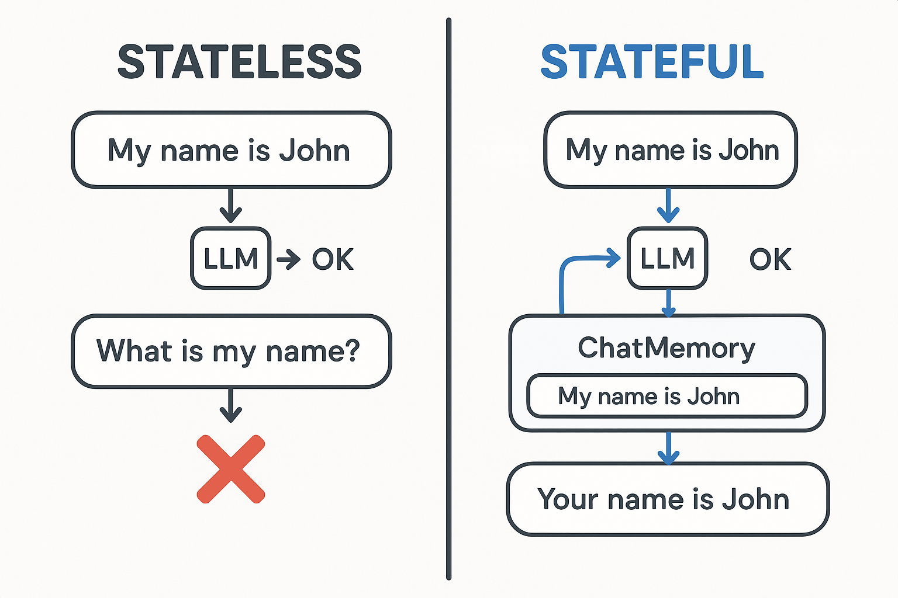
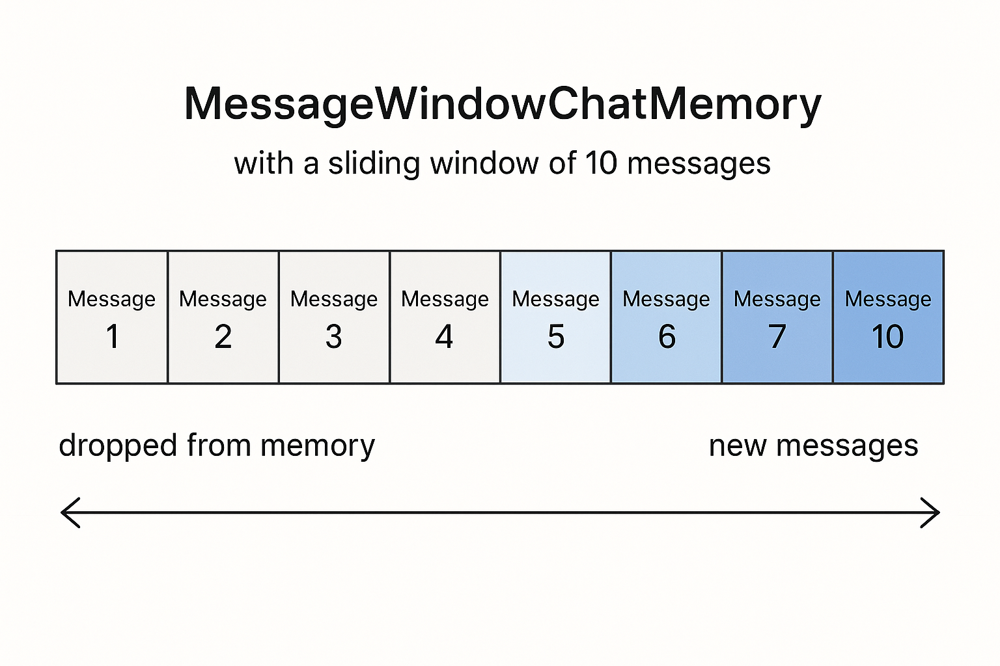
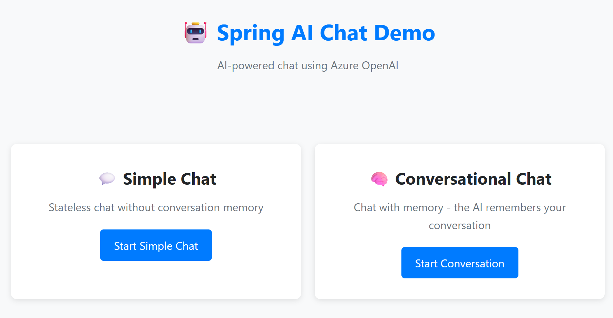
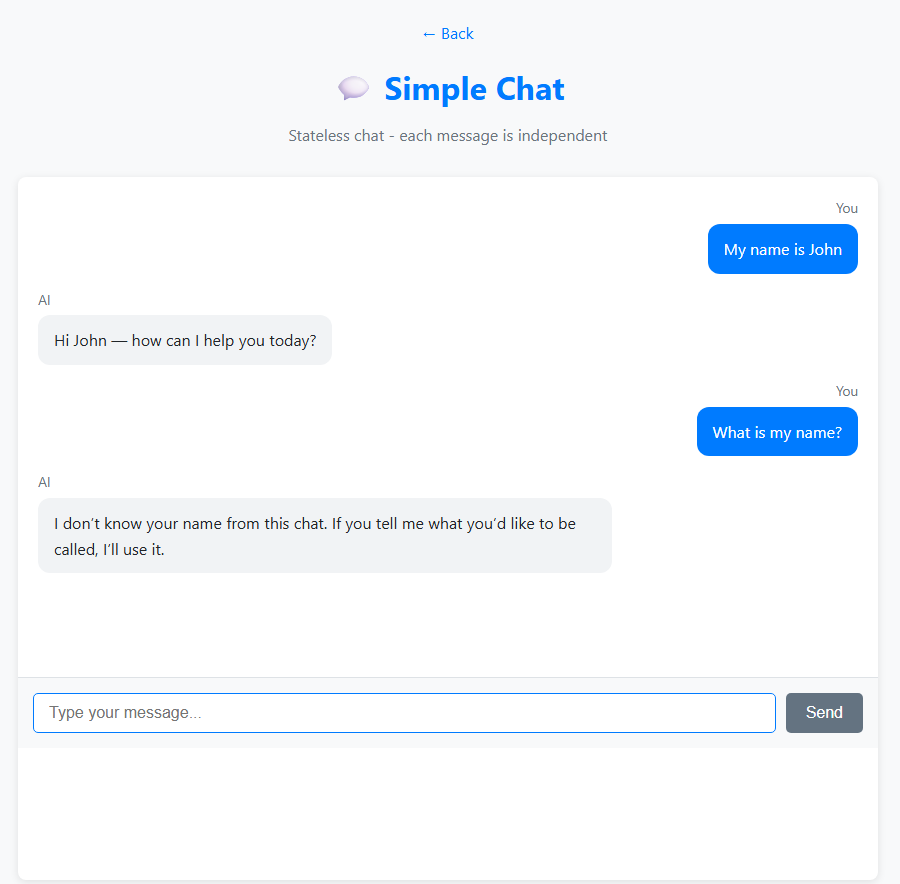
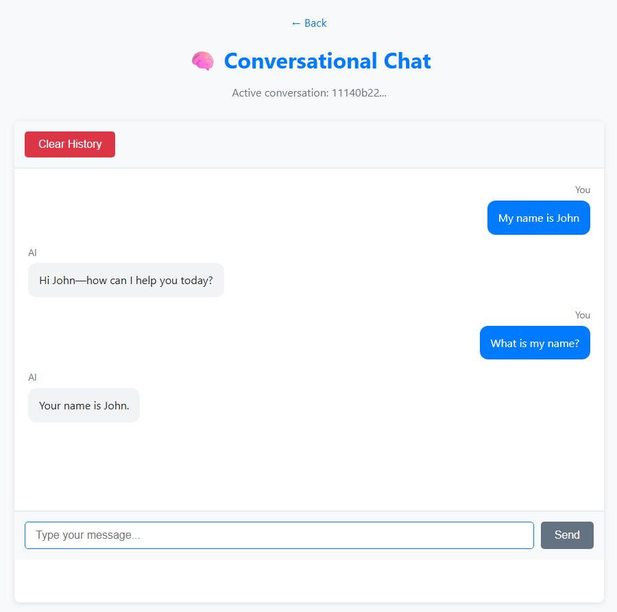

# Module 01: Getting Started with Spring AI

## Table of Contents

- [What You'll Learn](#what-youll-learn)
- [Prerequisites](#prerequisites)
- [Understanding the Core Problem](#understanding-the-core-problem)
- [Understanding Tokens](#understanding-tokens)
- [How Memory Works](#how-memory-works)
- [How This Uses Spring AI](#how-this-uses-spring-ai)
- [Deploy Azure OpenAI Infrastructure](#deploy-azure-openai-infrastructure)
- [Run the Application Locally](#run-the-application-locally)
- [Using the Application](#using-the-application)
  - [Stateless Chat (Left Panel)](#stateless-chat-left-panel)
  - [Stateful Chat (Right Panel)](#stateful-chat-right-panel)
- [Next Steps](#next-steps)

## What You'll Learn

In the quick start, you used GitHub Models to send prompts, call tools, ask questions about documents, and test guardrails. Those demos showed what's possible — now we switch to Azure OpenAI and GPT-5.2 and start building production-style applications. This module focuses on conversational AI that remembers context and maintains state.

We'll use Azure OpenAI's GPT-5.2 throughout this guide because its advanced reasoning capabilities make the behavior of different patterns more apparent. When you add memory, you'll clearly see the difference. This makes it easier to understand what each component brings to your application.

You'll build one application that demonstrates both patterns:

**Stateless Chat** - Each request is independent. The model has no memory of previous messages. This is the pattern you used in the quick start.

**Stateful Conversation** - Each request includes conversation history managed by Spring AI's `MessageWindowChatMemory`. The model maintains context across multiple turns with automatic sliding-window trimming. This is what production applications require.

## Prerequisites

- Completed [Module 00 - Quick Start](../00-quick-start/README.md)
- Azure subscription with Azure OpenAI access
- Java 21, Maven 3.9+ 
- Azure CLI (https://learn.microsoft.com/en-us/cli/azure/install-azure-cli)
- Azure Developer CLI (azd) (https://learn.microsoft.com/en-us/azure/developer/azure-developer-cli/install-azd)

> **Note:** Java, Maven, Azure CLI and Azure Developer CLI (azd) are pre-installed in the provided devcontainer.

> **Note:** This module uses GPT-5.2 on Azure OpenAI. The deployment is configured automatically via `azd up` - do not modify the model name in the code.

## Understanding the Core Problem

Language models are stateless. Each API call is independent. If you send "My name is John" and then ask "What's my name?", the model has no idea you just introduced yourself. It treats every request as if it's the first conversation you've ever had.

This is fine for simple Q&A but useless for real applications. Customer service bots need to remember what you told them. Personal assistants need context. Any multi-turn conversation requires memory.

The following diagram contrasts the two approaches — on the left, a stateless call that forgets your name; on the right, a stateful call backed by conversation memory that remembers it.



*The difference between stateless (independent calls) and stateful (context-aware) conversations*

## Understanding Tokens

Before diving into conversations, it's important to understand tokens - the basic units of text that language models process:


*Example of how text is broken into tokens - "I love AI!" becomes 4 separate processing units*

Tokens are how AI models measure and process text. Words, punctuation, and even spaces can be tokens. Your model has a limit of how many tokens it can process at once (400,000 for GPT-5.2, with up to 272,000 input tokens and 128,000 output tokens). Understanding tokens helps you manage conversation length and costs.

## How Memory Works

Chat memory solves the stateless problem by maintaining conversation history. Before sending your request to the model, the framework prepends relevant previous messages. When you ask "What's my name?", the system actually sends the entire conversation history, allowing the model to see you previously said "My name is John."

Spring AI provides conversation management through its `ChatMemory` abstraction. `MessageWindowChatMemory` maintains a sliding window of recent messages per conversation, automatically dropping old ones when the window is full. The diagram below shows how a sliding window of messages maintains recent conversation context.



*A sliding message window maintains recent messages, automatically dropping old ones*

## How This Uses Spring AI

This module uses two core Spring AI capabilities — **ChatModel** for sending prompts and **Chat Memory** for maintaining conversation history. Here's how the pieces fit together:

**Dependencies** - Add the Spring AI OpenAI SDK starter for auto-configuration:

```xml
<dependency>
    <groupId>org.springframework.ai</groupId>
    <artifactId>spring-ai-starter-model-openai-sdk</artifactId> <!-- Version managed by Spring AI BOM in root pom.xml -->
</dependency>
```

**Chat Model** - The starter auto-configures `OpenAiSdkChatModel` from properties in `application.yaml` — no manual `@Bean` needed ([SpringAiConfig.java](src/main/java/com/example/springai/config/SpringAiConfig.java)):

```yaml
spring:
  ai:
    openai-sdk:
      base-url: ${AZURE_OPENAI_ENDPOINT}
      api-key: ${AZURE_OPENAI_API_KEY}
      chat:
        options:
          model: ${AZURE_OPENAI_DEPLOYMENT}
```

Credentials come from environment variables set by `azd up`. Azure OpenAI mode is detected automatically when the base URL contains `openai.azure.com`.

**Conversation Memory** - Use Spring AI's `MessageWindowChatMemory` for automatic sliding-window memory management ([ConversationService.java](src/main/java/com/example/springai/service/ConversationService.java)):

```java
ChatMemory chatMemory = MessageWindowChatMemory.builder()
        .maxMessages(10)
        .build();

String conversationId = "user-123";
chatMemory.add(conversationId, new UserMessage("My name is John"));
// send to model with full history
List<Message> history = chatMemory.get(conversationId);
ChatResponse response = chatModel.call(new Prompt(history));
chatMemory.add(conversationId, response.getResult().getOutput());
```

`MessageWindowChatMemory` keeps the last 10 messages per conversation ID, automatically trimming older messages. It stores separate histories per conversation ID, allowing multiple users to chat simultaneously. No manual list trimming needed — the framework handles the sliding window for you.

> **🤖 Try with [GitHub Copilot](https://github.com/features/copilot) Chat:** Open [`ConversationService.java`](src/main/java/com/example/springai/service/ConversationService.java) and ask:
> - "How does MessageWindowChatMemory decide which messages to drop when it's full?"
> - "Can I implement custom memory storage using a database instead of in-memory?"
> - "How would I add summarization to compress old conversation history?"

The stateless chat endpoint skips memory entirely — just `chatModel.call(new Prompt(prompt))` like the quick start. The stateful endpoint adds messages to history, retrieves context, and includes it with each request. Same model configuration, different patterns.

## Deploy Azure OpenAI Infrastructure

**Bash:**
```bash
cd 01-introduction
azd up  # Select subscription and location (eastus2 recommended)
```

**PowerShell:**
```powershell
cd 01-introduction
azd up  # Select subscription and location (eastus2 recommended)
```

> **Note:** If you encounter a timeout error (`RequestConflict: Cannot modify resource ... provisioning state is not terminal`), simply run `azd up` again. Azure resources may still be provisioning in the background, and retrying allows the deployment to complete once resources reach a terminal state.

This will:
1. Deploy Azure OpenAI resource with GPT-5.2 and text-embedding-3-small models
2. Automatically generate `.env` file in project root with credentials
3. Set up all required environment variables

**Having deployment issues?** See the [Infrastructure README](infra/README.md) for detailed troubleshooting including subdomain name conflicts, manual Azure Portal deployment steps, and model configuration guidance.

**Verify deployment succeeded:**

**Bash:**
```bash
cat ../.env  # Should show AZURE_OPENAI_ENDPOINT, API_KEY, etc.
```

**PowerShell:**
```powershell
Get-Content ..\.env  # Should show AZURE_OPENAI_ENDPOINT, API_KEY, etc.
```

> **Note:** The `azd up` command automatically generates the `.env` file. If you need to update it later, you can either edit the `.env` file manually or regenerate it by running:
>
> **Bash:**
> ```bash
> cd ..
> bash .azd-env.sh
> ```
>
> **PowerShell:**
> ```powershell
> cd ..
> .\.azd-env.ps1
> ```

## Run the Application Locally

**Verify deployment:**

Ensure the `.env` file exists in the root directory with Azure credentials. Run this from the module directory (`01-introduction/`):

**Bash:**
```bash
cat ../.env  # Should show AZURE_OPENAI_ENDPOINT, API_KEY, DEPLOYMENT
```

**PowerShell:**
```powershell
Get-Content ..\.env  # Should show AZURE_OPENAI_ENDPOINT, API_KEY, DEPLOYMENT
```

**Start the applications:**

**Option 1: Using Spring Boot Dashboard (Recommended for VS Code users)**

The dev container includes the Spring Boot Dashboard extension, which provides a visual interface to manage all Spring Boot applications. You can find it in the Activity Bar on the left side of VS Code (look for the Spring Boot icon).

From the Spring Boot Dashboard, you can:
- See all available Spring Boot applications in the workspace
- Start/stop applications with a single click
- View application logs in real-time
- Monitor application status

Simply click the play button next to "spring-ai-introduction" to start this module, or start all modules at once.

**Option 2: Using shell scripts**

Start all web applications (modules 01-04):

**Bash:**
```bash
cd ..  # From root directory
./start-all.sh
```

**PowerShell:**
```powershell
cd ..  # From root directory
.\start-all.ps1
```

Or start just this module:

**Bash:**
```bash
cd 01-introduction
./start.sh
```

**PowerShell:**
```powershell
cd 01-introduction
.\start.ps1
```

Both scripts automatically load environment variables from the root `.env` file and will build the JARs if they don't exist.

> **Note:** If you prefer to build all modules manually before starting:
>
> **Bash:**
> ```bash
> cd ..  # Go to root directory
> mvn clean package -DskipTests
> ```
>
> **PowerShell:**
> ```powershell
> cd ..  # Go to root directory
> mvn clean package -DskipTests
> ```

Open http://localhost:8080 in your browser.

**To stop:**

**Bash:**
```bash
./stop.sh  # This module only
# Or
cd .. && ./stop-all.sh  # All modules
```

**PowerShell:**
```powershell
.\stop.ps1  # This module only
# Or
cd ..; .\stop-all.ps1  # All modules
```

## Using the Application

The application provides a web interface with two chat implementations side-by-side.



*Dashboard showing both Simple Chat (stateless) and Conversational Chat (stateful) options*

### Stateless Chat (Left Panel)

Try this first. Ask "My name is John" and then immediately ask "What's my name?" The model won't remember because each message is independent. This demonstrates the core problem with basic language model integration - no conversation context.



*AI doesn't remember your name from the previous message*

### Stateful Chat (Right Panel)

Now try the same sequence here. Ask "My name is John" and then "What's my name?" This time it remembers. The difference is the sliding message window - it maintains conversation history and includes it with each request. This is how production conversational AI works.



*AI remembers your name from earlier in the conversation*

Both panels use the same GPT-5.2 model. The only difference is memory. This makes it clear what memory brings to your application and why it's essential for real use cases.

## Next Steps

**Next Module:** [02-prompt-engineering - Prompt Engineering with GPT-5.2](../02-prompt-engineering/README.md)

---

**Navigation:** [← Previous: Module 00 - Quick Start](../00-quick-start/README.md) | [Back to Main](../README.md) | [Next: Module 02 - Prompt Engineering →](../02-prompt-engineering/README.md)


