# Module 02: Prompt Engineering with GPT-5.2

## Table of Contents

- [What You'll Learn](#what-youll-learn)
- [Prerequisites](#prerequisites)
- [Understanding Prompt Engineering](#understanding-prompt-engineering)
- [Prompt Engineering Fundamentals](#prompt-engineering-fundamentals)
  - [Zero-Shot Prompting](#zero-shot-prompting)
  - [Few-Shot Prompting](#few-shot-prompting)
  - [Chain of Thought](#chain-of-thought)
  - [Role-Based Prompting](#role-based-prompting)
  - [Prompt Templates](#prompt-templates)
- [Advanced Patterns](#advanced-patterns)
- [How This Uses Spring AI](#how-this-uses-spring-ai)
- [Run the Application](#run-the-application)
- [Application Screenshots](#application-screenshots)
- [Exploring the Patterns](#exploring-the-patterns)
  - [Low vs High Eagerness](#low-vs-high-eagerness)
  - [Task Execution (Tool Preambles)](#task-execution-tool-preambles)
  - [Self-Reflecting Code](#self-reflecting-code)
  - [Structured Analysis](#structured-analysis)
  - [Multi-Turn Chat](#multi-turn-chat)
  - [Step-by-Step Reasoning](#step-by-step-reasoning)
  - [Constrained Output](#constrained-output)
- [What You're Really Learning](#what-youre-really-learning)
- [Summary](#summary)
- [Next Steps](#next-steps)

## What You'll Learn

The following diagram provides an overview of the key topics and skills you'll develop in this module — from prompt refinement techniques to the step-by-step workflow you'll follow.

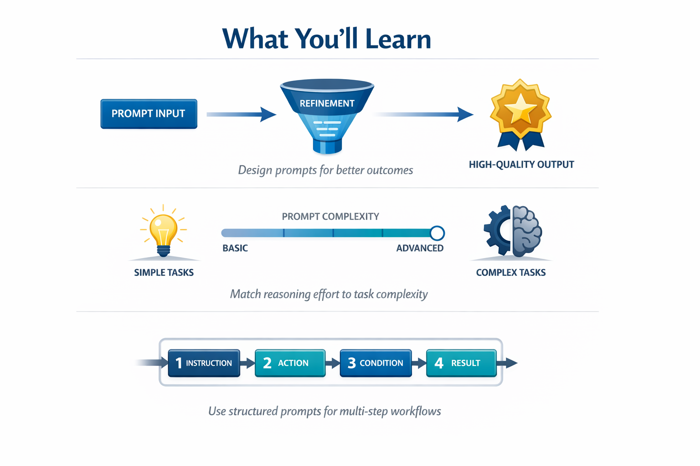

In the previous module, you explored basic Spring AI interactions with Microsoft Foundry and saw how memory enables conversational AI. Now we'll focus on how you ask questions — the prompts themselves — using Microsoft Foundry's GPT-5.2. The way you structure your prompts dramatically affects the quality of responses you get. We start with a review of the fundamental prompting techniques, then move into eight advanced patterns that take full advantage of GPT-5.2's capabilities.

We'll use GPT-5.2 because it introduces reasoning control - you can tell the model how much thinking to do before answering. This makes different prompting strategies more apparent and helps you understand when to use each approach.

## Prerequisites

- Completed Module 01 (Microsoft Foundry resources deployed)
- `.env` file in root directory with Azure credentials (created by `azd up` in Module 01)

> **Note:** If you haven't completed Module 01, follow the deployment instructions there first.

> **Why this module is different:** The other Foundry modules (01, 03, 04, 05, 06) use `gpt-4o-mini` for speed. This module is the *only* one that uses **gpt-5.2** because reasoning control is the subject of the demos — you'll be adjusting reasoning effort and watching the behaviour change. Expect responses here to be slower than in other modules; that's the point.

## Understanding Prompt Engineering

At its core, prompt engineering is the difference between vague instructions and precise ones, as the comparison below illustrates.


Prompt engineering is about designing input text that consistently gets you the results you need. It's not just about asking questions - it's about structuring requests so the model understands exactly what you want and how to deliver it.

Think of it like giving instructions to a colleague. "Fix the bug" is vague. "Fix the null pointer exception in UserService.java line 45 by adding a null check" is specific. Language models work the same way - specificity and structure matter.

## Prompt Engineering Fundamentals

The five core techniques shown below form the foundation of effective prompt engineering. Each one addresses a different aspect of how you communicate with language models.


Before diving into the advanced patterns in this module, let's review five foundational prompting techniques. These are the building blocks that every prompt engineer should know.

### Zero-Shot Prompting

The simplest approach: give the model a direct instruction with no examples. The model relies entirely on its training to understand and execute the task. This works well for straightforward requests where the expected behavior is obvious.


*Direct instruction without examples — the model infers the task from the instruction alone*

```java
String prompt = "Classify this sentiment: 'I absolutely loved the movie!'";
String response = chatClient.prompt(prompt).call().content();
// Response: "Positive"
```

**When to use:** Simple classifications, direct questions, translations, or any task the model can handle without additional guidance.

### Few-Shot Prompting

Provide examples that demonstrate the pattern you want the model to follow. The model learns the expected input-output format from your examples and applies it to new inputs. This dramatically improves consistency for tasks where the desired format or behavior isn't obvious.

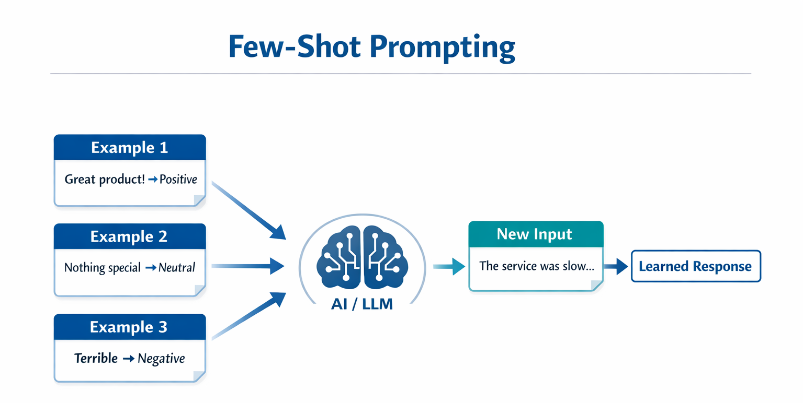

*Learning from examples — the model identifies the pattern and applies it to new inputs*

```java
String prompt = """
    Classify the sentiment as positive, negative, or neutral.
    
    Examples:
    Text: "This product exceeded my expectations!" → Positive
    Text: "It's okay, nothing special." → Neutral
    Text: "Waste of money, very disappointed." → Negative
    
    Now classify this:
    Text: "Best purchase I've made all year!"
    """;
String response = chatClient.prompt(prompt).call().content();
```

**When to use:** Custom classifications, consistent formatting, domain-specific tasks, or when zero-shot results are inconsistent.

### Chain of Thought

Ask the model to show its reasoning step-by-step. Instead of jumping straight to an answer, the model breaks down the problem and works through each part explicitly. This improves accuracy on math, logic, and multi-step reasoning tasks.

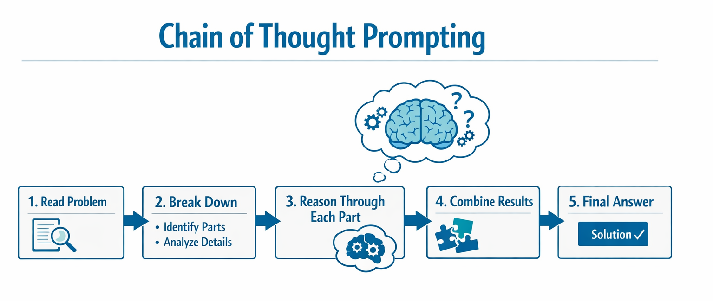

*Step-by-step reasoning — breaking complex problems into explicit logical steps*

```java
String prompt = """
    Problem: A store has 15 apples. They sell 8 apples and then 
    receive a shipment of 12 more apples. How many apples do they have now?
    
    Let's solve this step-by-step:
    """;
String response = chatClient.prompt(prompt).call().content();
// The model shows: 15 - 8 = 7, then 7 + 12 = 19 apples
```

**When to use:** Math problems, logic puzzles, debugging, or any task where showing the reasoning process improves accuracy and trust.

### Role-Based Prompting

Set a persona or role for the AI before asking your question. This provides context that shapes the tone, depth, and focus of the response. A "software architect" gives different advice than a "junior developer" or a "security auditor".


*Setting context and persona — the same question gets a different response depending on the assigned role*

```java
String prompt = """
    You are an experienced software architect reviewing code.
    Provide a brief code review for this function:
    
    def calculate_total(items):
        total = 0
        for item in items:
            total = total + item['price']
        return total
    """;
String response = chatClient.prompt(prompt).call().content();
```

**When to use:** Code reviews, tutoring, domain-specific analysis, or when you need responses tailored to a particular expertise level or perspective.

### Prompt Templates

Create reusable prompts with variable placeholders. Instead of writing a new prompt every time, define a template once and fill in different values. Spring AI's `PromptTemplate` class makes this easy with `{variable}` syntax — single curly braces around variable names like `{destination}` and `{activity}`. You define the template string once, then call `template.create()` with a map of values to produce different prompts from the same structure.

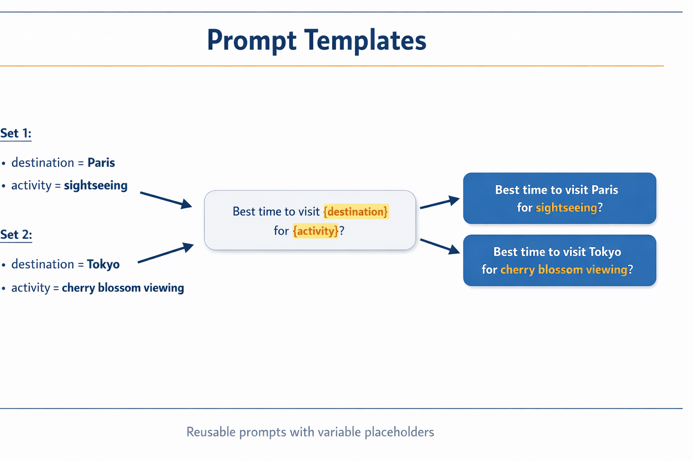

*This diagram shows how a single Spring AI `PromptTemplate` with `{destination}` and `{activity}` placeholders produces different prompts by swapping in variable values — Set 1 fills in "Paris" and "sightseeing", Set 2 fills in "Tokyo" and "hiking", both from the same reusable template.*

```java
PromptTemplate template = new PromptTemplate(
    "What's the best time to visit {destination} for {activity}?"
);

Prompt prompt = template.create(Map.of(
    "destination", "Paris",
    "activity", "sightseeing"
));

String response = chatClient.prompt(prompt).call().content();
```

**When to use:** Repeated queries with different inputs, batch processing, building reusable AI workflows, or any scenario where the prompt structure stays the same but the data changes.

---

These five fundamentals give you a solid toolkit for most prompting tasks. The rest of this module builds on them with **eight advanced patterns** that leverage GPT-5.2's reasoning control, self-evaluation, and structured output capabilities.

## Advanced Patterns

With the fundamentals covered, let's move to the eight advanced patterns that make this module unique. Not all problems need the same approach. Some questions need quick answers, others need deep thinking. Some need visible reasoning, others just need results. Each pattern below is optimized for a different scenario — and GPT-5.2's reasoning control makes the differences even more pronounced.

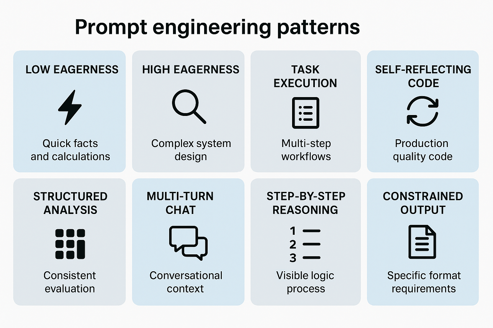

*Overview of the eight prompt engineering patterns and their use cases*

GPT-5.2 adds another dimension to these patterns: *reasoning control*. The slider below shows how you can adjust the model's thinking effort — from quick, direct answers to deep, thorough analysis.

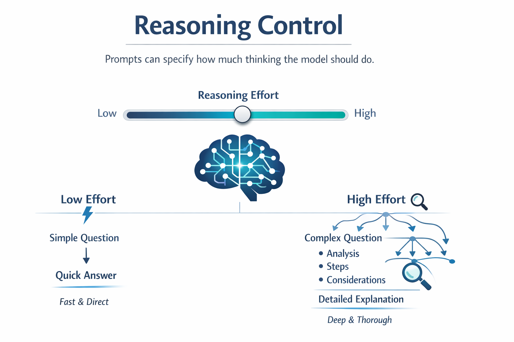

*GPT-5.2's reasoning control lets you specify how much thinking the model should do — from fast direct answers to deep exploration*

**Low Eagerness (Quick & Focused)** - For simple questions where you want fast, direct answers. The model does minimal reasoning - maximum 2 steps. Use this for calculations, lookups, or straightforward questions.

```java
String prompt = """
    <context_gathering>
    - Search depth: very low
    - Bias strongly towards providing a correct answer as quickly as possible
    - Usually, this means an absolute maximum of 2 reasoning steps
    - If you think you need more time, state what you know and what's uncertain
    </context_gathering>
    
    Problem: What is 15% of 200?
    
    Provide your answer:
    """;

String response = chatClient.prompt(prompt).call().content();
```

> 💡 **Explore with GitHub Copilot:** Open [`Gpt5PromptService.java`](src/main/java/com/example/springai/prompts/service/Gpt5PromptService.java) and ask:
> - "What's the difference between low eagerness and high eagerness prompting patterns?"
> - "How do the XML tags in prompts help structure the AI's response?"
> - "When should I use self-reflection patterns vs direct instruction?"

**High Eagerness (Deep & Thorough)** - For complex problems where you want comprehensive analysis. The model explores thoroughly and shows detailed reasoning. Use this for system design, architecture decisions, or complex research.

```java
String prompt = """
    Analyze this problem thoroughly and provide a comprehensive solution.
    Consider multiple approaches, trade-offs, and important details.
    Show your analysis and reasoning in your response.
    
    Problem: Design a caching strategy for a high-traffic REST API.
    """;

String response = chatClient.prompt(prompt).call().content();
```

**Task Execution (Step-by-Step Progress)** - For multi-step workflows. The model provides an upfront plan, narrates each step as it works, then gives a summary. Use this for migrations, implementations, or any multi-step process.

```java
String prompt = """
    <task_execution>
    1. First, briefly restate the user's goal in a friendly way
    
    2. Create a step-by-step plan:
       - List all steps needed
       - Identify potential challenges
       - Outline success criteria
    
    3. Execute each step:
       - Narrate what you're doing
       - Show progress clearly
       - Handle any issues that arise
    
    4. Summarize:
       - What was completed
       - Any important notes
       - Next steps if applicable
    </task_execution>
    
    <tool_preambles>
    - Always begin by rephrasing the user's goal clearly
    - Outline your plan before executing
    - Narrate each step as you go
    - Finish with a distinct summary
    </tool_preambles>
    
    Task: Create a REST endpoint for user registration
    
    Begin execution:
    """;

String response = chatClient.prompt(prompt).call().content();
```

Chain-of-Thought prompting explicitly asks the model to show its reasoning process, improving accuracy for complex tasks. The step-by-step breakdown helps both humans and AI understand the logic.

> **🤖 Try with [GitHub Copilot](https://github.com/features/copilot) Chat:** Ask about this pattern:
> - "How would I adapt the task execution pattern for long-running operations?"
> - "What are best practices for structuring tool preambles in production applications?"
> - "How can I capture and display intermediate progress updates in a UI?"

The diagram below illustrates this Plan → Execute → Summarize workflow.

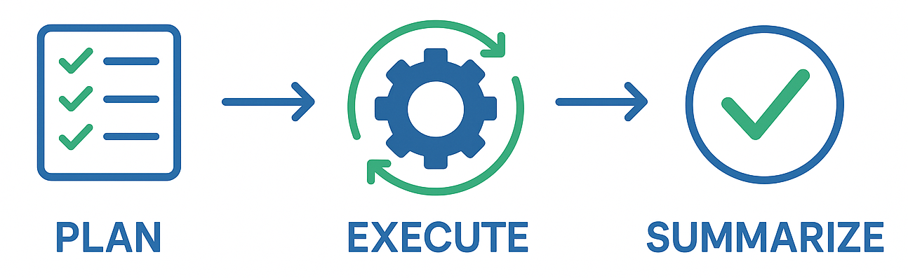

*Plan → Execute → Summarize workflow for multi-step tasks*

**Self-Reflecting Code** - For generating production-quality code. The model generates code following production standards with proper error handling. Use this when building new features or services.

```java
String prompt = """
    Generate Java code with production-quality standards: Create an email validation service
    Keep it simple and include basic error handling.
    """;

String response = chatClient.prompt(prompt).call().content();
```

The diagram below shows this iterative improvement loop — generate, evaluate, identify weaknesses, and refine until the code meets production standards.

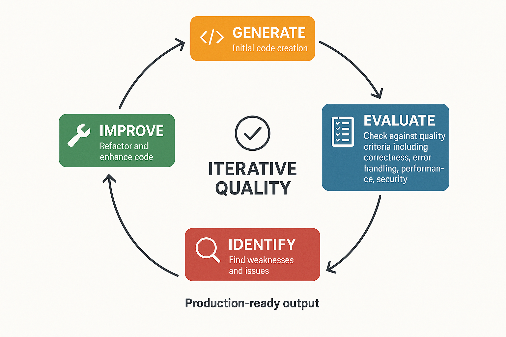

*Iterative improvement loop - generate, evaluate, identify issues, improve, repeat*

**Structured Analysis** - For consistent evaluation. The model reviews code using a fixed framework (correctness, practices, performance, security, maintainability). Use this for code reviews or quality assessments.

```java
String prompt = """
    <analysis_framework>
    You are an expert code reviewer. Analyze the code for:
    
    1. Correctness
       - Does it work as intended?
       - Are there logical errors?
    
    2. Best Practices
       - Follows language conventions?
       - Appropriate design patterns?
    
    3. Performance
       - Any inefficiencies?
       - Scalability concerns?
    
    4. Security
       - Potential vulnerabilities?
       - Input validation?
    
    5. Maintainability
       - Code clarity?
       - Documentation?
    
    <output_format>
    Provide your analysis in this structure:
    - Summary: One-sentence overall assessment
    - Strengths: 2-3 positive points
    - Issues: List any problems found with severity (High/Medium/Low)
    - Recommendations: Specific improvements
    </output_format>
    </analysis_framework>
    
    Code to analyze:
    ```
    public List getUsers() {
        return database.query("SELECT * FROM users");
    }
    ```
    Provide your structured analysis:
    """;

String response = chatClient.prompt(prompt).call().content();
```

> **🤖 Try with [GitHub Copilot](https://github.com/features/copilot) Chat:** Ask about structured analysis:
> - "How can I customize the analysis framework for different types of code reviews?"
> - "What's the best way to parse and act on structured output programmatically?"
> - "How do I ensure consistent severity levels across different review sessions?"

The following diagram shows how this structured framework organizes a code review into consistent categories with severity levels.

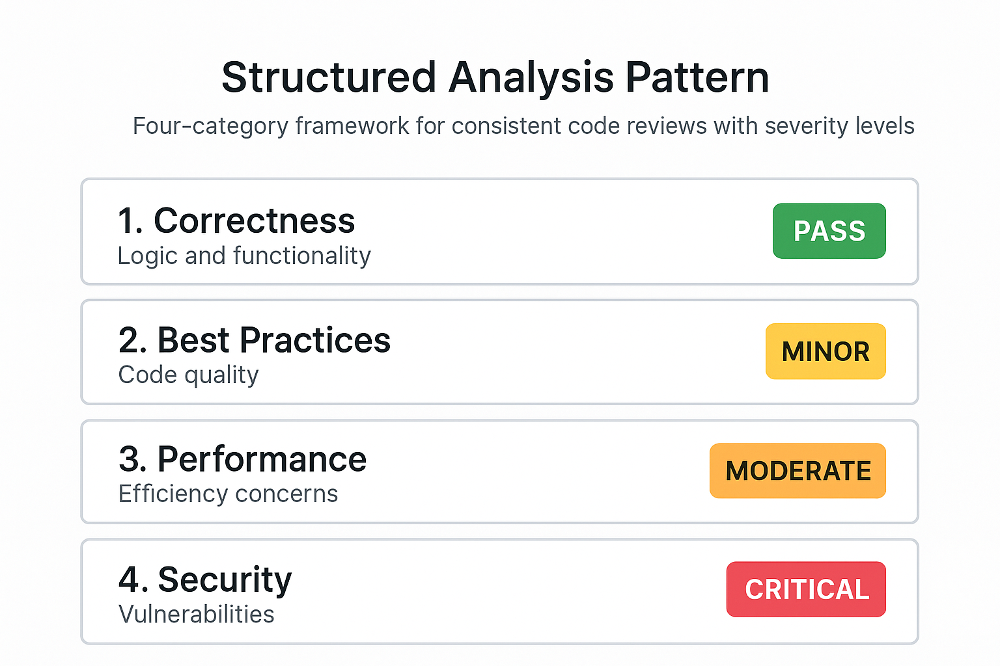

*Framework for consistent code reviews with severity levels*

**Multi-Turn Chat** - For conversations that need context. This module uses Spring AI's `MessageWindowChatMemory` directly: each request adds the user's message, sends the session's recent messages to the model (via `ChatClient` for non-streaming calls, or via the streaming helper for streaming calls), then stores the assistant's response. The streaming path follows the same rule by accumulating streamed tokens and saving the completed assistant message when the stream finishes, so streaming and non-streaming turns share the same conversation memory.

```java
ChatMemory chatMemory = MessageWindowChatMemory.builder()
    .maxMessages(10)
    .build();

String sessionId = "user-session-1";
chatMemory.add(sessionId, new UserMessage("What is Spring Boot?"));

String response1 = chatClient.prompt()
        .messages(chatMemory.get(sessionId))
        .call()
        .content();
chatMemory.add(sessionId, new AssistantMessage(response1));

chatMemory.add(sessionId, new UserMessage("Show me an example"));

String response2 = chatClient.prompt()
        .messages(chatMemory.get(sessionId))
        .call()
        .content();
chatMemory.add(sessionId, new AssistantMessage(response2));
```

The diagram below visualizes how conversation context accumulates with each turn and how it relates to the model's token limit.

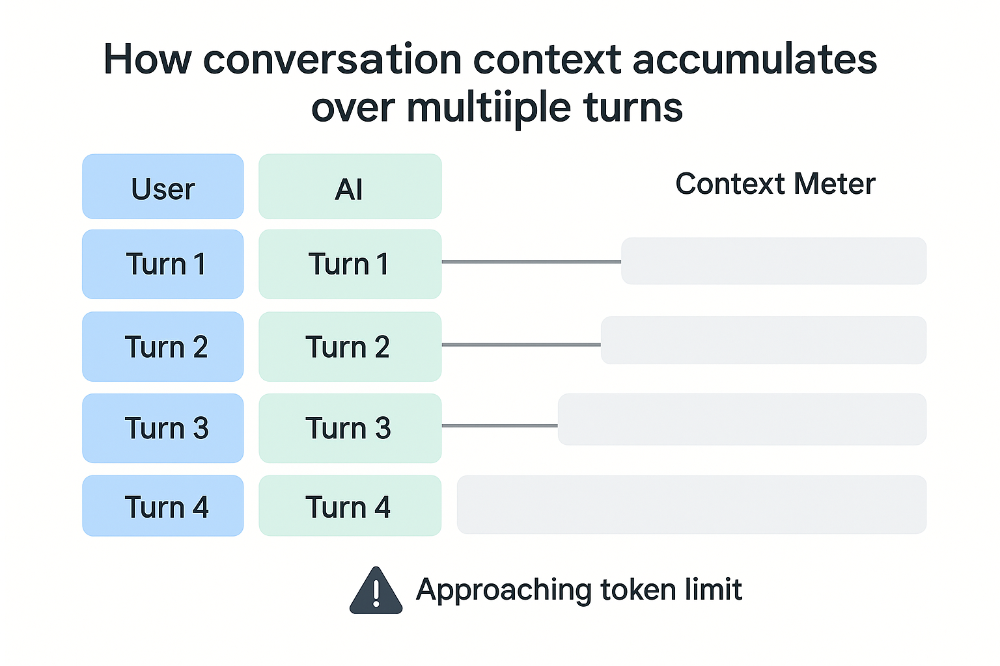

*How conversation context accumulates over multiple turns until reaching the token limit*

**Step-by-Step Reasoning** - For problems requiring visible logic. The model shows explicit reasoning for each step. Use this for math problems, logic puzzles, or when you need to understand the thinking process.

```java
String prompt = """
    <instruction>Show your reasoning step-by-step</instruction>
    
    If a train travels 120 km in 2 hours, then stops for 30 minutes,
    then travels another 90 km in 1.5 hours, what is the average speed
    for the entire journey including the stop?
    """;

String response = chatClient.prompt(prompt).call().content();
```

The diagram below illustrates how the model breaks problems into explicit, numbered logical steps.

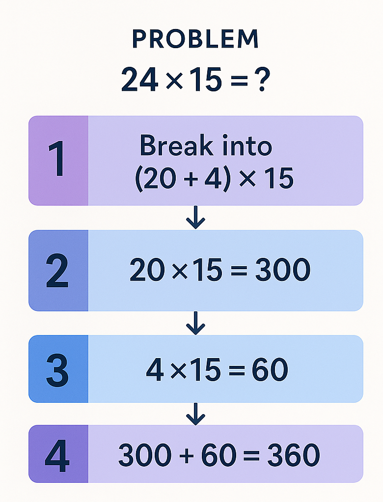

*Breaking down problems into explicit logical steps*

**Constrained Output** - For responses with specific format requirements. The model strictly follows format and length rules. Use this for summaries or when you need precise output structure.

```java
String prompt = """
    <constraints>
    - Exactly 100 words
    - Bullet point format
    - Technical terms only
    </constraints>
    
    Summarize the key concepts of machine learning.
    """;

String response = chatClient.prompt(prompt).call().content();
```

The following diagram shows how constraints guide the model to produce output that strictly adheres to your format and length requirements.

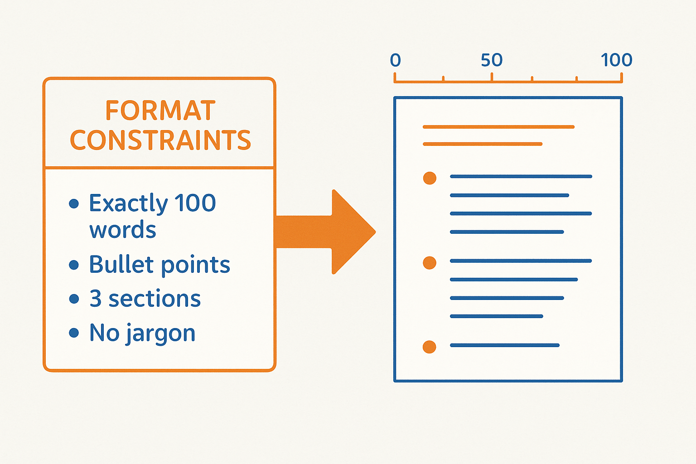

*Enforcing specific format, length, and structure requirements*

## How This Uses Spring AI

This module uses the same Spring AI dependency introduced in [Module 01](../01-introduction/README.md#how-this-uses-spring-ai) — `spring-ai-starter-model-openai` — which auto-configures `OpenAiChatModel` and a `ChatClient.Builder` for Microsoft Foundry. The service code in this module injects `ChatClient` and uses its fluent API for every call. No additional Spring AI dependencies are needed.

The `application.yaml` configuration is nearly identical to Module 01 — the only difference is the deployment variable: this module points `AZURE_OPENAI_DEPLOYMENT` at the GPT-5.2 deployment, whereas Module 01 uses `AZURE_OPENAI_FAST_DEPLOYMENT` for gpt-4o-mini ([application.yaml](src/main/resources/application.yaml)):

```yaml
spring:
  ai:
    openai:
      base-url: ${AZURE_OPENAI_ENDPOINT}
      api-key: ${AZURE_OPENAI_API_KEY}
      microsoft-deployment-name: ${AZURE_OPENAI_DEPLOYMENT}
      chat:
        model: ${AZURE_OPENAI_DEPLOYMENT}
```

Beyond that deployment swap, the difference in this module is how the prompts are constructed — the rest of the model configuration stays the same.

The diagram below shows the Spring AI components involved in prompt engineering — `PromptTemplate` resolves variables into a `Prompt`, `ChatClient` sends it to the model via `ChatModel`, and you get a structured response back.

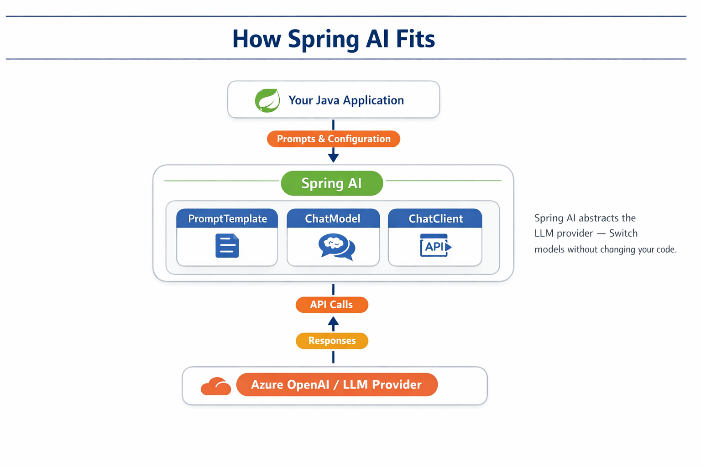

## Run the Application

**Verify deployment:**

Ensure the `.env` file exists in the root directory with Azure credentials (created during Module 01). Run this from the module directory (`02-prompt-engineering/`):

**Bash:**
```bash
cat ../.env  # Should show AZURE_OPENAI_ENDPOINT, API_KEY, DEPLOYMENT
```

**PowerShell:**
```powershell
Get-Content ..\.env  # Should show AZURE_OPENAI_ENDPOINT, API_KEY, DEPLOYMENT
```

**Start the application:**

> **Note:** If you already started all applications using `./start-all.sh` from the root directory (as described in Module 01), this module is already running on port 8083. You can skip the start commands below and go directly to http://localhost:8083.

**Option 1: Using Spring Boot Dashboard (Recommended for VS Code users)**

The dev container includes the Spring Boot Dashboard extension, which provides a visual interface to manage all Spring Boot applications. You can find it in the Activity Bar on the left side of VS Code (look for the Spring Boot icon).

From the Spring Boot Dashboard, you can:
- See all available Spring Boot applications in the workspace
- Start/stop applications with a single click
- View application logs in real-time
- Monitor application status

Simply click the play button next to "spring-ai-prompt-engineering" to start this module, or start all modules at once.

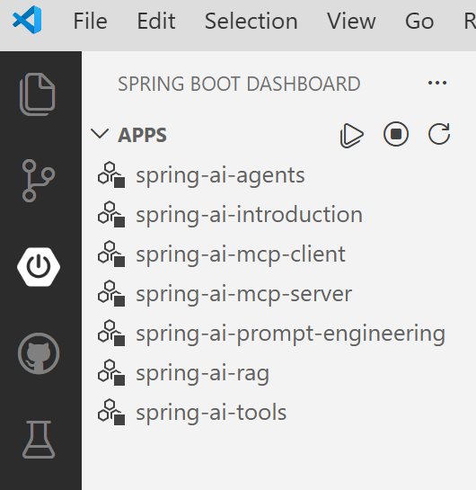

**Option 2: Using shell scripts**

Start all web applications (all modules 01-06):

**Bash:**
```bash
cd ..  # Go to root directory
./start-all.sh
```

**PowerShell:**
```powershell
cd ..  # Go to root directory
.\start-all.ps1
```

Or start just this module:

**Bash:**
```bash
# From this module directory
./start.sh
```

**PowerShell:**
```powershell
# From this module directory
.\start.ps1
```

Both scripts automatically load environment variables from the root `.env` file and will build the JARs if they don't exist.

> **Note:** If you prefer to build all modules manually before starting:
>
> **Bash:**
> ```bash
> cd ..  # Go to root directory
> mvn clean package -DskipTests
> ```
>
> **PowerShell:**
> ```powershell
> cd ..  # Go to root directory
> mvn clean package -DskipTests
> ```

Open http://localhost:8083 in your browser.

**To stop:**

**Bash:**
```bash
./stop.sh  # This module only
# Or
cd .. && ./stop-all.sh  # All modules
```

**PowerShell:**
```powershell
.\stop.ps1  # This module only
# Or
cd ..; .\stop-all.ps1  # All modules
```

## Application Screenshots

Here is the main interface of the prompt engineering module, where you can experiment with all eight patterns side by side.

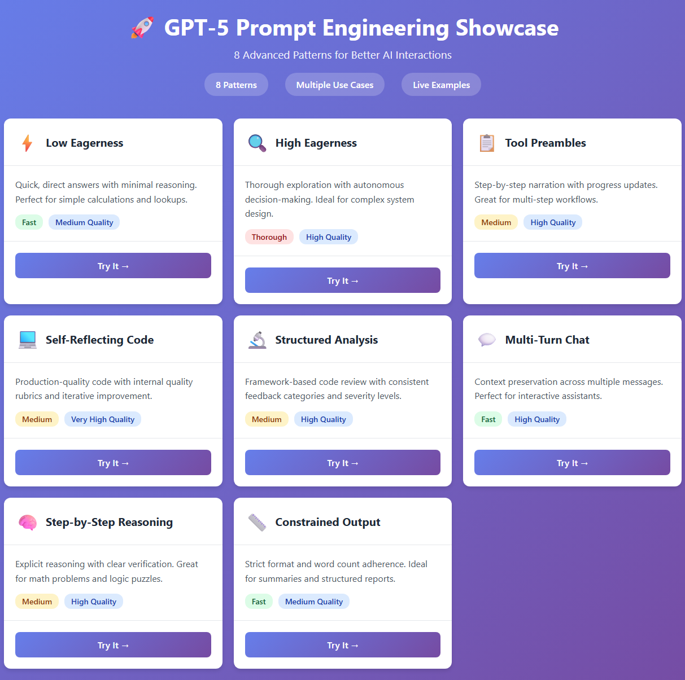

*The main dashboard showing all 8 prompt engineering patterns with their characteristics and use cases*

## Exploring the Patterns

The web interface lets you experiment with different prompting strategies. Each pattern solves different problems - try them to see when each approach shines.

> **Note: Streaming vs Non-Streaming** — Every pattern page offers two buttons: **🔴 Stream Response (Live)** and a **Non-streaming** option. Streaming uses Server-Sent Events (SSE) to display tokens in real-time as the model generates them, so you see progress immediately. The non-streaming option waits for the entire response before displaying it. For prompts that trigger deep reasoning (e.g., High Eagerness, Self-Reflecting Code), the non-streaming call can take a very long time — sometimes minutes — with no visible feedback. **Use streaming when experimenting with complex prompts** so you can see the model working and avoid the impression that the request has timed out.
>
> **Note: Browser Requirement** — The streaming feature uses the Fetch Streams API (`response.body.getReader()`) which requires a full browser (Chrome, Edge, Firefox, Safari). It does **not** work in VS Code's built-in Simple Browser, as its webview does not support the ReadableStream API. If you use the Simple Browser, the non-streaming buttons will still work normally — only the streaming buttons are affected. Open `http://localhost:8083` in an external browser for the full experience.

### Low vs High Eagerness

Ask a simple question like "What is 15% of 200?" using Low Eagerness. You'll get an instant, direct answer. Now ask something complex like "Design a caching strategy for a high-traffic API" using High Eagerness. Click **🔴 Stream Response (Live)** and watch the model's detailed reasoning appear token-by-token. Same model, same question structure - but the prompt tells it how much thinking to do.

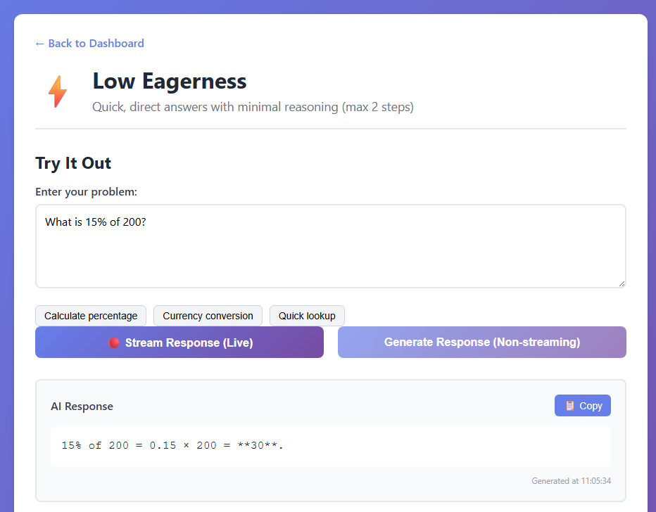

*Low Eagerness — a one-line calculation answered in two reasoning steps*

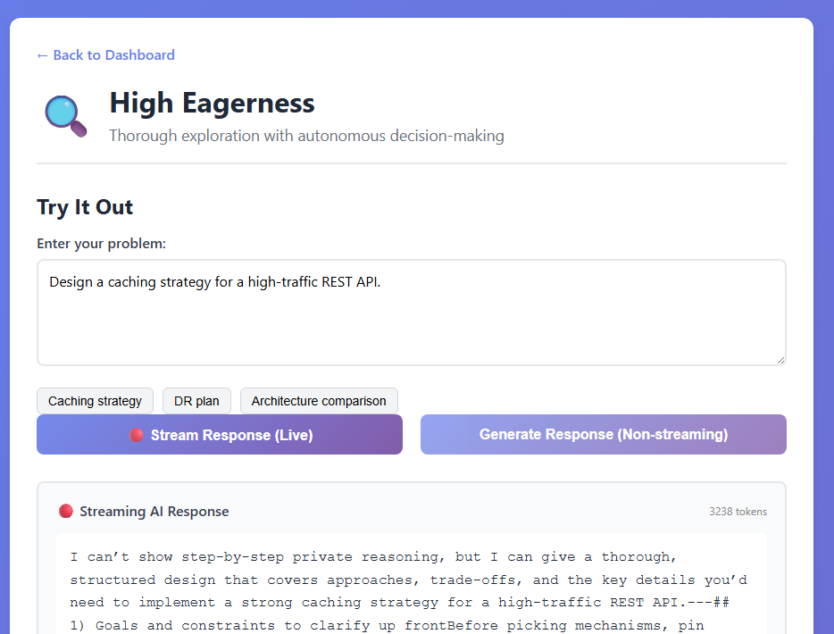

*High Eagerness — the same model, streaming a thorough architectural analysis*

### Task Execution (Tool Preambles)

Multi-step workflows benefit from upfront planning and progress narration. The model outlines what it will do, narrates each step, then summarizes results.

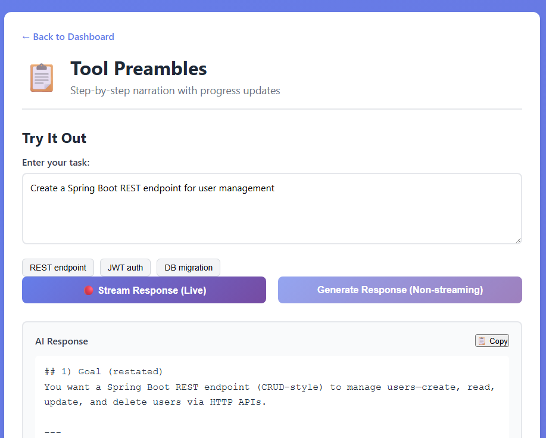

*Plan → Execute → Summarize in action for a REST endpoint task*

### Self-Reflecting Code

Try "Create an email validation service". Instead of just generating code and stopping, the model generates, evaluates against quality criteria, identifies weaknesses, and improves. You'll see it iterate until the code meets production standards.

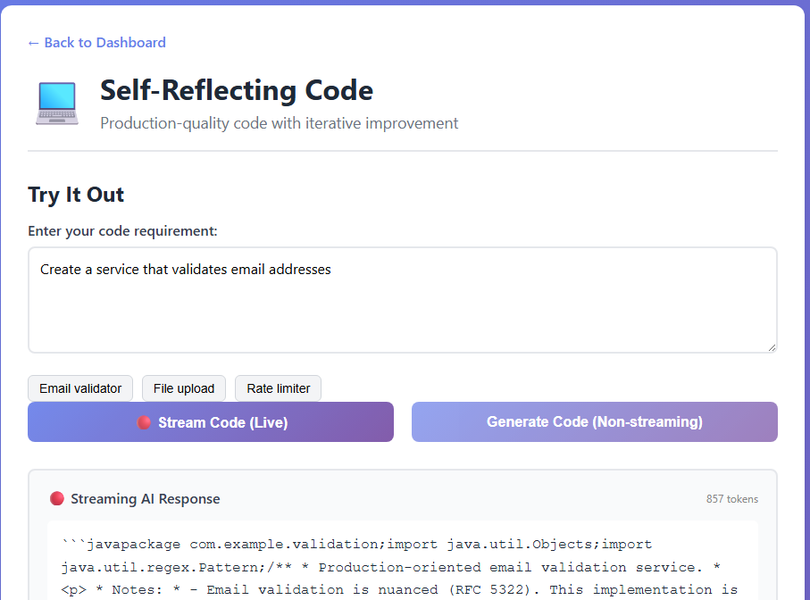

*Streaming output showing the model generating, evaluating, and refining a validation service*

### Structured Analysis

Code reviews need consistent evaluation frameworks. The model analyzes code using fixed categories (correctness, practices, performance, security) with severity levels.

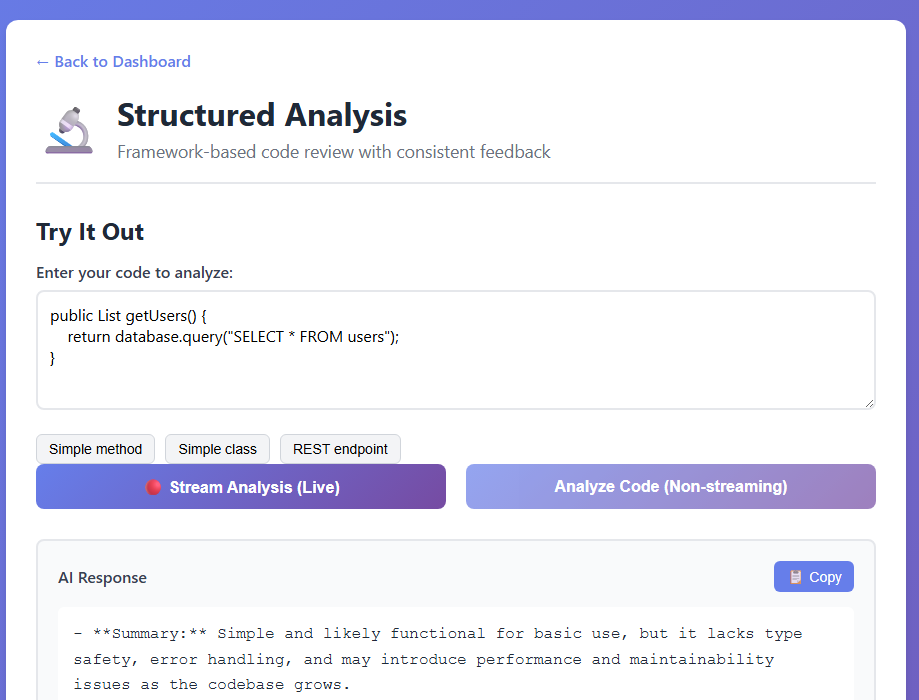

*A code snippet reviewed across correctness, best practices, performance, security, and maintainability*

### Multi-Turn Chat

Ask "What is Spring Boot?" then immediately follow up with "Show me an example". The model remembers your first question and gives you a Spring Boot example specifically. Without memory, that second question would be too vague.

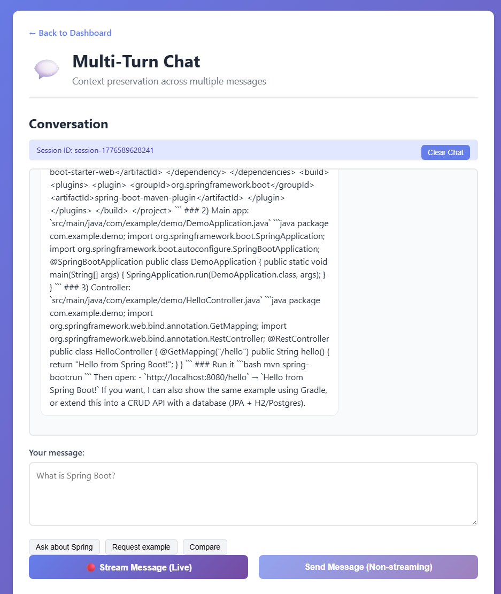

*Follow-up “Show me an example” is answered with a Spring Boot sample — context from the previous turn was preserved*

### Step-by-Step Reasoning

Pick a math problem and try it with both Step-by-Step Reasoning and Low Eagerness. Low eagerness just gives you the answer - fast but opaque. Step-by-step shows you every calculation and decision.

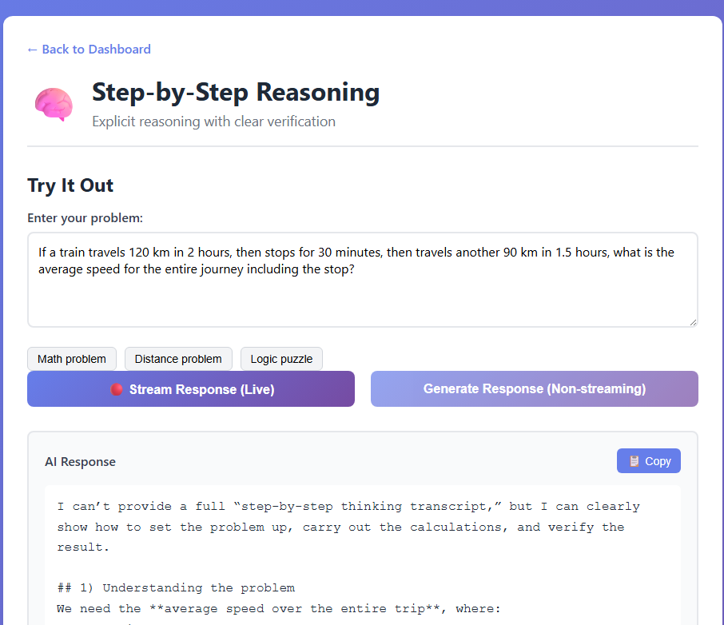

*Each calculation shown explicitly — distances, times, and the final average speed*

### Constrained Output

When you need specific formats or word counts, this pattern enforces strict adherence. Try generating a summary with exactly 100 words in bullet point format.

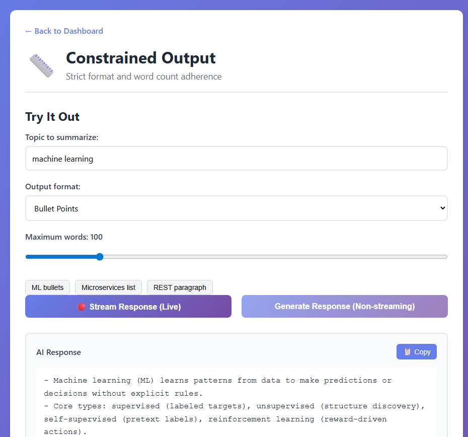

*A 100-word, bullet-point summary of machine learning — format and length strictly enforced*

## What You're Really Learning

**Reasoning Effort Changes Everything**

GPT-5.2 lets you control computational effort through your prompts. Low effort means fast responses with minimal exploration. High effort means the model takes time to think deeply. You're learning to match effort to task complexity - don't waste time on simple questions, but don't rush complex decisions either.

**Structure Guides Behavior**

Notice the XML tags in the prompts? They're not decorative. Models follow structured instructions more reliably than freeform text. When you need multi-step processes or complex logic, structure helps the model track where it is and what comes next. The diagram below breaks down a well-structured prompt, showing how tags like `<system>`, `<instructions>`, `<context>`, `<user-input>`, and `<constraints>` organize your instructions into clear sections.

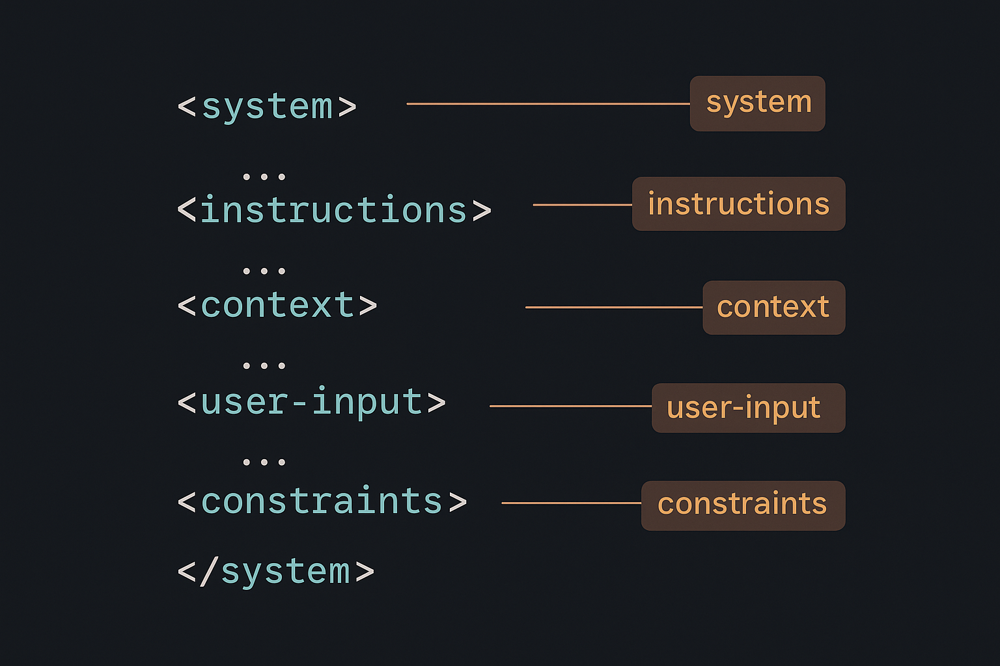

*Anatomy of a well-structured prompt with clear sections and XML-style organization*

**Quality Through Self-Evaluation**

The self-reflecting patterns work by making quality criteria explicit. Instead of hoping the model "does it right", you tell it exactly what "right" means: correct logic, error handling, performance, security. The model can then evaluate its own output and improve. This turns code generation from a lottery into a process.

**Context Is Finite**

Multi-turn conversations work by including message history with each request via `MessageWindowChatMemory`, which automatically trims old messages when the window is full. But there's still a limit — every model has a maximum token count. As conversations grow, the sliding window keeps the most recent context without hitting that ceiling. This module shows you how memory works; later you'll learn when to summarize, when to forget, and when to retrieve.

## Summary

In this module you focused on *how* you ask — using Microsoft Foundry's GPT-5.2 and its reasoning controls. You reviewed the fundamental prompting techniques and then worked through advanced patterns: tool preambles, self-reflecting code, structured analysis, multi-turn chat, step-by-step reasoning, and constrained output. The key lesson is that prompt structure dramatically affects response quality, and that making your quality criteria explicit turns generation into a repeatable process. Next, you'll ground responses in your own data with RAG.

## Next Steps

**Next Module:** [03-rag - RAG (Retrieval-Augmented Generation)](../03-rag/README.md)

---

**Navigation:** [← Previous: Module 01 - Introduction](../01-introduction/README.md) | [Back to Main](../README.md) | [Next: Module 03 - RAG →](../03-rag/README.md)
