# Module 03: RAG (Retrieval-Augmented Generation)

## Table of Contents

- [What You'll Learn](#what-youll-learn)
- [Prerequisites](#prerequisites)
- [How This Uses Spring AI](#how-this-uses-spring-ai)
- [Understanding RAG](#understanding-rag)
  - [Which RAG Approach Does This Tutorial Use?](#which-rag-approach-does-this-tutorial-use)
- [How It Works](#how-it-works)
  - [Document Processing](#document-processing)
  - [Creating Embeddings](#creating-embeddings)
  - [Semantic Search](#semantic-search)
  - [Answer Generation](#answer-generation)
- [Run the Application](#run-the-application)
- [Using the Application](#using-the-application)
  - [Upload a Document](#upload-a-document)
  - [Ask Questions](#ask-questions)
  - [Check Source References](#check-source-references)
  - [Experiment with Questions](#experiment-with-questions)
- [Spring AI 2.0 Advisor-Based RAG](#spring-ai-20-advisor-based-rag)
- [Key Concepts](#key-concepts)
  - [Chunking Strategy](#chunking-strategy)
  - [Similarity Scores](#similarity-scores)
  - [In-Memory Storage](#in-memory-storage)
  - [Context Window Management](#context-window-management)
- [When RAG Matters](#when-rag-matters)
- [Next Steps](#next-steps)

## What You'll Learn

In the previous modules, you learned how to have conversations with AI and structure your prompts effectively. But there's a fundamental limitation: language models only know what they learned during training. They can't answer questions about your company's policies, your project documentation, or any information they weren't trained on.

RAG (Retrieval-Augmented Generation) solves this problem. Instead of trying to teach the model your information (which is expensive and impractical), you give it the ability to search through your documents. When someone asks a question, the system finds relevant information and includes it in the prompt. The model then answers based on that retrieved context.

Think of RAG as giving the model a reference library. When you ask a question, the system:

1. **User Query** - You ask a question
2. **Embedding** - Converts your question to a vector
3. **Vector Search** - Finds similar document chunks
4. **Context Assembly** - Adds relevant chunks to the prompt
5. **Response** - LLM generates an answer based on the context

This grounds the model's responses in your actual data instead of relying on its training knowledge or making up answers.

## Prerequisites

- Completed [Module 00 - Quick Start](../00-quick-start/README.md) (for the Easy RAG example referenced later in this module)
- Completed [Module 01 - Introduction](../01-introduction/README.md) (Azure OpenAI resources deployed, including the `text-embedding-3-small` embedding model)
- `.env` file in root directory with Azure credentials (created by `azd up` in Module 01)

> **Note:** If you haven't completed Module 01, follow the deployment instructions there first. The `azd up` command deploys both the GPT chat model and the embedding model used by this module.

## How This Uses Spring AI

This module reuses `spring-ai-starter-model-openai-sdk` from [Module 01](../01-introduction/README.md#how-this-uses-spring-ai) for the chat model and introduces three new Spring AI dependencies for the RAG pipeline ([pom.xml](pom.xml)):

```xml
<!-- Fluent ChatClient API with advisor support (used by AdvisorRagService) -->
<dependency>
    <groupId>org.springframework.ai</groupId>
    <artifactId>spring-ai-client-chat</artifactId> <!-- Version managed by Spring AI BOM in root pom.xml -->
</dependency>

<!-- QuestionAnswerAdvisor — automatically retrieves relevant context and injects it into prompts -->
<dependency>
    <groupId>org.springframework.ai</groupId>
    <artifactId>spring-ai-advisors-vector-store</artifactId>
</dependency>

<!-- SimpleVectorStore — in-memory vector store for document embeddings -->
<dependency>
    <groupId>org.springframework.ai</groupId>
    <artifactId>spring-ai-vector-store</artifactId>
</dependency>
```

The `application.yaml` extends Module 01's config with an **embedding model** for converting text to vectors ([application.yaml](src/main/resources/application.yaml)):

```yaml
spring:
  ai:
    openai-sdk:
      base-url: ${AZURE_OPENAI_ENDPOINT}
      api-key: ${AZURE_OPENAI_API_KEY}
      chat:
        options:
          model: ${AZURE_OPENAI_DEPLOYMENT}
      embedding:
        options:
          model: ${AZURE_OPENAI_EMBEDDING_DEPLOYMENT}
```

The `embedding.options.model` property configures the `text-embedding-3-small` model deployed by `azd up` in Module 01.

## Understanding RAG

The diagram below illustrates the core concept: instead of relying on the model's training data alone, RAG gives it a reference library of your documents to consult before generating each answer.

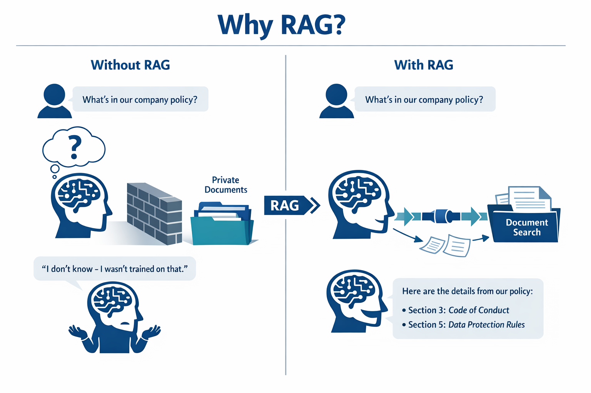

*This diagram shows the difference between a standard LLM (which guesses from training data) and a RAG-enhanced LLM (which consults your documents first).*

Here's how the pieces connect end-to-end. A user's question flows through four stages — embedding, vector search, context assembly, and answer generation — each building on the previous one:

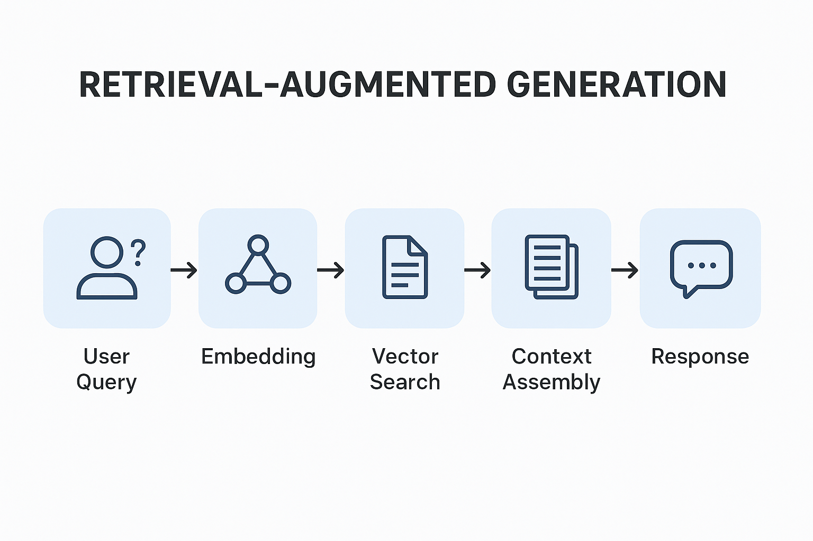

*This diagram shows the end-to-end RAG pipeline — a user query flows through embedding, vector search, context assembly, and answer generation.*

The rest of this module walks through each stage in detail, with code you can run and modify.

### Which RAG Approach Does This Tutorial Use?

Spring AI offers different ways to implement RAG, each with a different level of abstraction:

| Approach | What It Does | Trade-off |
|---|---|---|
| **Advisor-based RAG** | Uses Spring AI 2.0's `QuestionAnswerAdvisor` with `ChatClient` to automatically retrieve relevant context and inject it into prompts. | Minimal code — the recommended approach for production. |
| **Native RAG** | You call the vector store search, build the prompt, and generate the answer yourself — one explicit step at a time. | More code, but every stage is visible and modifiable. |

The diagram below compares these three levels of abstraction — from the fully manual Native approach, through the Advisor-based pipeline, to a full ETL pipeline — so you can see the trade-off between control and convenience at a glance.

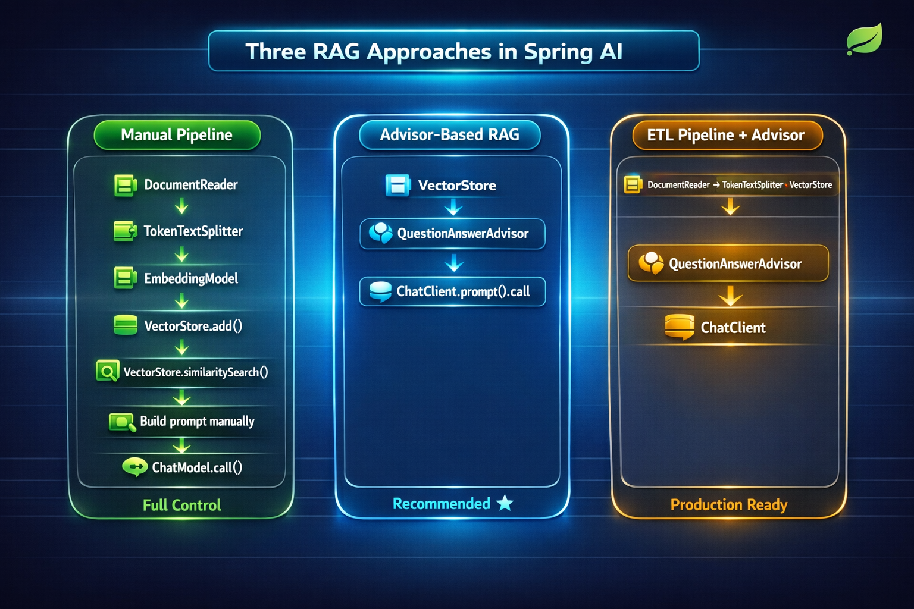

*This diagram compares three Spring AI RAG approaches side by side: Native RAG (manual vector search, context assembly, and prompt building), Advisor-based RAG (QuestionAnswerAdvisor handles retrieval and injection automatically), and full ETL pipeline (end-to-end document processing with minimal code).*

**This tutorial implements both approaches.** The Native approach in [`RagService.java`](src/main/java/com/example/springai/rag/service/RagService.java) writes out each RAG step explicitly — searching the vector store, assembling the context, and generating the answer — so you can see and understand every stage. The Advisor-based approach in [`AdvisorRagService.java`](src/main/java/com/example/springai/rag/service/AdvisorRagService.java) uses Spring AI 2.0's `QuestionAnswerAdvisor` with `ChatClient` to do the same thing in a single call. Both endpoints are available in the running application so you can compare them side-by-side.

## How It Works

The RAG pipeline in this module breaks down into four stages that run in sequence every time a user asks a question. First, an uploaded document is **parsed and chunked** into manageable pieces. Those chunks are then converted into **vector embeddings** and stored so they can be compared mathematically. When a query arrives, the system performs a **semantic search** to find the most relevant chunks, and finally passes them as context to the LLM for **answer generation**.

Before diving into each stage, here's the Spring AI class hierarchy that powers this pipeline — from document ingestion through to answer generation:

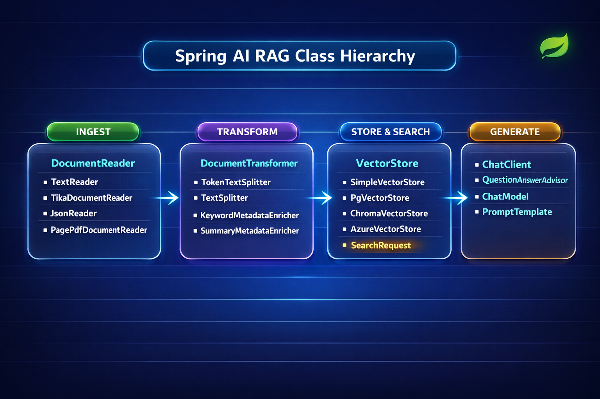

*This diagram shows the four-stage Spring AI RAG class hierarchy: INGEST (DocumentReader, TextReader, PagePdfDocumentReader), EMBED (EmbeddingModel, TokenTextSplitter), STORE & SEARCH (VectorStore, SimpleVectorStore, SearchRequest), and GENERATE (ChatClient, QuestionAnswerAdvisor, PromptTemplate). Each stage feeds into the next.*

And here's how those classes connect in the ETL (Extract-Transform-Load) pipeline that runs end-to-end when a document is uploaded and queried:

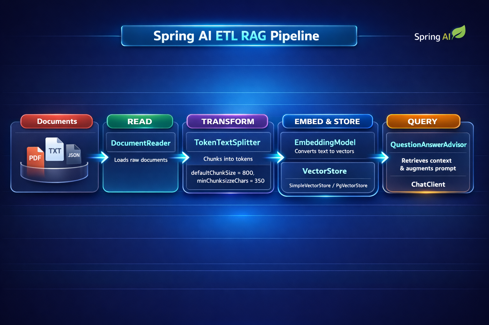

*This diagram shows the Spring AI ETL RAG pipeline: DocumentReader extracts text, TokenTextSplitter chunks it, EmbeddingModel converts chunks to vectors, VectorStore stores them, and at query time QuestionAnswerAdvisor retrieves relevant chunks and ChatClient generates the answer.*

The sections below walk through each stage with the actual code and diagrams. Let's look at the first step.

### Document Processing

[DocumentService.java](src/main/java/com/example/springai/rag/service/DocumentService.java)

When you upload a document, the system parses it (PDF or plain text), attaches metadata such as the filename, and then breaks it into chunks — smaller pieces that fit comfortably in the model's context window.

```java
// Parse the uploaded file and wrap it in a Spring AI Document with metadata
Document document = new Document(content, Map.of(
        "filename", filename,
        "documentId", documentId
));

// Split into token-based chunks
TokenTextSplitter splitter = TokenTextSplitter.builder().build();
List<Document> segments = splitter.split(document);
```

The diagram below shows how this works visually. Notice how each chunk shares some tokens with its neighbors — the 30-token overlap ensures no important context falls between the cracks:

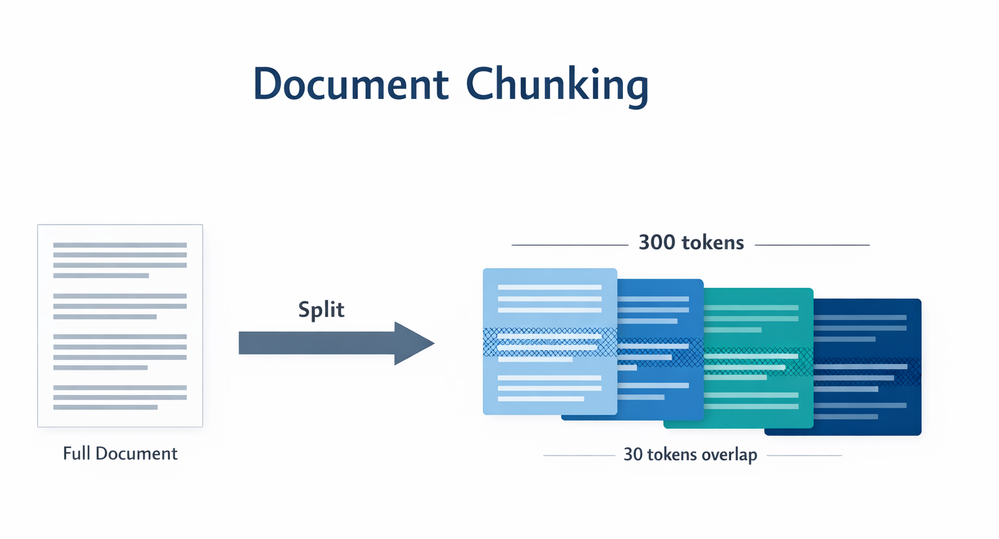

*This diagram shows a document being split into 300-token chunks with 30-token overlap, preserving context at chunk boundaries.*

> **🤖 Try with [GitHub Copilot](https://github.com/features/copilot) Chat:** Open [`DocumentService.java`](src/main/java/com/example/springai/rag/service/DocumentService.java) and ask:
> - "How does Spring AI split documents into chunks and why is overlap important?"
> - "What's the optimal chunk size for different document types and why?"
> - "How do I handle documents in multiple languages or with special formatting?"

### Creating Embeddings

[SpringAiRagConfig.java](src/main/java/com/example/springai/rag/config/SpringAiRagConfig.java)

Each chunk is converted into a numerical representation called an embedding — essentially a meaning-to-numbers converter. The embedding model isn't "intelligent" the way a chat model is; it can't follow instructions, reason, or answer questions. What it can do is map text into a mathematical space where similar meanings land near each other — "car" near "automobile," "refund policy" near "return my money." Think of a chat model as a person you can talk to; an embedding model is an ultra-good filing system.

The diagram below visualizes this concept — text goes in, numerical vectors come out, and similar meanings produce nearby vectors:

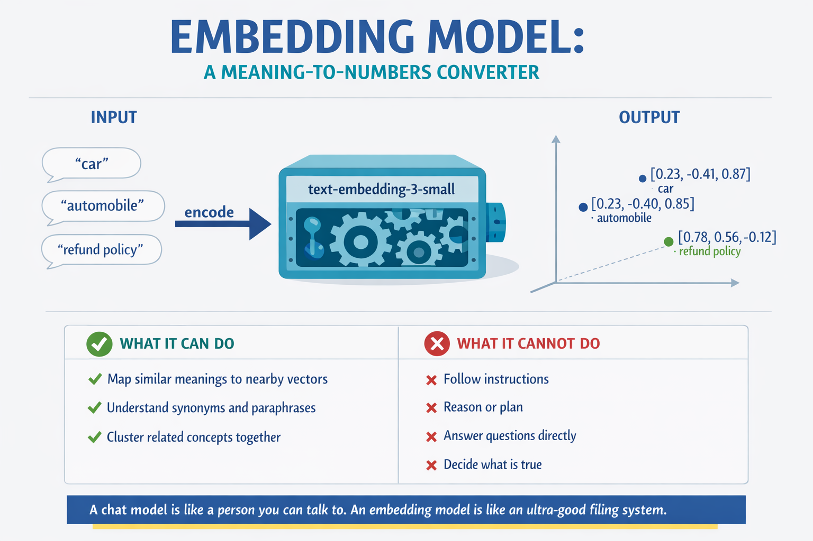

*This diagram shows how an embedding model converts text into numerical vectors, placing similar meanings — like "car" and "automobile" — near each other in vector space.*

```java
// Auto-configured by spring-ai-starter-model-openai-sdk via application.yaml:
//   spring.ai.openai-sdk.embedding.options.model: ${AZURE_OPENAI_EMBEDDING_DEPLOYMENT}

@Bean
public VectorStore vectorStore(EmbeddingModel embeddingModel) {
    return SimpleVectorStore.builder(embeddingModel).build();
}
```

The **ingestion flow** (runs once at upload time) splits the document and stores the chunks via `vectorStore.add()` — the `VectorStore` handles embedding automatically. The **query flow** (runs each time a user asks) searches the store via `vectorStore.similaritySearch()`, and passes the matched context to the chat model. Both flows meet at the shared `VectorStore` interface.

Once embeddings are stored, similar content naturally clusters together in vector space. The visualization below shows how documents about related topics end up as nearby points, which is what makes semantic search possible:

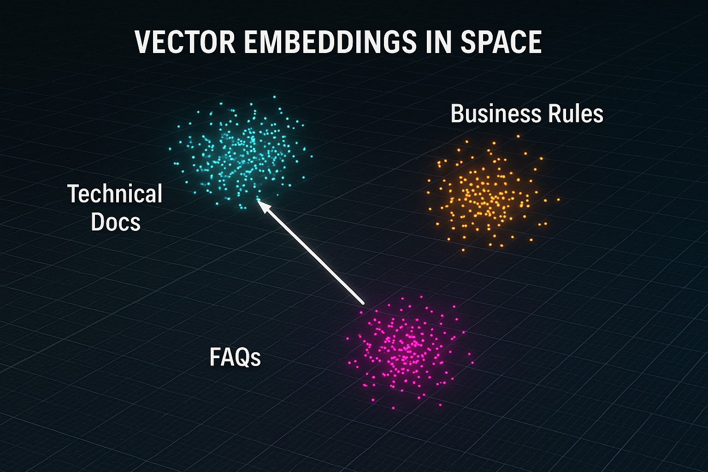

*This visualization shows how related documents cluster together in 3D vector space, with topics like Technical Docs, Business Rules, and FAQs forming distinct groups.*

When a user searches, the system follows four steps: embed the documents once, embed the query on each search, compare the query vector against all stored vectors using cosine similarity, and return the top-K highest-scoring chunks. The diagram below walks through each step:

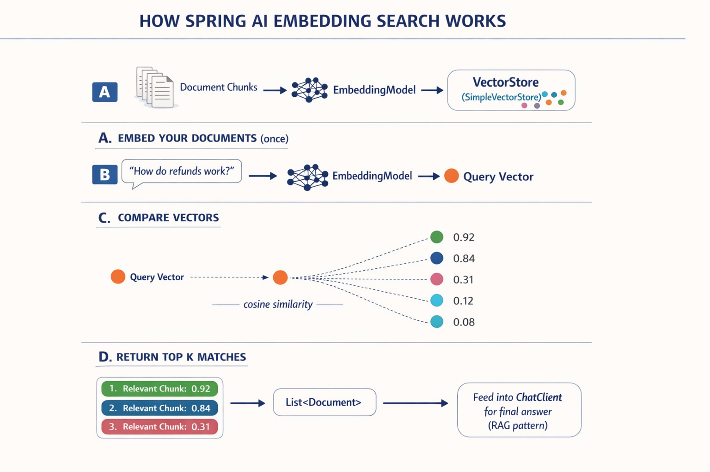

*This diagram shows the four-step embedding search process: embed documents, embed the query, compare vectors with cosine similarity, and return the top-K results.*

### Semantic Search

[RagService.java](src/main/java/com/example/springai/rag/service/RagService.java)

When you ask a question, the `VectorStore` automatically embeds your question and compares it against all the document chunks' embeddings. It finds the chunks with the most similar meanings — not just matching keywords, but actual semantic similarity.

```java
SearchRequest searchRequest = SearchRequest.builder()
    .query(request.question())
    .topK(5)
    .similarityThreshold(0.0)
    .build();

List<Document> matches = vectorStore.similaritySearch(searchRequest);

for (Document doc : matches) {
    String relevantText = doc.getText();
    Double score = doc.getScore();
}
```

The diagram below contrasts semantic search with traditional keyword search. A keyword search for "vehicle" misses a chunk about "cars and trucks," but semantic search understands they mean the same thing and returns it as a high-scoring match:

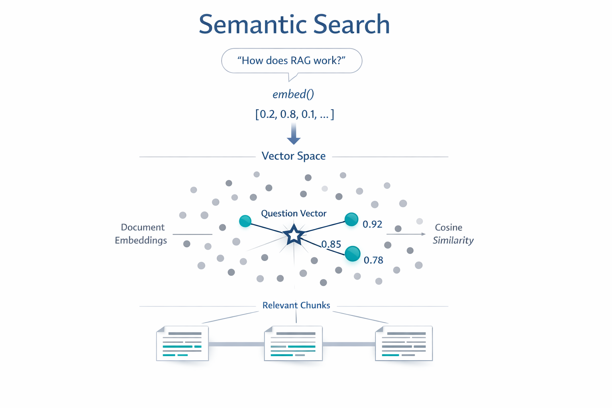

*This diagram compares keyword-based search with semantic search, showing how semantic search retrieves conceptually related content even when exact keywords differ.*

Under the hood, similarity is measured using cosine similarity — essentially asking "are these two arrows pointing in the same direction?" Two chunks can use completely different words, but if they mean the same thing their vectors point the same way and score close to 1.0:

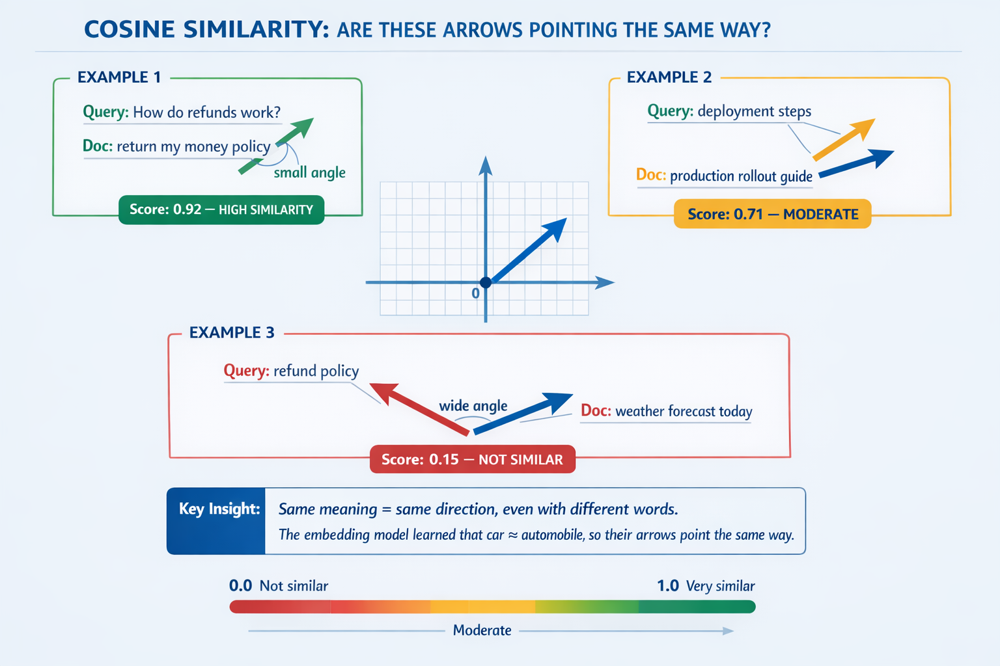

*This diagram illustrates cosine similarity as the angle between embedding vectors — more aligned vectors score closer to 1.0, indicating higher semantic similarity.*

> **🤖 Try with [GitHub Copilot](https://github.com/features/copilot) Chat:** Open [`RagService.java`](src/main/java/com/example/springai/rag/service/RagService.java) and ask:
> - "How does similarity search work with embeddings and what determines the score?"
> - "What similarity threshold should I use and how does it affect results?"
> - "How do I handle cases where no relevant documents are found?"

### Answer Generation

[RagService.java](src/main/java/com/example/springai/rag/service/RagService.java)

The most relevant chunks are assembled into a structured prompt that includes explicit instructions, the retrieved context, and the user's question. The model reads those specific chunks and answers based on that information — it can only use what's in front of it, which prevents hallucination.

```java
String context = matches.stream()
    .map(Document::getText)
    .collect(Collectors.joining("\n\n"));

String promptText = String.format("""
    Answer the question based on the following context.
    If the answer cannot be found in the context, say so.

    Context:
    %s

    Question: %s

    Answer:""", context, request.question());

String answer = chatModel.call(new Prompt(promptText))
        .getResult().getOutput().getText();
```

The diagram below shows this assembly in action — the top-scoring chunks from the search step are injected into the prompt template, and the `OpenAiSdkChatModel` generates a grounded answer:

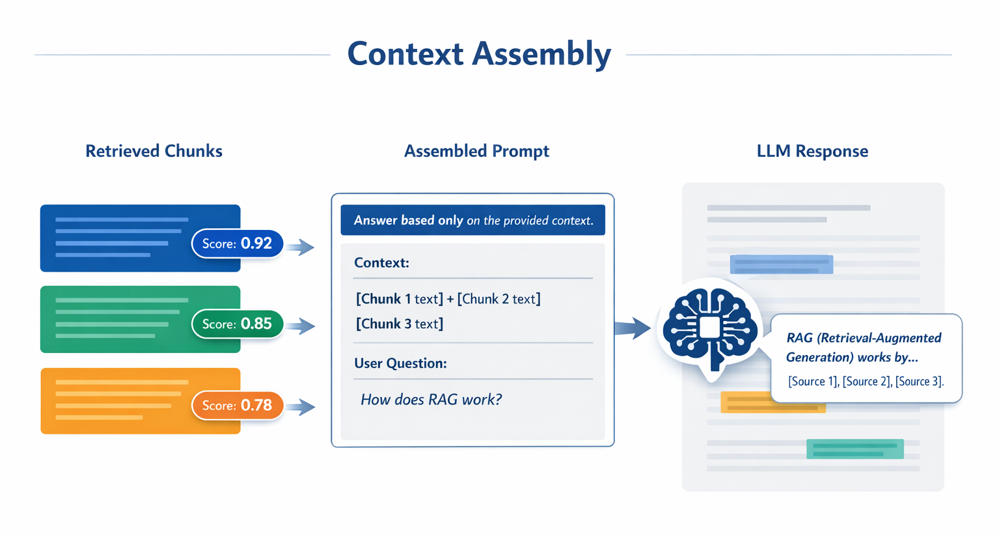

*This diagram shows how the top-scoring chunks are assembled into a structured prompt, allowing the model to generate a grounded answer from your data.*

## Run the Application

**Verify deployment:**

Ensure the `.env` file exists in the root directory with Azure credentials (created during Module 01). Run this from the module directory (`03-rag/`):

**Bash:**
```bash
cat ../.env  # Should show AZURE_OPENAI_ENDPOINT, API_KEY, DEPLOYMENT
```

**PowerShell:**
```powershell
Get-Content ..\.env  # Should show AZURE_OPENAI_ENDPOINT, API_KEY, DEPLOYMENT
```

**Start the application:**

> **Note:** If you already started all applications using `./start-all.sh` from the root directory (as described in Module 01), this module is already running on port 8081. You can skip the start commands below and go directly to http://localhost:8081.

**Option 1: Using Spring Boot Dashboard (Recommended for VS Code users)**

The dev container includes the Spring Boot Dashboard extension, which provides a visual interface to manage all Spring Boot applications. You can find it in the Activity Bar on the left side of VS Code (look for the Spring Boot icon).

From the Spring Boot Dashboard, you can:
- See all available Spring Boot applications in the workspace
- Start/stop applications with a single click
- View application logs in real-time
- Monitor application status

Simply click the play button next to "spring-ai-rag" to start this module, or start all modules at once.

**Option 2: Using shell scripts**

Start all web applications (modules 01-04):

**Bash:**
```bash
cd ..  # From root directory
./start-all.sh
```

**PowerShell:**
```powershell
cd ..  # From root directory
.\start-all.ps1
```

Or start just this module:

**Bash:**
```bash
cd 03-rag
./start.sh
```

**PowerShell:**
```powershell
cd 03-rag
.\start.ps1
```

Both scripts automatically load environment variables from the root `.env` file and will build the JARs if they don't exist.

> **Note:** If you prefer to build all modules manually before starting:
>
> **Bash:**
> ```bash
> cd ..  # Go to root directory
> mvn clean package -DskipTests
> ```
>
> **PowerShell:**
> ```powershell
> cd ..  # Go to root directory
> mvn clean package -DskipTests
> ```

Open http://localhost:8081 in your browser.

**To stop:**

**Bash:**
```bash
./stop.sh  # This module only
# Or
cd .. && ./stop-all.sh  # All modules
```

**PowerShell:**
```powershell
.\stop.ps1  # This module only
# Or
cd ..; .\stop-all.ps1  # All modules
```

## Using the Application

The application provides a web interface for document upload and questioning.

<a href="images/rag-homepage.png">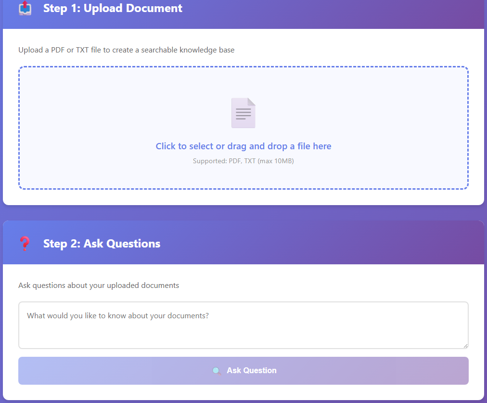</a>

*This screenshot shows the RAG application interface where you upload documents and ask questions.*

### Upload a Document

Start by uploading a document - TXT files work best for testing. A `sample-document.txt` is provided in this directory that contains information about Spring AI features, RAG implementation, and best practices - perfect for testing the system. 

The system processes your document, breaks it into chunks, and creates embeddings for each chunk. This happens automatically when you upload.

### Ask Questions

Now ask specific questions about the document content. Try something factual that's clearly stated in the document. The system searches for relevant chunks, includes them in the prompt, and generates an answer.

### Check Source References

Notice each answer includes source references with similarity scores. These scores (0 to 1) show how relevant each chunk was to your question. Higher scores mean better matches. This lets you verify the answer against the source material.

<a href="images/rag-query-results.png">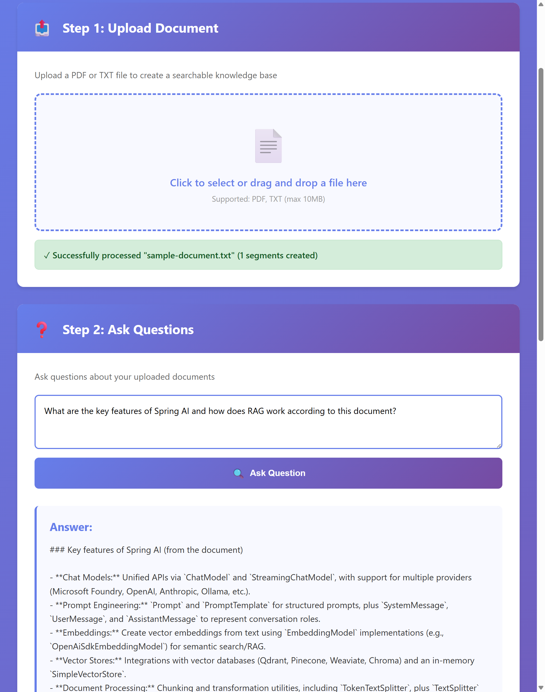</a>

*This screenshot shows query results with the generated answer, source references, and relevance scores for each retrieved chunk.*

### Experiment with Questions

Try different types of questions:
- Specific facts: "What is the main topic?"
- Comparisons: "What's the difference between X and Y?"
- Summaries: "Summarize the key points about Z"

Watch how the relevance scores change based on how well your question matches document content.

## Spring AI 2.0 Advisor-Based RAG

[AdvisorRagService.java](src/main/java/com/example/springai/rag/service/AdvisorRagService.java)

Spring AI 2.0 provides a `QuestionAnswerAdvisor` that encapsulates the entire RAG pipeline — vector search, context injection, and prompt augmentation — into a single advisor you attach to a `ChatClient` call. This is the recommended approach for production applications.

**Dependencies** — In addition to `spring-ai-starter-model-openai-sdk` and `spring-ai-vector-store`, you need:

```xml
<!-- Spring AI ChatClient for fluent API and advisor support -->
<dependency>
    <groupId>org.springframework.ai</groupId>
    <artifactId>spring-ai-client-chat</artifactId>
</dependency>

<!-- Spring AI Advisors for QuestionAnswerAdvisor -->
<dependency>
    <groupId>org.springframework.ai</groupId>
    <artifactId>spring-ai-advisors-vector-store</artifactId>
</dependency>
```

**ChatClient bean** — Create a `ChatClient` from the chat model:

```java
@Bean
public ChatClient chatClient(OpenAiSdkChatModel chatModel) {
    return ChatClient.builder(chatModel).build();
}
```

**QuestionAnswerAdvisor** — Build the advisor with your `VectorStore` and search configuration, then use it with `ChatClient`:

```java
QuestionAnswerAdvisor qaAdvisor = QuestionAnswerAdvisor.builder(vectorStore)
        .searchRequest(SearchRequest.builder()
                .similarityThreshold(0.0)
                .topK(5)
                .build())
        .build();

ChatResponse response = chatClient.prompt()
        .advisors(qaAdvisor)
        .user("What are the key features?")
        .call()
        .chatResponse();
```

That's it — the advisor automatically queries the vector store, injects matching document chunks into the prompt, and the model generates a grounded answer. Compare this with the ~30 lines of manual pipeline code in `RagService.java`.

> **🤖 Try with [GitHub Copilot](https://github.com/features/copilot) Chat:** Open [`AdvisorRagService.java`](src/main/java/com/example/springai/rag/service/AdvisorRagService.java) and ask:
> - "How does QuestionAnswerAdvisor inject context into the prompt?"
> - "What's the difference between QuestionAnswerAdvisor and RetrievalAugmentationAdvisor?"
> - "How can I customize the prompt template used by the advisor?"
> - "How do I add dynamic filter expressions at runtime?"

The application exposes both endpoints so you can compare them:
- **Native RAG:** `POST /api/rag/ask` — manual pipeline (educational)
- **Advisor RAG:** `POST /api/rag/advisor/ask` — Spring AI 2.0 recommended approach

## Key Concepts

### Chunking Strategy

Documents are split into 300-token chunks with 30 tokens of overlap. This balance ensures each chunk has enough context to be meaningful while staying small enough to include multiple chunks in a prompt.

### Similarity Scores

Every retrieved chunk comes with a similarity score between 0 and 1 that indicates how closely it matches the user's question. The diagram below visualizes the score ranges and how the system uses them to filter results:

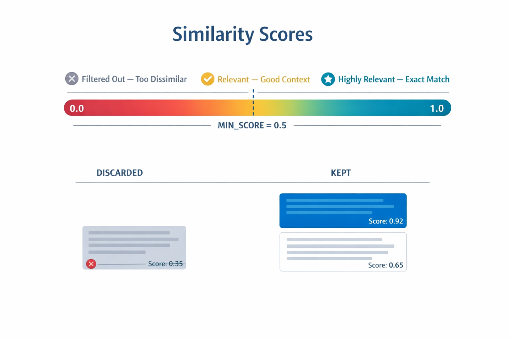

*This diagram shows score ranges from 0 to 1, illustrating how similarity thresholds filter out irrelevant chunks.*

Scores range from 0 to 1:
- 0.7-1.0: Highly relevant, exact match
- 0.3-0.7: Relevant, good context
- Below 0.3: Low relevance, may be noise

The default threshold is set to `0.0` so that `SimpleVectorStore` (in-memory) returns all matches — its cosine-similarity scores tend to be lower than production vector databases. In production, raise the threshold (e.g., 0.5-0.7) once you're using a dedicated vector store like Azure AI Search.

Embeddings work well when meaning clusters cleanly, but they have blind spots. The diagram below shows the common failure modes — chunks that are too large produce muddy vectors, chunks that are too small lack context, ambiguous terms point to multiple clusters, and exact-match lookups (IDs, part numbers) don't work with embeddings at all:

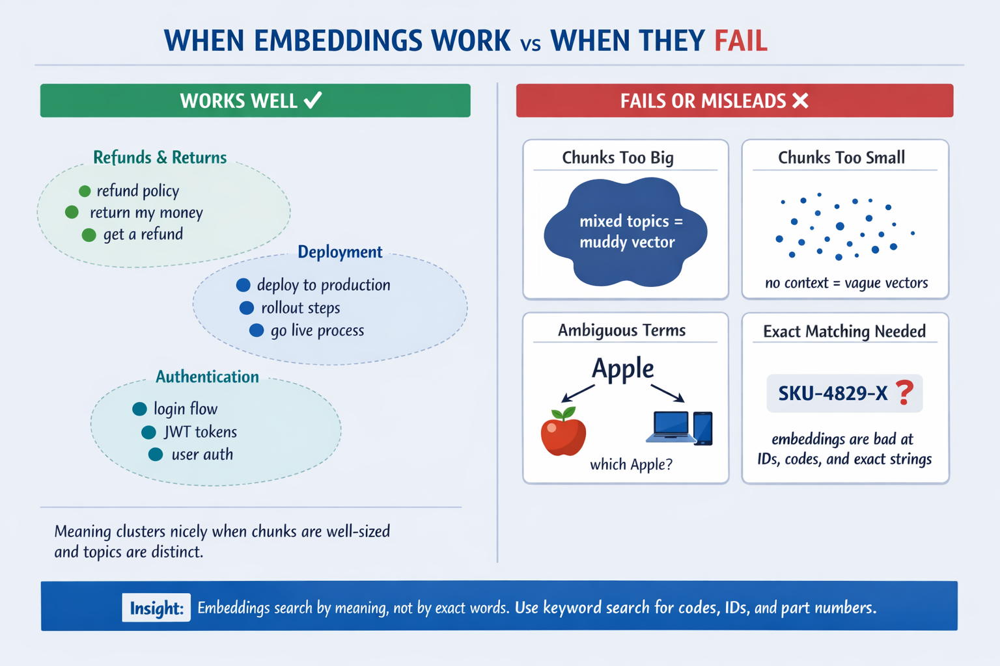

*This diagram shows common embedding failure modes: chunks too large, chunks too small, ambiguous terms that point to multiple clusters, and exact-match lookups like IDs.*

### In-Memory Storage

This module uses in-memory storage for simplicity. When you restart the application, uploaded documents are lost. Production systems use persistent vector databases like Azure AI Search.

### Context Window Management

Each model has a maximum context window. You can't include every chunk from a large document. The system retrieves the top N most relevant chunks (default 5) to stay within limits while providing enough context for accurate answers.

## When RAG Matters

RAG isn't always the right approach. The decision guide below helps you determine when RAG adds value versus when simpler approaches — like including content directly in the prompt or relying on the model's built-in knowledge — are sufficient:

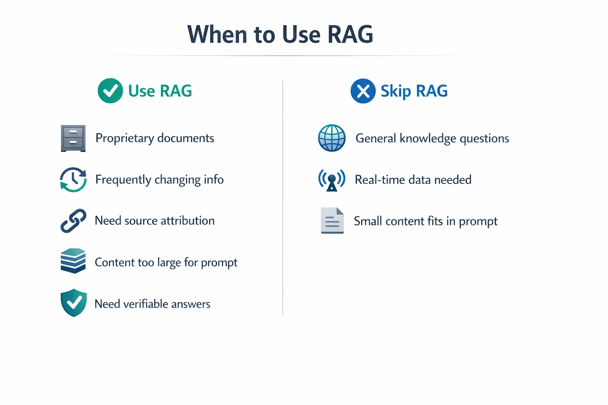

*This diagram shows a decision guide for when RAG adds value versus when simpler approaches are sufficient.*

## Next Steps

**Next Module:** [04-tools - AI Agents with Tools](../04-tools/README.md)

---

**Navigation:** [← Previous: Module 02 - Prompt Engineering](../02-prompt-engineering/README.md) | [Back to Main](../README.md) | [Next: Module 04 - Tools →](../04-tools/README.md)