# Module 04: AI Agents with Tools

## Table of Contents

- [What You'll Learn](#what-youll-learn)
- [Prerequisites](#prerequisites)
- [How This Uses Spring AI](#how-this-uses-spring-ai)
- [Understanding AI Agents with Tools](#understanding-ai-agents-with-tools)
- [How Tool Calling Works](#how-tool-calling-works)
  - [Tool Definitions](#tool-definitions)
  - [Decision Making](#decision-making)
  - [Execution](#execution)
  - [Response Generation](#response-generation)
  - [Architecture: Spring Boot Auto-Wiring](#architecture-spring-boot-auto-wiring)
- [Tool Chaining](#tool-chaining)
- [Run the Application](#run-the-application)
- [Using the Application](#using-the-application)
  - [Try Simple Tool Usage](#try-simple-tool-usage)
  - [Test Tool Chaining](#test-tool-chaining)
  - [See Conversation Flow](#see-conversation-flow)
  - [Experiment with Different Requests](#experiment-with-different-requests)
- [Key Concepts](#key-concepts)
  - [ReAct Pattern (Reasoning and Acting)](#react-pattern-reasoning-and-acting)
  - [Tool Descriptions Matter](#tool-descriptions-matter)
  - [Session Management](#session-management)
  - [Error Handling](#error-handling)
- [Available Tools](#available-tools)
- [When to Use Tool-Based Agents](#when-to-use-tool-based-agents)
- [Tools vs RAG](#tools-vs-rag)
- [Summary](#summary)
- [Next Steps](#next-steps)

## What You'll Learn

So far, you've learned how to have conversations with AI, structure prompts effectively, and ground responses in your documents. But there's still a fundamental limitation: language models can only generate text. They can't check the weather, perform calculations, query databases, or interact with external systems.

Tools change this. By giving the model access to functions it can call, you transform it from a text generator into an agent that can take actions. The model decides when it needs a tool, which tool to use, and what parameters to pass. Your code executes the function and returns the result. The model incorporates that result into its response.

## Prerequisites

- Completed [Module 01 - Introduction](../01-introduction/README.md) (Microsoft Foundry resources deployed)
- Completed previous modules recommended (this module references [RAG concepts from Module 03](../03-rag/README.md) in the Tools vs RAG comparison)
- `.env` file in root directory with Azure credentials (created by `azd up` in Module 01)

> **Note:** If you haven't completed Module 01, follow the deployment instructions there first.

## How This Uses Spring AI

This module reuses `spring-ai-starter-model-openai` from [Module 01](../01-introduction/README.md#how-this-uses-spring-ai) and `spring-ai-client-chat` introduced in [Module 03](../03-rag/README.md#how-this-uses-spring-ai). No new Spring AI dependencies are added — tool calling is built into `ChatClient` via the `.tools()` method ([pom.xml](pom.xml)).

The `application.yaml` is the same chat-model configuration as Module 01 ([application.yaml](src/main/resources/application.yaml)):

```yaml
spring:
  ai:
    openai:
      base-url: ${AZURE_OPENAI_ENDPOINT}
      api-key: ${AZURE_OPENAI_API_KEY}
      microsoft-deployment-name: ${AZURE_OPENAI_FAST_DEPLOYMENT}
      chat:
        model: ${AZURE_OPENAI_FAST_DEPLOYMENT}
```

Tool methods are annotated with `@Tool`, and this module creates the tool instances in `AgentService` before passing them to `ChatClient` at call time with `.tools(weatherTool, temperatureTool)`. Spring AI uses those annotated instances to expose callable tools to the model for that request.

## Understanding AI Agents with Tools

> **📝 Note:** The term "agents" in this module refers to AI assistants enhanced with tool-calling capabilities. This is different from the **Agentic AI** patterns (autonomous agents with planning, memory, and multi-step reasoning) that we'll cover in [Module 06: Agents](../06-agents/README.md).

Without tools, a language model can only generate text from its training data. Ask it for the current weather, and it has to guess. Give it tools, and it can call a weather API, perform calculations, or query a database — then weave those real results into its response.

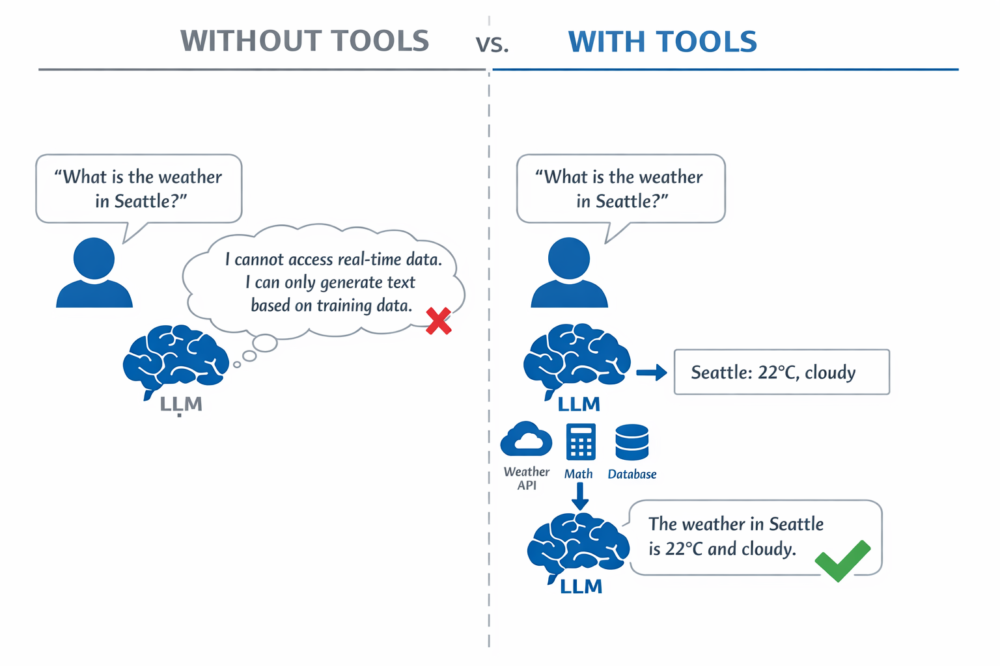

*Without tools the model can only guess — with tools it can call APIs, run calculations, and return real-time data.*

An AI agent with tools follows a **Reasoning and Acting (ReAct)** pattern. The model doesn't just respond — it thinks about what it needs, acts by calling a tool, observes the result, and then decides whether to act again or deliver the final answer:

1. **Reason** — The agent analyzes the user's question and determines what information it needs
2. **Act** — The agent selects the right tool, generates the correct parameters, and calls it
3. **Observe** — The agent receives the tool's output and evaluates the result
4. **Repeat or Respond** — If more data is needed, the agent loops back; otherwise, it composes a natural language answer

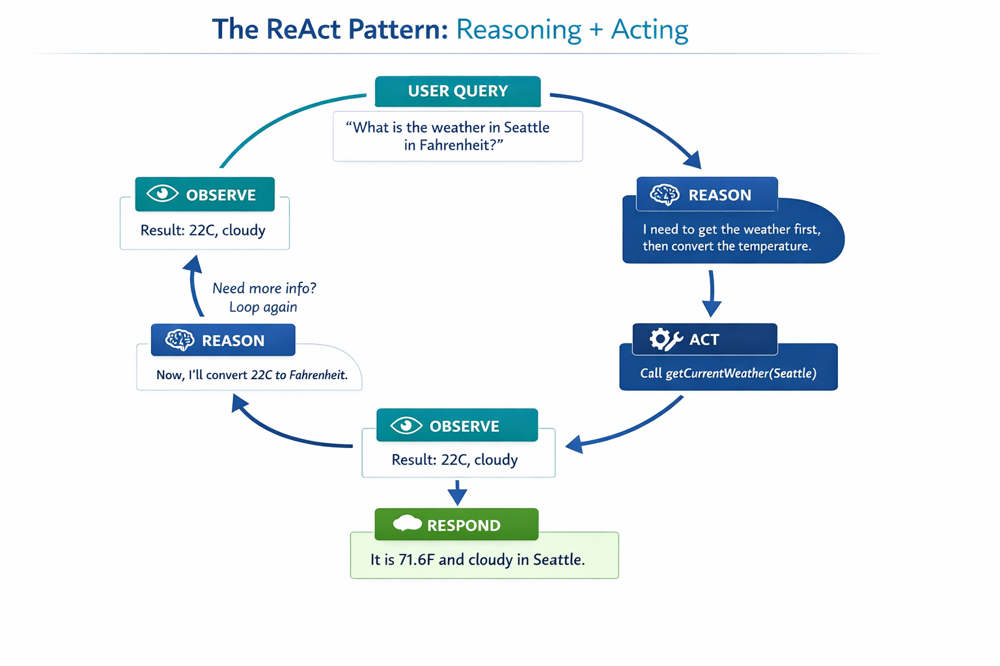

*The ReAct cycle — the agent reasons about what to do, acts by calling a tool, observes the result, and loops until it can deliver the final answer.*

This happens automatically. You define the tools and their descriptions. The model handles the decision-making about when and how to use them.

## How Tool Calling Works

### Tool Definitions

[WeatherTool.java](src/main/java/com/example/springai/tools/tools/WeatherTool.java) | [TemperatureTool.java](src/main/java/com/example/springai/tools/tools/TemperatureTool.java)

You define functions with clear descriptions and parameter specifications. The model sees these descriptions in its system prompt and understands what each tool does.

```java
public class WeatherTool {
    
    @Tool("Get the current weather for a location")
    public String getCurrentWeather(@ToolParam("Location name") String location) {
        // Your weather lookup logic
        return "Weather in " + location + ": 22°C, cloudy";
    }
}

// Tools are passed to ChatClient at call time:
chatClient.prompt()
    .tools(new WeatherTool())
    .user(message)
    .call()
    .content();

// ChatClient is auto-configured by Spring Boot with:
// - ChatModel bean (OpenAiChatModel via starter)
// - ChatMemory for session management
```

The diagram below breaks down every annotation and shows how each piece helps the AI understand when to call the tool and what arguments to pass:

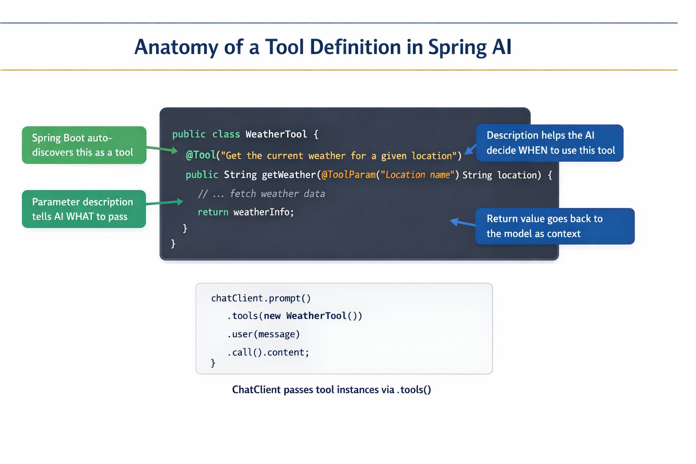

*Anatomy of a tool definition — @Tool tells the AI when to use it, @ToolParam describes each parameter, and ChatClient wires everything together at call time.*

> **🤖 Try with [GitHub Copilot](https://github.com/features/copilot) Chat:** Open [`WeatherTool.java`](src/main/java/com/example/springai/tools/tools/WeatherTool.java) and ask:
> - "How would I integrate a real weather API like OpenWeatherMap instead of mock data?"
> - "What makes a good tool description that helps the AI use it correctly?"
> - "How do I handle API errors and rate limits in tool implementations?"

### Decision Making

When a user asks "What's the weather in Seattle?", the model doesn't randomly pick a tool. It compares the user's intent against every tool description it has access to, scores each one for relevance, and selects the best match. It then generates a structured function call with the right parameters — in this case, setting `location` to `"Seattle"`.

If no tool matches the user's request, the model falls back to answering from its own knowledge. If multiple tools match, it picks the most specific one.

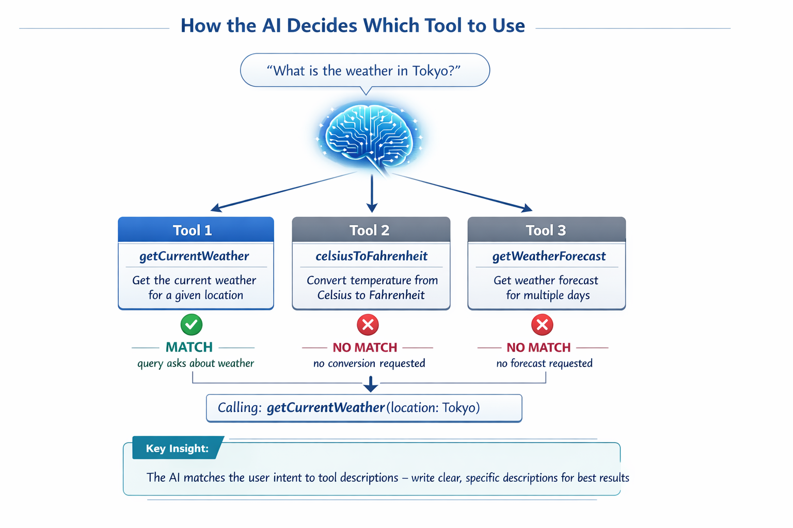

*The model evaluates every available tool against the user's intent and selects the best match — this is why writing clear, specific tool descriptions matters.*

### Execution

[AgentService.java](src/main/java/com/example/springai/tools/service/AgentService.java)

Spring AI's `ChatClient` accepts tool instances via `.tools()` and executes tool calls automatically. Behind the scenes, a complete tool call flows through six stages — from the user's natural language question all the way back to a natural language answer:

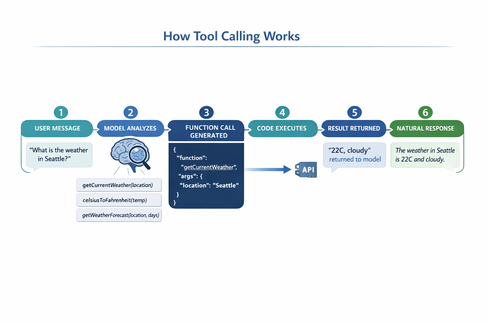

*The end-to-end flow — the user asks a question, the model selects a tool, Spring AI executes it, and the model weaves the result into a natural response.*

If you ran the [ToolIntegrationDemo](../00-quick-start/src/main/java/com/example/springai/quickstart/ToolIntegrationDemo.java) in Module 00, you already saw this pattern in action — the `Calculator` tools were called the same way. The sequence diagram below shows exactly what happened under the hood during that demo:

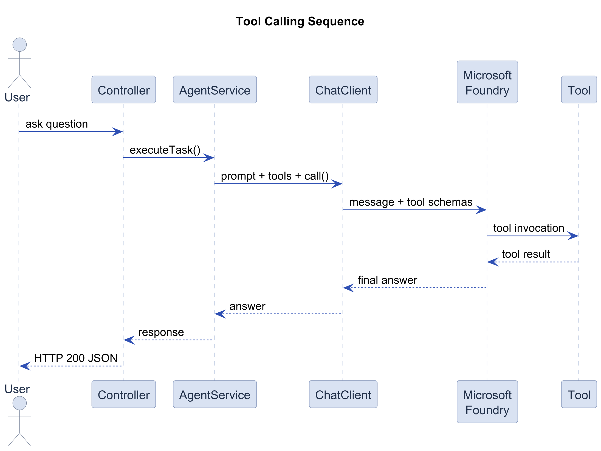

*The tool-calling loop from the Quick Start demo — `main()` asks ChatClient, which sends the message and tool schemas to the LLM. The LLM requests `add(42, 58)`, ChatClient executes it on the Calculator, and the LLM uses the result to compose the final answer.*

> **🤖 Try with [GitHub Copilot](https://github.com/features/copilot) Chat:** Open [`AgentService.java`](src/main/java/com/example/springai/tools/service/AgentService.java) and ask:
> - "How does the ReAct pattern work and why is it effective for AI agents?"
> - "How does the agent decide which tool to use and in what order?"
> - "What happens if a tool execution fails - how should I handle errors robustly?"

### Response Generation

The model receives the weather data and formats it into a natural language response for the user.

### Architecture: Spring Boot Auto-Wiring

This module uses Spring AI's `ChatClient` with tool instances passed via `.tools()`. Spring Boot auto-configures the `ChatClient.Builder` bean with your `ChatModel` — you create tool instances and pass them at call time.

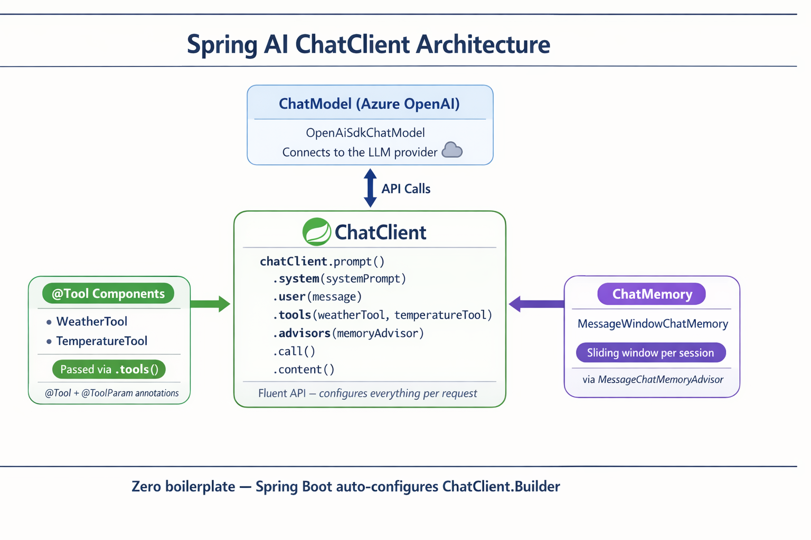

*ChatClient ties together the ChatModel and tool instances — Spring Boot auto-configures the builder, and you pass tools at call time via .tools().*

Here's the full request lifecycle as a sequence diagram — from the HTTP request through the controller and ChatClient, all the way to the tool execution and back:

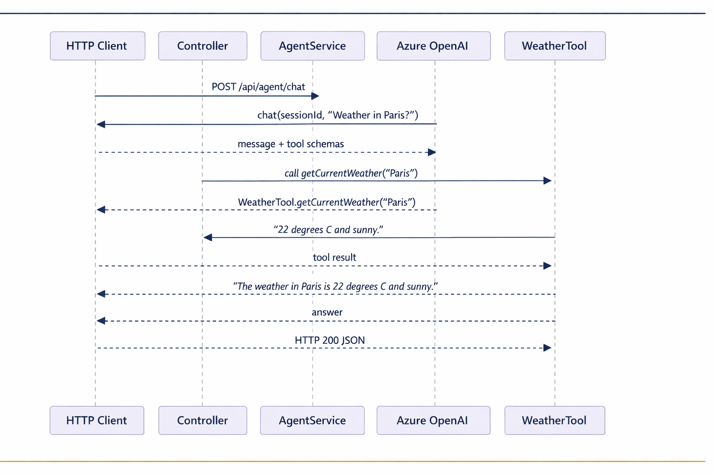

*The complete Spring Boot request lifecycle — HTTP Client → Controller → AgentService → ChatClient → Microsoft Foundry → WeatherTool and back. The LLM decides to call the tool, gets the result, and returns a natural language answer.*

Key benefits of this approach:

- **Spring Boot auto-wiring** — ChatModel and tools automatically injected
- **MessageWindowChatMemory** — Automatic sliding-window session memory per conversation ID
- **Single instance** — Assistant created once and reused for better performance
- **Type-safe execution** — Java methods called directly with type conversion
- **Multi-turn orchestration** — Handles tool chaining automatically
- **Zero boilerplate** — No manual message list trimming or memory HashMap

Alternative approaches (manual `ChatModel.call()` with tool handling) require more code and miss `ChatClient` integration benefits.

## Tool Chaining

**Tool Chaining** — The real power of tool-based agents shows when a single question requires multiple tools. Ask "What's the weather in Seattle in Fahrenheit?" and the agent automatically chains two tools: first it calls `getCurrentWeather` to get the temperature in Celsius, then it passes that value to `celsiusToFahrenheit` for conversion — all in a single conversation turn.

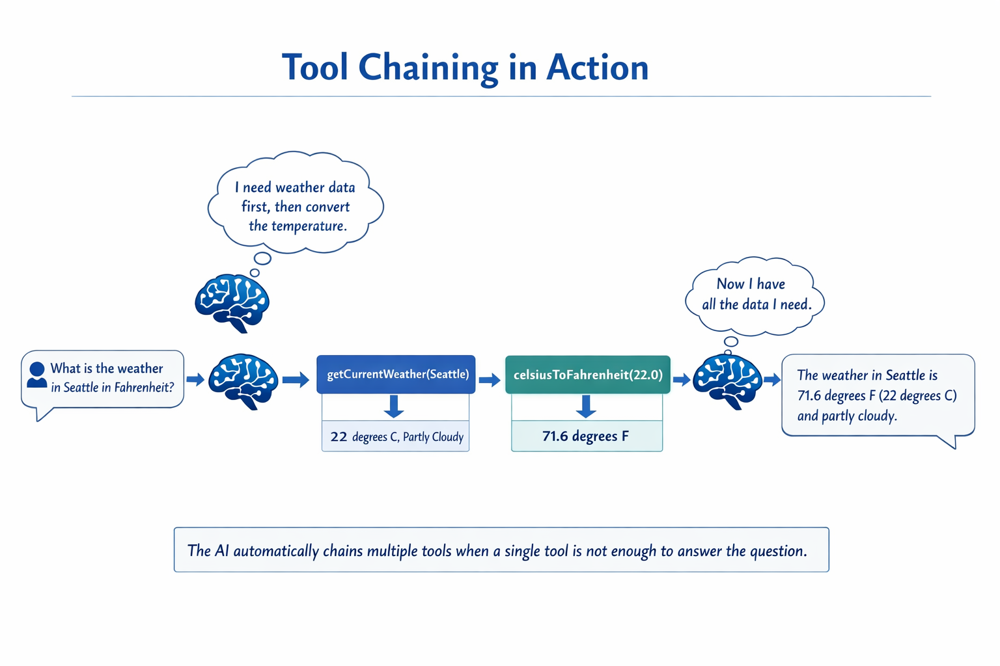

*Tool chaining in action — the agent calls getCurrentWeather first, then pipes the Celsius result into celsiusToFahrenheit, and delivers a combined answer.*

**Graceful Failures** — Ask for weather in a city that's not in the mock data. The tool returns an error message, and the AI explains it can't help rather than crashing. Tools fail safely. The diagram below contrasts the two approaches — with proper error handling, the agent catches the exception and responds helpfully, while without it the entire application crashes:

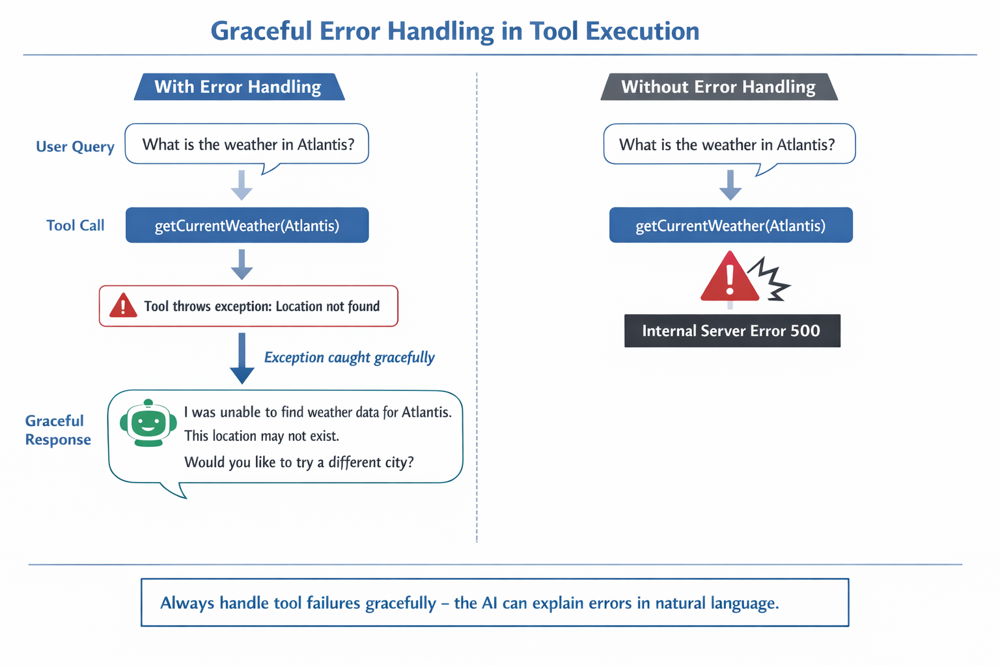

*When a tool fails, the agent catches the error and responds with a helpful explanation instead of crashing.*

This happens in a single conversation turn. The agent orchestrates multiple tool calls autonomously.

## Run the Application

**Verify deployment:**

Ensure the `.env` file exists in the root directory with Azure credentials (created during Module 01). Run this from the module directory (`04-tools/`):

**Bash:**
```bash
cat ../.env  # Should show AZURE_OPENAI_ENDPOINT, API_KEY, DEPLOYMENT
```

**PowerShell:**
```powershell
Get-Content ..\.env  # Should show AZURE_OPENAI_ENDPOINT, API_KEY, DEPLOYMENT
```

**Start the application:**

> **Note:** If you already started all applications using `./start-all.sh` from the root directory (as described in Module 01), this module is already running on port 8084. You can skip the start commands below and go directly to http://localhost:8084.

**Option 1: Using Spring Boot Dashboard (Recommended for VS Code users)**

The dev container includes the Spring Boot Dashboard extension, which provides a visual interface to manage all Spring Boot applications. You can find it in the Activity Bar on the left side of VS Code (look for the Spring Boot icon).

From the Spring Boot Dashboard, you can:
- See all available Spring Boot applications in the workspace
- Start/stop applications with a single click
- View application logs in real-time
- Monitor application status

Simply click the play button next to "spring-ai-tools" to start this module, or start all modules at once.


**Option 2: Using shell scripts**

Start all web applications (all modules 01-06):

**Bash:**
```bash
cd ..  # Go to root directory
./start-all.sh
```

**PowerShell:**
```powershell
cd ..  # Go to root directory
.\start-all.ps1
```

Or start just this module:

**Bash:**
```bash
# From this module directory
./start.sh
```

**PowerShell:**
```powershell
# From this module directory
.\start.ps1
```

Both scripts automatically load environment variables from the root `.env` file and will build the JARs if they don't exist.

> **Note:** If you prefer to build all modules manually before starting:
>
> **Bash:**
> ```bash
> cd ..  # Go to root directory
> mvn clean package -DskipTests
> ```
>
> **PowerShell:**
> ```powershell
> cd ..  # Go to root directory
> mvn clean package -DskipTests
> ```

Open http://localhost:8084 in your browser.

**To stop:**

**Bash:**
```bash
./stop.sh  # This module only
# Or
cd .. && ./stop-all.sh  # All modules
```

**PowerShell:**
```powershell
.\stop.ps1  # This module only
# Or
cd ..; .\stop-all.ps1  # All modules
```

## Using the Application

The application provides a web interface where you can interact with an AI agent that has access to weather and temperature conversion tools. Here's what the interface looks like — it includes quick-start examples and a chat panel for sending requests:

<a href="images/tools-homepage.png">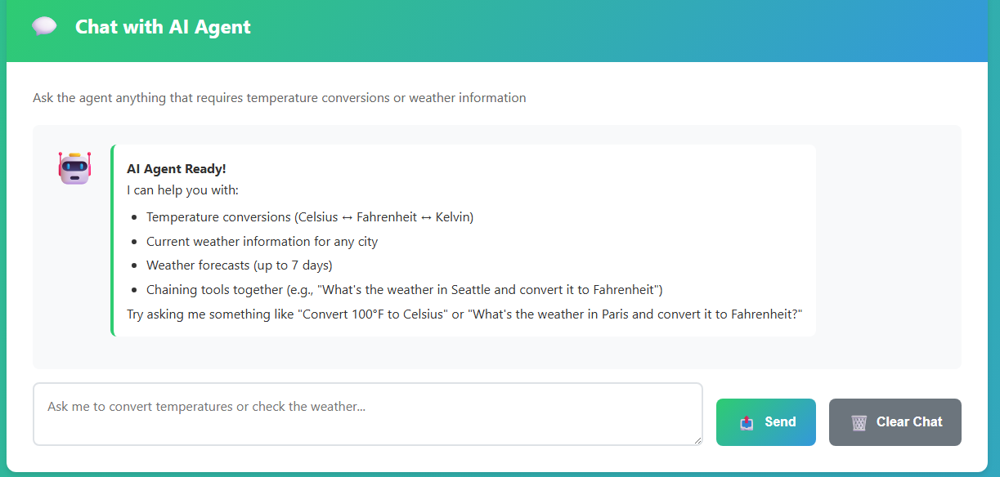</a>

*The AI Agent Tools interface - quick examples and chat interface for interacting with tools*

### Try Simple Tool Usage

Start with a straightforward request: "Convert 100 degrees Fahrenheit to Celsius". The agent recognizes it needs the temperature conversion tool, calls it with the right parameters, and returns the result. Notice how natural this feels - you didn't specify which tool to use or how to call it.

After the response, the chat message shows a **Tools run** line with the actual Java tool method that executed, such as `fahrenheitToCelsius(fahrenheit=100.0)`. This metadata is recorded from real tool invocations, so it reflects what actually ran rather than inferred model behavior.

### Test Tool Chaining

Now try something more complex: "What's the weather in Seattle and convert it to Fahrenheit?" Watch the agent work through this in steps. It first gets the weather (which returns Celsius), recognizes it needs to convert to Fahrenheit, calls the conversion tool, and combines both results into one response.

For chained requests, the **Tools run** line can show multiple tool calls in the same agent response, making the orchestration visible while you test the demo.

### See Conversation Flow

The chat interface maintains conversation history, allowing you to have multi-turn interactions. You can see all previous queries and responses, making it easy to track the conversation and understand how the agent builds context over multiple exchanges.

<a href="images/tools-conversation-demo.png">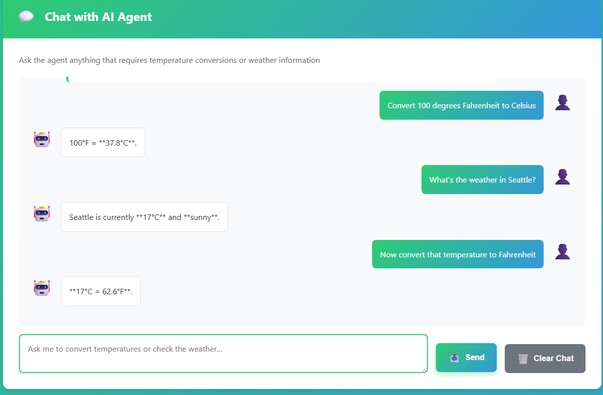</a>

*Multi-turn conversation showing simple conversions, weather lookups, and tool chaining*

### Experiment with Different Requests

Try various combinations:
- Weather lookups: "What's the weather in Tokyo?"
- Temperature conversions: "What is 25°C in Kelvin?"
- Combined queries: "Check the weather in Paris and tell me if it's above 20°C"

Notice how the agent interprets natural language and maps it to appropriate tool calls.

## Key Concepts

### ReAct Pattern (Reasoning and Acting)

The agent alternates between reasoning (deciding what to do) and acting (using tools). This pattern enables autonomous problem-solving rather than just responding to instructions.

### Tool Descriptions Matter

The quality of your tool descriptions directly affects how well the agent uses them. Clear, specific descriptions help the model understand when and how to call each tool.

### Session Management

The service uses Spring AI's `MessageWindowChatMemory` for automatic session-based memory management. Each session ID gets its own conversation history within the `ChatMemory` instance, so multiple users can interact with the agent simultaneously without their conversations mixing together. The following diagram shows how multiple users are routed to isolated memory stores based on their session IDs:

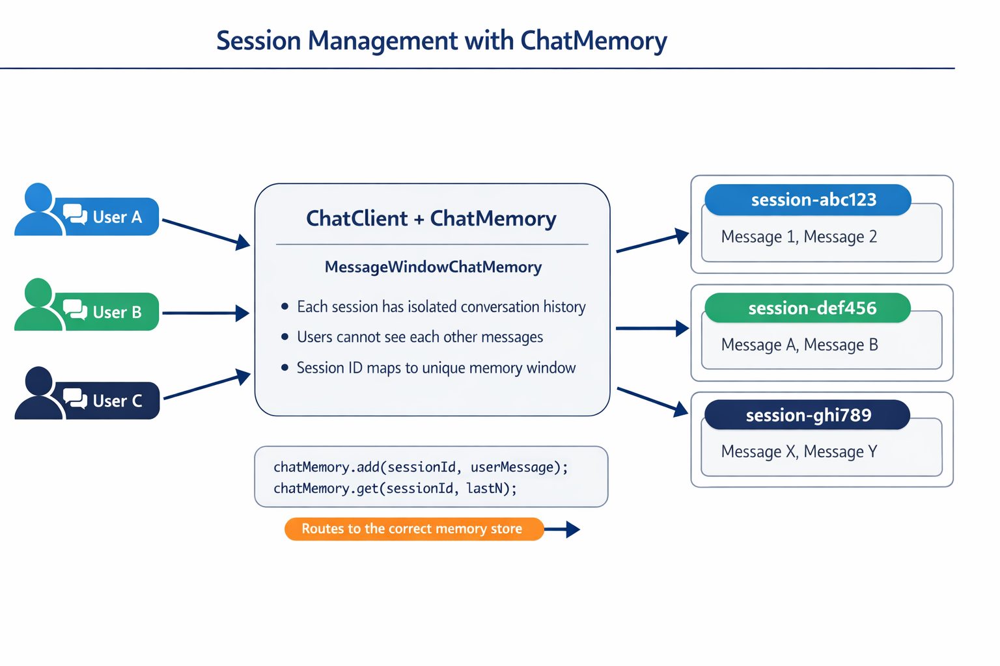

*Each session ID maps to an isolated conversation history — users never see each other's messages.*

### Error Handling

Tools can fail — APIs timeout, parameters might be invalid, external services go down. Production agents need error handling so the model can explain problems or try alternatives rather than crashing the entire application. When a tool throws an exception, Spring AI catches it and feeds the error message back to the model, which can then explain the problem in natural language.

## Available Tools

The diagram below shows the broad ecosystem of tools you can build. This module demonstrates weather and temperature tools, but the same `@Tool` pattern works for any Java method — from database queries to payment processing.

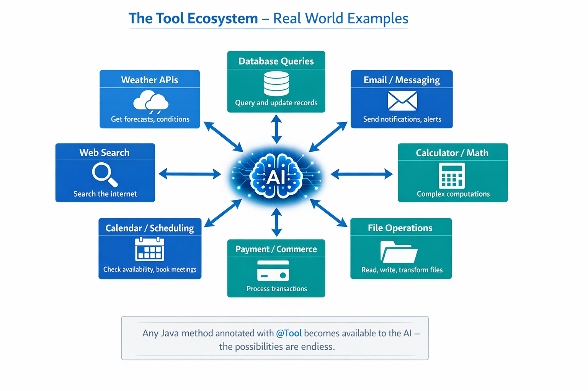

*Any Java method annotated with @Tool becomes available to the AI — the pattern extends to databases, APIs, email, file operations, and more.*

## When to Use Tool-Based Agents

Not every request needs tools. The decision comes down to whether the AI needs to interact with external systems or can answer from its own knowledge. The following guide summarizes when tools add value and when they're unnecessary:

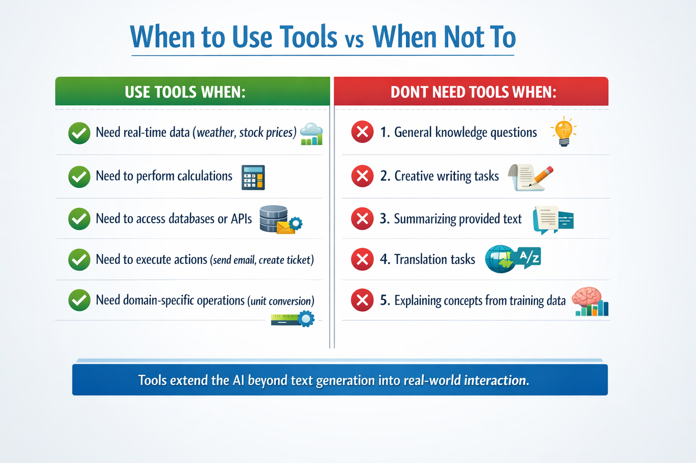

*A quick decision guide — tools are for real-time data, calculations, and actions; general knowledge and creative tasks don't need them.*

## Tools vs RAG

Modules 03 and 04 both extend what the AI can do, but in fundamentally different ways. RAG gives the model access to **knowledge** by retrieving documents. Tools give the model the ability to take **actions** by calling functions. The diagram below compares these two approaches side by side — from how each workflow operates to the trade-offs between them:

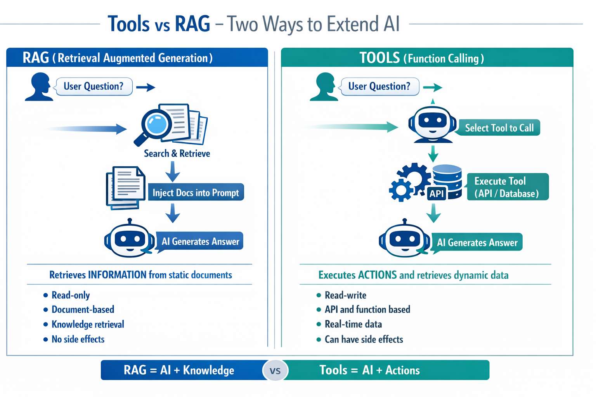

*RAG retrieves information from static documents — Tools execute actions and fetch dynamic, real-time data. Many production systems combine both.*

In practice, many production systems combine both approaches: RAG for grounding answers in your documentation, and Tools for fetching live data or performing operations.

## Summary

In this module you turned the model from a text generator into an agent that can take actions. By exposing functions as tools, you let the model decide when to call them, which to use, and what parameters to pass — while your code runs the function and returns the result. You explored the ReAct pattern, why tool descriptions matter, session management, and error handling, and you compared tools (actions) against RAG (knowledge). Next, you'll move those tools out of process and share them across services with the Model Context Protocol.

## Next Steps

**Next Module:** [05-mcp - Model Context Protocol (MCP)](../05-mcp/README.md)

---

**Navigation:** [← Previous: Module 03 - RAG](../03-rag/README.md) | [Back to Main](../README.md) | [Next: Module 05 - MCP →](../05-mcp/README.md)