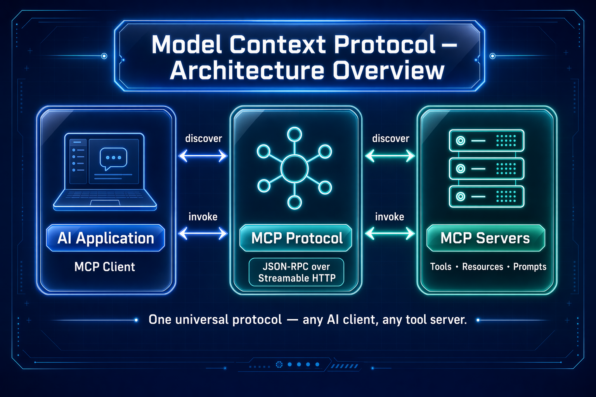
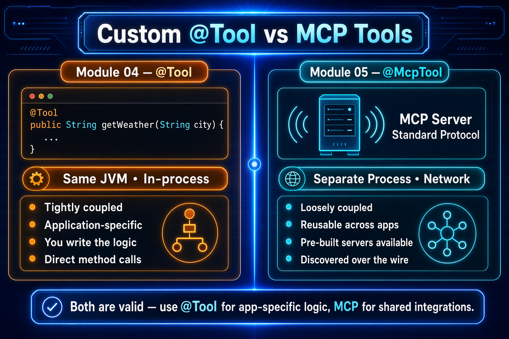
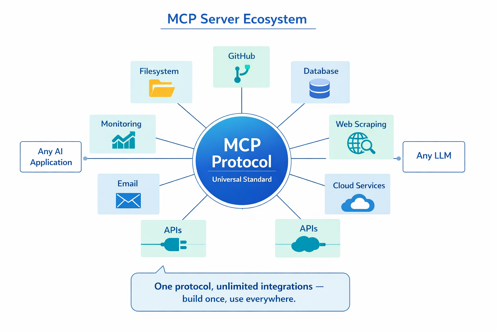
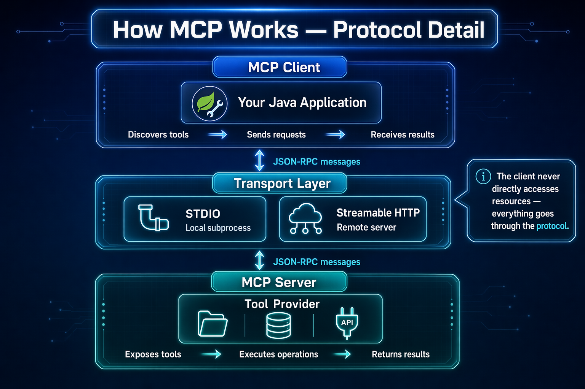
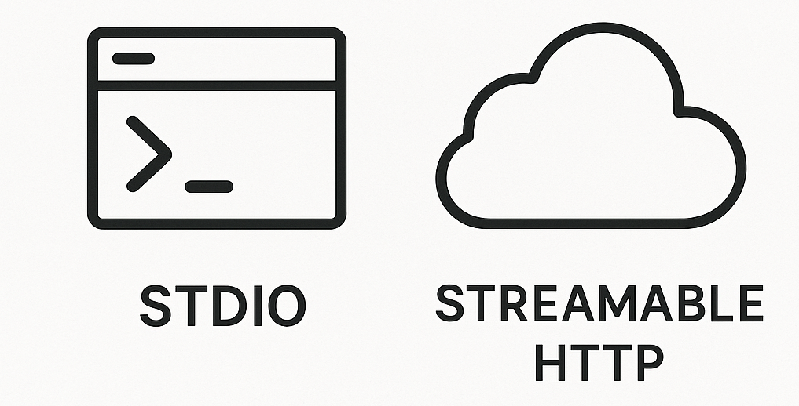
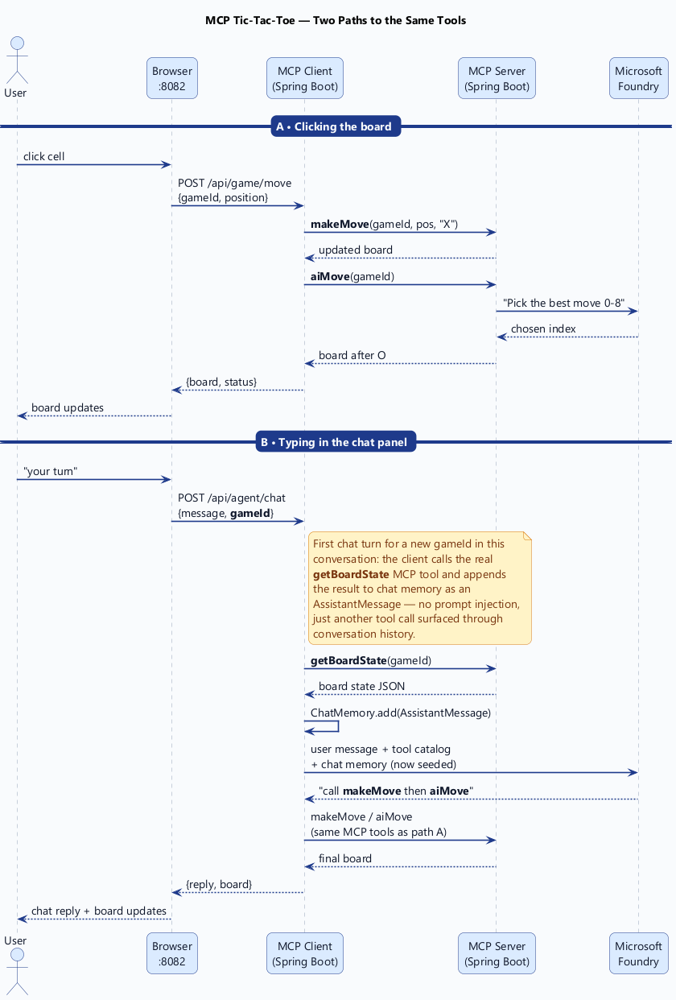
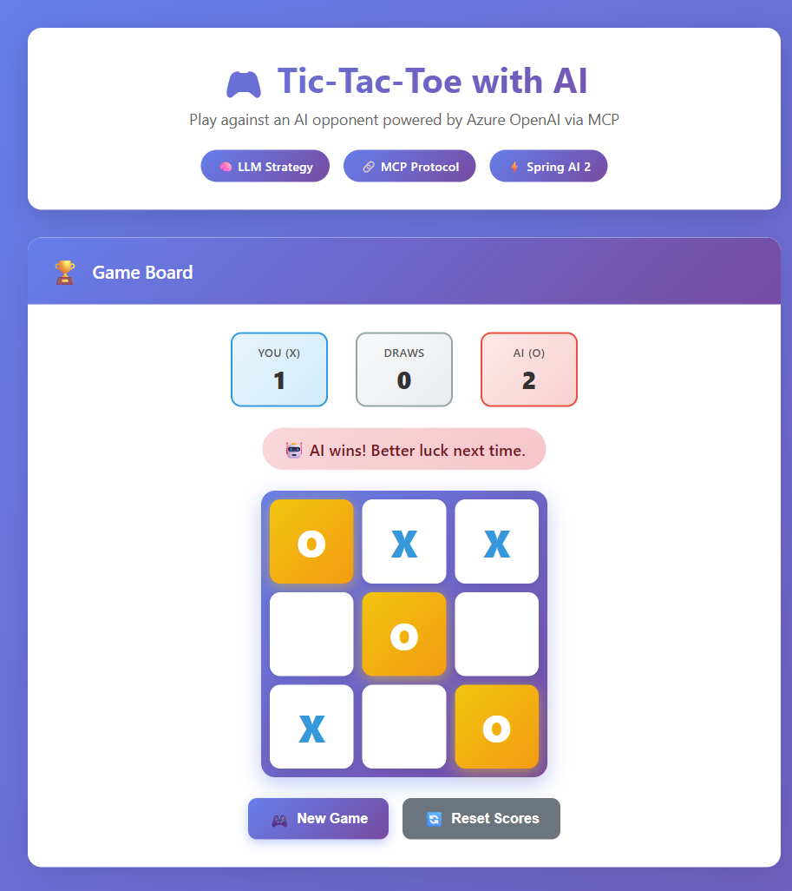
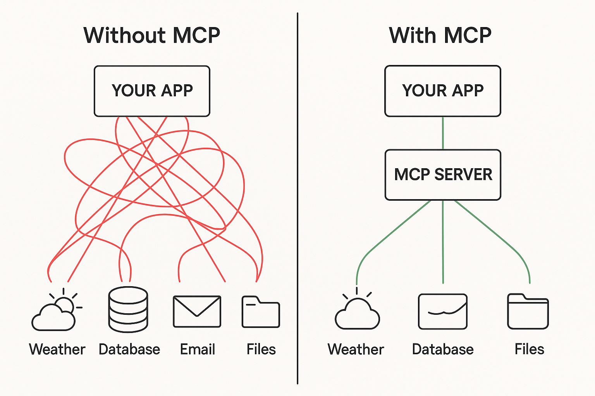

# Module 05: Model Context Protocol (MCP)

## Table of Contents

- [What You'll Learn](#what-youll-learn)
- [Prerequisites](#prerequisites)
- [Understanding MCP](#understanding-mcp)
  - [Why MCP?](#why-mcp)
  - [Custom Tools vs MCP](#custom-tools-vs-mcp)
  - [MCP Ecosystem](#mcp-ecosystem)
- [How MCP Works](#how-mcp-works)
  - [MCP Architecture](#mcp-architecture)
  - [Tool Discovery](#tool-discovery)
  - [Transport Mechanisms](#transport-mechanisms)
- [How This Uses Spring AI](#how-this-uses-spring-ai)
- [How This Demo Works](#how-this-demo-works)
  - [MCP Server — Game Engine + AI Strategy](#mcp-server--game-engine--ai-strategy)
  - [MCP Client — Thin Web UI](#mcp-client--thin-web-ui)
  - [Game Flow](#game-flow)
- [Run the Application](#run-the-application)
- [Using the Application](#using-the-application)
  - [Start a New Game](#start-a-new-game)
  - [Make Your Move](#make-your-move)
  - [Watch the AI Respond](#watch-the-ai-respond)
  - [Track Your Score](#track-your-score)
- [Code Walkthrough](#code-walkthrough)
  - [Server: @McpTool Definitions](#server-mcptool-definitions)
  - [Server: AI Strategy via ChatClient](#server-ai-strategy-via-chatclient)
  - [Server: Game Engine Logic](#server-game-engine-logic)
  - [Client: Tool Discovery via ToolCallbackProvider](#client-tool-discovery-via-toolcallbackprovider)
  - [Client: Direct MCP Tool Invocation](#client-direct-mcp-tool-invocation)
- [Key Concepts](#key-concepts)
  - [MCP Streamable HTTP Protocol](#mcp-streamable-http-protocol)
  - [Direct Tool Calls vs LLM-Orchestrated Calls](#direct-tool-calls-vs-llm-orchestrated-calls)
  - [AI Strategy with ChatClient](#ai-strategy-with-chatclient)
- [Spring AI 2 Features Demonstrated](#spring-ai-2-features-demonstrated)
- [MCP vs Tools (Module 04)](#mcp-vs-tools-module-04)
- [Next Steps](#next-steps)

## What You'll Learn

In the previous modules, you learned about chat, prompt engineering, RAG, and tool calling. But all of those tools lived *inside* the same application. What if your tools live in a different service? What if you want a universal protocol for AI applications to discover and call tools across service boundaries?

That's what the **Model Context Protocol (MCP)** provides. MCP is an open protocol for connecting AI applications to external tool providers — a standard way for AI clients to discover and invoke tools hosted on remote servers.



*MCP provides a universal protocol for AI applications to discover and invoke tools on remote servers — decoupling AI logic from tool implementations.*

In this module, you'll build a **Tic-Tac-Toe game** that demonstrates MCP in action:
- An **MCP Server** exposes game-engine tools *and* an AI move tool powered by Microsoft Foundry
- An **MCP Client** provides a thin web UI that discovers and calls server tools — no LLM on the client
- The AI strategy lives entirely on the server, using **Spring AI's ChatClient** to choose moves
- All game operations flow through the **MCP Streamable HTTP protocol**

## Prerequisites

- Completed [Module 01 - Introduction](../01-introduction/README.md) (Microsoft Foundry resources deployed)
- Completed previous modules recommended (this module builds on [tool calling from Module 04](../04-tools/README.md))
- `.env` file in root directory with Azure credentials (created by `azd up` in Module 01)

> **Note:** If you haven't completed Module 01, follow the deployment instructions there first.

## Understanding MCP

### Why MCP?

In Module 04, you used `@Tool` annotations to define tools *inside* your application. That works well for tools that are tightly coupled to your app. But in practice, tools often live in separate services — microservices, third-party APIs, or shared infrastructure.

MCP solves this by providing:
- **Universal protocol** — A standard way for AI apps to discover and call tools
- **Service separation** — Tools live in their own process, enabling independent deployment
- **Auto-discovery** — Clients automatically learn what tools are available
- **Cross-language support** — MCP servers and clients can be written in any language

### Custom Tools vs MCP

The following diagram compares the custom `@Tool` approach from Module 04 with the MCP approach in this module. Notice how MCP moves tools out of the application and behind a protocol boundary:



*Custom @Tool methods run in-process; MCP tools run on a separate server and are discovered over the network via a standard protocol.*

### MCP Ecosystem

MCP isn't just for your own tools. A growing ecosystem of MCP servers provides pre-built integrations for databases, APIs, cloud services, and more. Your AI application can connect to any MCP server — yours or third-party — using the same protocol:



*The MCP ecosystem — your AI application can connect to any MCP-compatible server, whether you built it or someone else did.*

## How MCP Works

### MCP Architecture

The protocol follows a client-server model. The **MCP client** (your AI application) discovers and invokes tools on one or more **MCP servers**. Each server exposes a set of tools with typed parameters and descriptions, and the client can call them over HTTP or stdio:



*The MCP protocol detail — clients send JSON-RPC requests to servers, which respond with structured results. Tool schemas are exchanged during the discovery phase.*

### Tool Discovery

When an MCP client connects to a server, it first requests the list of available tools. The server responds with tool names, descriptions, and parameter schemas. Spring AI's `ToolCallbackProvider` handles this automatically — you get a collection of `ToolCallback` objects ready to invoke:


*Tool discovery — the client connects, requests the tool list, and receives typed schemas it can use to invoke tools or pass to an LLM.*

### Transport Mechanisms

MCP supports multiple transport mechanisms. This module uses **Streamable HTTP**, the modern recommended transport:



*MCP transport options — Streamable HTTP is the recommended choice for web-deployed servers; stdio is for local process-based servers.*

## How This Uses Spring AI

This module is split into two Spring Boot applications — an MCP server and an MCP client — each with its own dependencies and configuration.

**Server Dependencies** ([mcp-server/pom.xml](mcp-server/pom.xml)) — The server needs the Web MVC MCP server starter to expose `@McpTool` endpoints over Streamable HTTP, the OpenAI SDK starter for Microsoft Foundry access, and the chat client library:

```xml
<!-- Exposes @McpTool methods as MCP endpoints over Streamable HTTP (Spring MVC runtime) -->
<dependency>
    <groupId>org.springframework.ai</groupId>
    <artifactId>spring-ai-starter-mcp-server-webmvc</artifactId> <!-- Version managed by Spring AI BOM in root pom.xml -->
</dependency>

<!-- Microsoft Foundry via OpenAI SDK Starter (auto-configures OpenAiChatModel) -->
<dependency>
    <groupId>org.springframework.ai</groupId>
    <artifactId>spring-ai-starter-model-openai</artifactId>
</dependency>

<!-- Spring AI Chat Client for LLM-powered AI moves -->
<dependency>
    <groupId>org.springframework.ai</groupId>
    <artifactId>spring-ai-client-chat</artifactId>
</dependency>
```

**Client Dependencies** ([mcp-client/pom.xml](mcp-client/pom.xml)) — The client needs the WebFlux MCP client starter to discover and invoke remote MCP tools. It has **no AI model dependencies** — all LLM logic lives on the server:

```xml
<!-- MCP Client — discovers and invokes tools on the MCP server via Streamable HTTP -->
<dependency>
    <groupId>org.springframework.ai</groupId>
    <artifactId>spring-ai-starter-mcp-client-webflux</artifactId> <!-- Version managed by Spring AI BOM in root pom.xml -->
</dependency>
```

**Server Configuration** ([application.yaml](mcp-server/src/main/resources/application.yaml)) — The starter auto-configures the MCP server and the Microsoft Foundry chat model from properties:

```yaml
spring:
  ai:
    openai-sdk:
      base-url: ${AZURE_OPENAI_ENDPOINT}
      api-key: ${AZURE_OPENAI_API_KEY}
      chat:
        options:
          model: ${AZURE_OPENAI_FAST_DEPLOYMENT}
    mcp:
      server:
        name: tictactoe-server
        protocol: STREAMABLE
```

Credentials come from environment variables set by `azd up`. The `protocol: STREAMABLE` setting enables the modern Streamable HTTP transport.

**Client Configuration** ([application.yaml](mcp-client/src/main/resources/application.yaml)) — The client points to the MCP server URL. Spring AI handles connection, tool discovery, and invocation automatically:

```yaml
spring:
  ai:
    mcp:
      client:
        streamable-http:
          connections:
            tictactoe-server:
              url: http://localhost:8085
```

No Azure credentials on the client — it only talks to the MCP server.

## How This Demo Works

### MCP Server — Game Engine + AI Strategy

[TicTacToeTools.java](mcp-server/src/main/java/com/example/springai/mcp/server/TicTacToeTools.java) | [GameEngine.java](mcp-server/src/main/java/com/example/springai/mcp/server/GameEngine.java) | [SpringAiConfig.java](mcp-server/src/main/java/com/example/springai/mcp/server/SpringAiConfig.java)

The MCP server is the game engine **and** the AI strategist. It connects to Microsoft Foundry to power the `aiMove` tool. It exposes five tools via `@McpTool`:

| Tool | Description |
|------|-------------|
| `startNewGame()` | Creates a new game with an empty 3×3 board |
| `makeMove(gameId, position, player)` | Places X or O at a position (0–8), validates the move, checks for wins |
| `aiMove(gameId)` | **LLM-powered** — Analyzes the board via ChatClient, picks the best position, and executes the move as O |
| `getBoardState(gameId)` | Returns the current board, status, and whose turn it is |
| `getAvailableMoves(gameId)` | Returns the list of empty positions |

### MCP Client — Thin Web UI

[GameService.java](mcp-client/src/main/java/com/example/springai/mcp/client/GameService.java) | [GameController.java](mcp-client/src/main/java/com/example/springai/mcp/client/GameController.java)

The MCP client is a **thin web frontend** with no LLM or AI logic. It discovers the server's tools at startup and calls them directly:

1. **Direct MCP tool calls** — All operations (new game, human moves, AI moves, board state) are called via `ToolCallback.call()`. No LLM on the client.

2. **AI delegation** — When it's the AI's turn, the client simply calls the server's `aiMove` MCP tool. The server handles LLM communication internally and returns the result.

### Game Flow

The sequence diagram below shows how a single turn flows through the system — from the browser click, through the MCP client, across the Streamable HTTP protocol to the MCP server, and (for the AI's turn) out to Microsoft Foundry and back.



*Player turns call `makeMove` directly; AI turns call `aiMove`, which lets the server consult `gpt-4o-mini` and execute the chosen move — the client never talks to the LLM.*

**Step-by-step:**

1. **Player clicks "New Game"** — Client calls the `startNewGame` MCP tool; the server creates a game and returns an empty board.
2. **Player clicks a cell** (e.g., position 4) — Client calls `makeMove(gameId, 4, "X")`; the server validates and executes the move.
3. **AI turn** — Client calls `aiMove(gameId)`:
   - Server fetches board state and available moves from its `GameEngine`.
   - Server prompts Microsoft Foundry (`gpt-4o-mini`) via `ChatClient` to pick the best position.
   - Server applies the LLM's chosen move as `O` and returns the updated board.
4. **Board updates in the browser** — repeat until win or draw.

## Run the Application

**Verify deployment:**

Ensure the `.env` file exists in the root directory with Azure credentials (created during Module 01). Run this from the module directory (`05-mcp/`):

**Bash:**
```bash
cat ../.env  # Should show AZURE_OPENAI_ENDPOINT, API_KEY, DEPLOYMENT
```

**PowerShell:**
```powershell
Get-Content ..\.env  # Should show AZURE_OPENAI_ENDPOINT, API_KEY, DEPLOYMENT
```

**Start the application:**

This module requires **two Spring Boot applications** — the MCP server and the MCP client — running simultaneously.

**Option 1: Using Spring Boot Dashboard (Recommended for VS Code users)**

The dev container includes the Spring Boot Dashboard extension, which provides a visual interface to manage all Spring Boot applications. You can find it in the Activity Bar on the left side of VS Code (look for the Spring Boot icon).

From the Spring Boot Dashboard, you can:
- See all available Spring Boot applications in the workspace
- Start/stop applications with a single click
- View application logs in real-time
- Monitor application status

Start **`mcp-server`** first, wait for it to be ready on port 8085, then start **`mcp-client`** on port 8082.


**Option 2: Using shell scripts**

To start **all** modules at once (01-06, including both the MCP server and client in the correct order), run the root-level script from the repo root:

**Bash:**
```bash
cd ..  # From root directory
./start-all.sh
```

**PowerShell:**
```powershell
cd ..  # From root directory
.\start-all.ps1
```

To stop everything, run `./stop-all.sh` (or `.\stop-all.ps1`) from the same root directory.

If you prefer to run **only this module**, you'll need **two terminal windows** — one for the MCP server and one for the MCP client. The server must start before the client.

### Terminal 1: Start the MCP Server

**Bash:**
```bash
cd 05-mcp
./start-server.sh
```

**PowerShell:**
```powershell
cd 05-mcp
.\start-server.ps1
```

The server starts on **http://localhost:8085**. It exposes the game engine and AI strategy as MCP tools via the Streamable HTTP protocol. The startup script loads Microsoft Foundry credentials from the root `.env` file.

### Terminal 2: Start the MCP Client

**Bash:**
```bash
cd 05-mcp
./start-client.sh
```

**PowerShell:**
```powershell
cd 05-mcp
.\start-client.ps1
```

The client starts on **http://localhost:8082**. It connects to the MCP server to discover available tools — no Azure credentials needed on the client.

> **Note:** If you prefer to build both modules manually before starting:
>
> **Bash:**
> ```bash
> cd ..  # Go to root directory
> mvn clean package -DskipTests
> ```
>
> **PowerShell:**
> ```powershell
> cd ..  # Go to root directory
> mvn clean package -DskipTests
> ```

Open http://localhost:8082 in your browser.

## Using the Application



The application provides a Tic-Tac-Toe game where you play as **X** against an AI opponent playing as **O**. The AI uses Microsoft Foundry to analyze the board and choose strategic moves — all game operations flow through MCP tools on the server.

### Start a New Game

Click **New Game** to begin. The client calls the MCP `startNewGame()` tool on the server, which creates a fresh 3×3 board and returns a game ID. You'll see an empty board with the status "Your turn! Place your X."

### Make Your Move

Click any empty cell to place your **X**. The client calls the MCP `makeMove` tool directly — no LLM involved for human moves. The server validates the position, places your mark, checks for wins, and returns the updated board.

### Watch the AI Respond

After your move, the client calls the server's `aiMove` MCP tool. The server analyzes the board, consults Microsoft Foundry through Spring AI's `ChatClient`, and picks the best strategic position — all server-side. The AI's **O** appears on the board moments later.

### Track Your Score

The scoreboard at the top tracks wins, draws, and losses across games. Scores persist in your browser's localStorage, so they survive page refreshes. Click **Reset Scores** to start fresh.

## Code Walkthrough

### Server: @McpTool Definitions

[TicTacToeTools.java](mcp-server/src/main/java/com/example/springai/mcp/server/TicTacToeTools.java)

The server uses `@McpTool` and `@McpToolParam` annotations to expose game operations. The MCP framework automatically registers these as tools that clients can discover and invoke:

```java
@Service
public class TicTacToeTools {

    private final ChatClient chatClient;

    public TicTacToeTools(ChatClient.Builder chatClientBuilder) {
        this.chatClient = chatClientBuilder.build();
    }

    @McpTool(description = "Start a new tic-tac-toe game. "
            + "Returns the game ID and an empty 3x3 board.")
    public String startNewGame() {
        return gameEngine.newGame();
    }

    @McpTool(description = "Make a move on the tic-tac-toe board.")
    public String makeMove(
            @McpToolParam(description = "The game ID") String gameId,
            @McpToolParam(description = "Board position 0-8") int position,
            @McpToolParam(description = "Player symbol: X or O") String player) {
        return gameEngine.makeMove(gameId, position, player);
    }
}
```

Notice how the descriptions are written for AI consumption — they explain not just *what* the tool does, but *what it returns* and *how to use it*. This matters because MCP clients (and LLMs) rely on these descriptions to understand tool capabilities.

> **🤖 Try with [GitHub Copilot](https://github.com/features/copilot) Chat:** Open [`TicTacToeTools.java`](mcp-server/src/main/java/com/example/springai/mcp/server/TicTacToeTools.java) and ask:
> - "How do @McpTool annotations differ from @Tool annotations used in Module 04?"
> - "What makes a good MCP tool description that helps AI clients use it correctly?"
> - "How would I add a new tool like `undoMove` to this MCP server?"

### Server: AI Strategy via ChatClient

[TicTacToeTools.java](mcp-server/src/main/java/com/example/springai/mcp/server/TicTacToeTools.java) | [SpringAiConfig.java](mcp-server/src/main/java/com/example/springai/mcp/server/SpringAiConfig.java)

The `aiMove` tool is where the LLM meets MCP. The server fetches the board state, asks Microsoft Foundry for the best strategic move via `ChatClient`, and executes it — all inside a single MCP tool call:

```java
@McpTool(description = "AI makes a strategic move as player O using LLM-powered analysis. "
        + "Returns the updated board state after the AI's move.")
public String aiMove(@McpToolParam(description = "The game ID") String gameId) {
    String boardState = gameEngine.getBoardState(gameId);
    String availableMoves = gameEngine.getAvailableMoves(gameId);

    // Ask the LLM for the best strategic move
    String aiResponse = chatClient.prompt()
            .system(AI_STRATEGY_PROMPT)
            .user("Current board: " + boardState
                    + "\nAvailable: " + availableMoves)
            .call()
            .content();

    int position = parseAiPosition(aiResponse, availableMoves);
    return gameEngine.makeMove(gameId, position, "O");
}
```

This pattern — **game logic + LLM reasoning inside the MCP server** — means the client stays thin. Any MCP client can call `aiMove` without needing its own LLM configuration.

> **🤖 Try with [GitHub Copilot](https://github.com/features/copilot) Chat:** Open [`TicTacToeTools.java`](mcp-server/src/main/java/com/example/springai/mcp/server/TicTacToeTools.java) and ask:
> - "How does this tool combine MCP and ChatClient in a single method?"
> - "What are the trade-offs of putting LLM logic on the server vs the client?"
> - "How would I add difficulty levels that change the AI strategy prompt?"

### Server: Game Engine Logic

[GameEngine.java](mcp-server/src/main/java/com/example/springai/mcp/server/GameEngine.java)

The game engine manages board state, validates moves, and detects wins. It stores games in `ConcurrentHashMap` for thread safety and returns JSON responses for easy MCP transport:

```java
private static final int[][] WIN_PATTERNS = {
    {0, 1, 2}, {3, 4, 5}, {6, 7, 8},  // rows
    {0, 3, 6}, {1, 4, 7}, {2, 5, 8},  // columns
    {0, 4, 8}, {2, 4, 6}              // diagonals
};

private String checkWinner(String[] board) {
    for (int[] pattern : WIN_PATTERNS) {
        String a = board[pattern[0]], b = board[pattern[1]], c = board[pattern[2]];
        if (!a.isEmpty() && a.equals(b) && b.equals(c)) return a;
    }
    return null;
}
```

### Client: Tool Discovery via ToolCallbackProvider

[GameService.java](mcp-client/src/main/java/com/example/springai/mcp/client/GameService.java)

When the MCP client starts, Spring AI's `ToolCallbackProvider` connects to the server and discovers all available tools. The `GameService` stores them in a map for direct invocation:

```java
@Service
public class GameService {

    private final Map<String, ToolCallback> mcpTools;

    public GameService(ToolCallbackProvider toolCallbackProvider) {
        this.mcpTools = new HashMap<>();
        // Auto-discover MCP tools from the server
        for (ToolCallback cb : toolCallbackProvider.getToolCallbacks()) {
            mcpTools.put(cb.getToolDefinition().name(), cb);
        }
    }
}
```

This is a key Spring AI 2 pattern. The `ToolCallbackProvider` is injected automatically — Spring Boot discovers the MCP server connection from your `application.yaml` configuration and provides the callbacks at startup. Notice the client has **no LLM dependencies** — it just calls MCP tools.

### Client: Direct MCP Tool Invocation

[GameService.java](mcp-client/src/main/java/com/example/springai/mcp/client/GameService.java)

For game operations where the outcome is deterministic, the client calls MCP tools directly — no LLM needed:

```java
public String playerMove(String gameId, int position) {
    // Call MCP tool directly — no LLM involved
    return callTool("makeMove",
        String.format("{\"gameId\":\"%s\",\"position\":%d,\"player\":\"X\"}",
                      gameId, position));
}

public String aiMove(String gameId) {
    // Call the server's aiMove tool — the server handles LLM strategy internally
    return callTool("aiMove",
        String.format("{\"gameId\":\"%s\"}", gameId));
}
```

Notice how the `aiMove` call is just another MCP tool invocation — the client doesn't know or care that the server uses an LLM internally. This is the power of MCP's abstraction: the AI complexity is hidden behind the tool interface.

> **🤖 Try with [GitHub Copilot](https://github.com/features/copilot) Chat:** Open [`GameService.java`](mcp-client/src/main/java/com/example/springai/mcp/client/GameService.java) and ask:
> - "How does ToolCallbackProvider auto-discover tools from the MCP server?"
> - "What's the difference between calling ToolCallback.call() directly vs passing tools to ChatClient?"
> - "How would I add error handling for network failures between client and server?"

## Key Concepts

### MCP Streamable HTTP Protocol

The client and server communicate using MCP's **Streamable HTTP** transport — a modern replacement for the legacy Server-Sent Events (SSE) protocol. Configuration is minimal:

```yaml
# Server (application.yaml)
spring:
  ai:
    mcp:
      server:
        name: tictactoe-server
        protocol: STREAMABLE

# Client (application.yaml)
spring:
  ai:
    mcp:
      client:
        streamable-http:
          connections:
            tictactoe-server:
              url: http://localhost:8085
```

The server declares itself as a Streamable HTTP MCP server. The client specifies the server URL — Spring AI handles the connection, discovery, and invocation automatically.

### Direct Tool Calls vs LLM-Orchestrated Calls

This demo shows **both** patterns side by side:

| Pattern | When to Use | Example in This Module |
|---------|-------------|------------------------|
| **Direct calls** (`ToolCallback.call()`) | Deterministic operations where the outcome is known | New game, player moves, board state |
| **LLM-orchestrated calls** (`ChatClient.prompt().call()`) | Decisions requiring intelligence or reasoning | AI choosing the best tic-tac-toe move |

In Module 04, all tool calls were LLM-orchestrated — the model decided when and how to call tools. This module shows that MCP tools can also be called directly from your code, giving you precise control over deterministic operations while reserving LLM reasoning for decisions that actually need intelligence.

### AI Strategy with ChatClient

The AI opponent uses a priority-based strategy prompt:
1. **Win** — Complete a line of three O's
2. **Block** — Prevent the opponent from winning
3. **Center** — Take position 4 if available
4. **Corners** — Positions 0, 2, 6, 8
5. **Edges** — Positions 1, 3, 5, 7

The LLM evaluates the board state and returns a single position number, keeping the interaction fast and reliable. The system prompt constrains the response to a single digit — a prompt engineering technique from [Module 02](../02-prompt-engineering/README.md).

## Spring AI 2 Features Demonstrated

| Feature | How It's Used | Where to Find It |
|---------|---------------|------------------|
| **@McpTool** | Server-side tool definitions with automatic MCP registration | [TicTacToeTools.java](mcp-server/src/main/java/com/example/springai/mcp/server/TicTacToeTools.java) |
| **@McpToolParam** | Parameter descriptions for AI-friendly tool discovery | [TicTacToeTools.java](mcp-server/src/main/java/com/example/springai/mcp/server/TicTacToeTools.java) |
| **Streamable HTTP** | Modern MCP transport protocol between client and server | [application.yaml (server)](mcp-server/src/main/resources/application.yaml) |
| **ToolCallbackProvider** | Auto-discovery of remote MCP tools on the client | [GameService.java](mcp-client/src/main/java/com/example/springai/mcp/client/GameService.java) |
| **ToolCallback.call()** | Direct invocation of MCP tools without LLM intermediation | [GameService.java](mcp-client/src/main/java/com/example/springai/mcp/client/GameService.java) |
| **ChatClient** | Fluent API for LLM interactions — AI game strategy on the server | [TicTacToeTools.java](mcp-server/src/main/java/com/example/springai/mcp/server/TicTacToeTools.java) |
| **OpenAiChatModel** | Microsoft Foundry integration auto-configured by the OpenAI SDK starter | [SpringAiConfig.java](mcp-server/src/main/java/com/example/springai/mcp/server/SpringAiConfig.java) |

## MCP vs Tools (Module 04)

Modules 04 and 05 both give AI applications access to tools, but in fundamentally different ways. Module 04's `@Tool` methods run **in-process** — they're Java methods in the same application. Module 05's `@McpTool` methods run on a **separate server** and are accessed over the network via MCP:



*@Tool methods run in-process with the AI; @McpTool methods run on a separate server and are accessed over the network. MCP enables service separation and tool sharing.*

| Aspect | Module 04 (@Tool) | Module 05 (@McpTool) |
|--------|-------------------|---------------------|
| **Location** | In-process, same JVM | Separate server, different process |
| **Discovery** | Spring Boot component scan | MCP protocol auto-discovery |
| **Transport** | Direct method call | Streamable HTTP / stdio |
| **Sharing** | App-specific | Any MCP-compatible client |
| **Deployment** | Single deployment unit | Independent services |

In practice, many production systems combine both approaches: `@Tool` for app-specific logic and `@McpTool` for shared services.

## Next Steps

**Next Module:** [06-agents - Agentic Patterns](../06-agents/README.md)

- **Try modifying the AI prompt** in [`TicTacToeTools.java`](mcp-server/src/main/java/com/example/springai/mcp/server/TicTacToeTools.java) to change the AI's personality or strategy
- **Add difficulty levels** — Make the AI sometimes pick random moves for "easy" mode
- **Build your own MCP server** — Expose your own domain-specific tools for AI consumption
- **Explore the MCP ecosystem** — Connect to third-party MCP servers for database access, cloud APIs, or code execution

---

**Navigation:** [← Previous: Module 04 - Tools](../04-tools/README.md) | [Back to Main](../README.md) | [Next: Module 06 - Agents →](../06-agents/README.md)
