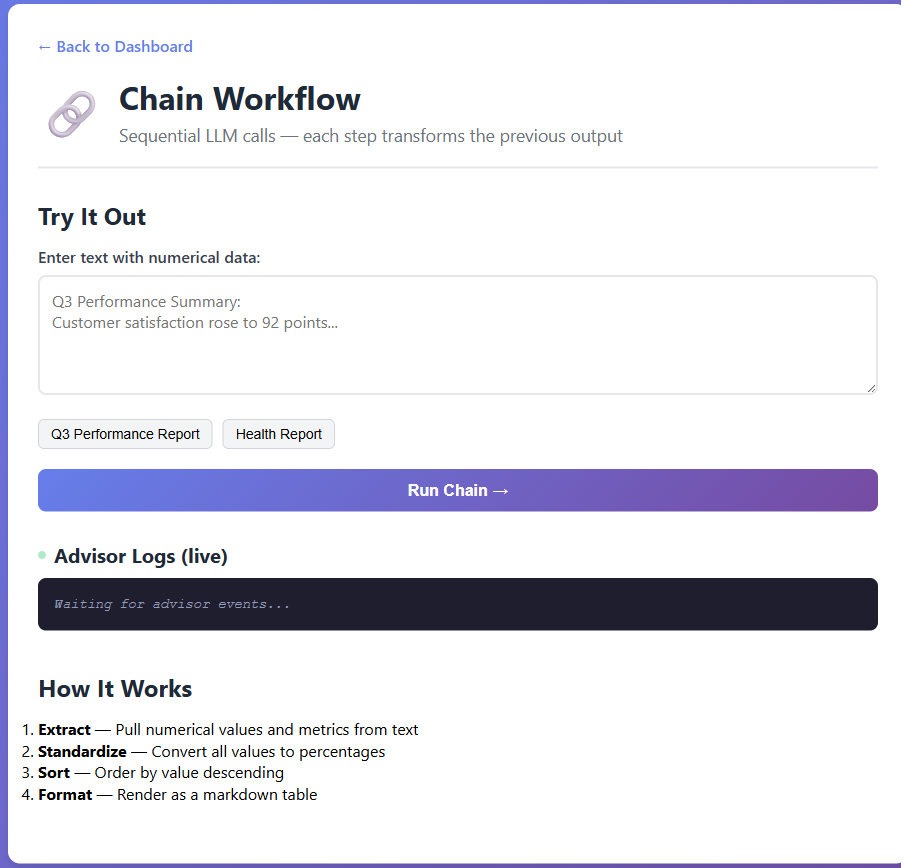
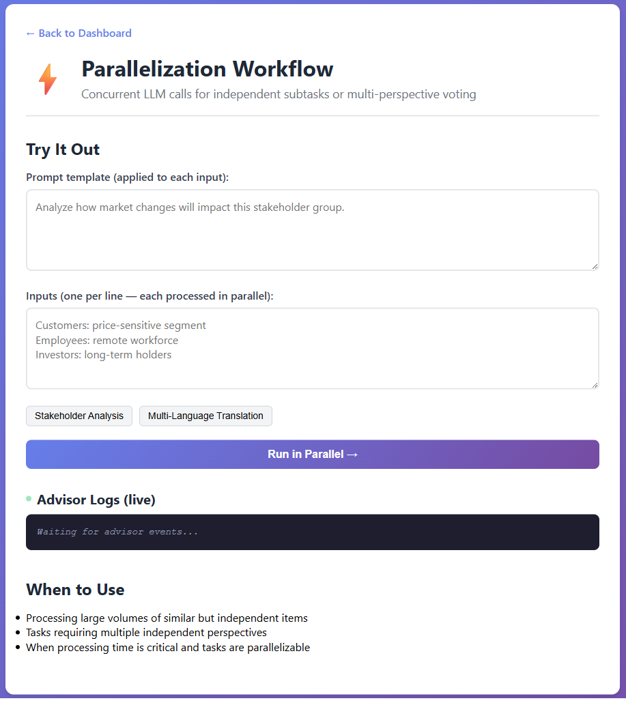
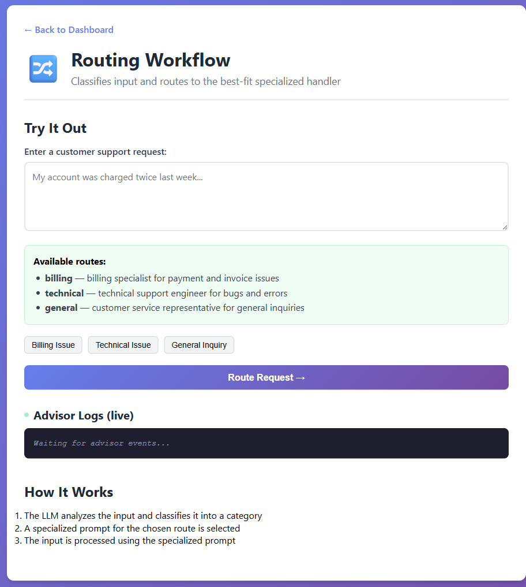
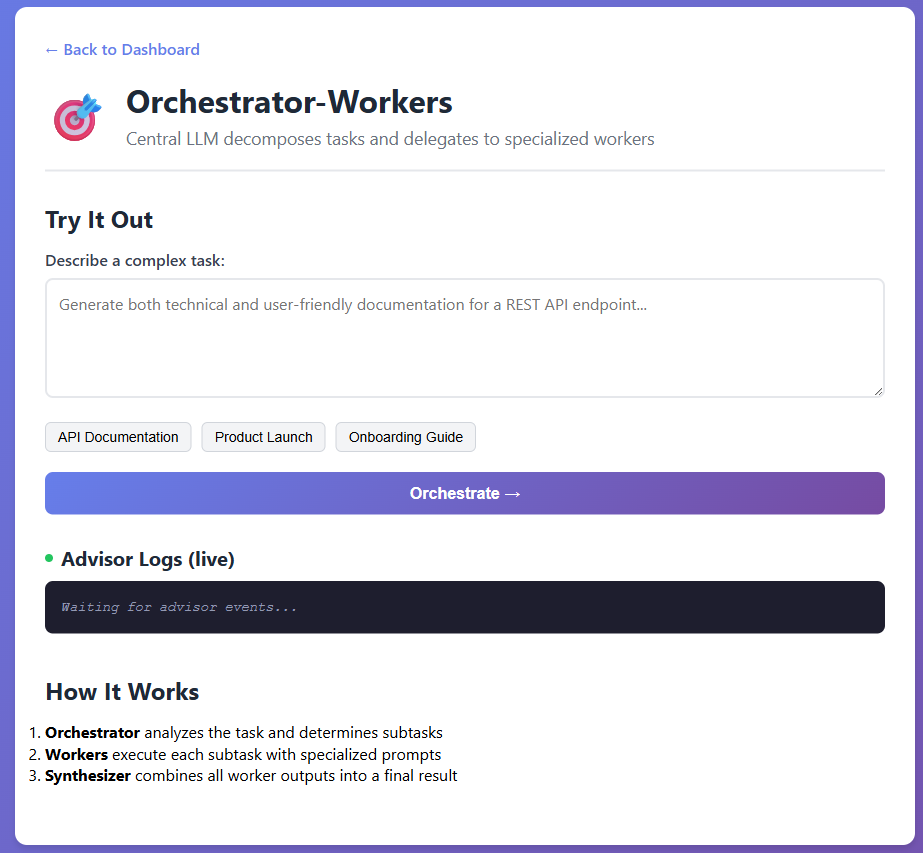
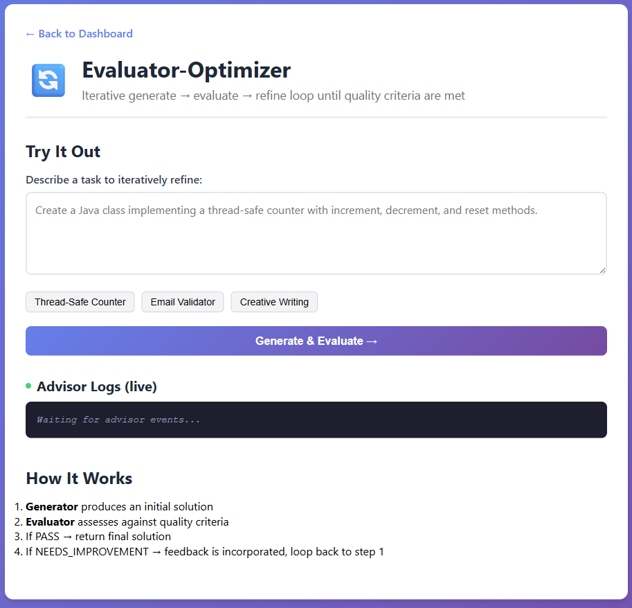

# Module 06: Agentic Patterns

This module demonstrates five fundamental **agentic workflow patterns** for building effective LLM-based systems using Spring AI. Each pattern is implemented as an interactive demo you can run and explore in a web UI.

## What Are Agents?

In previous modules, every interaction with the LLM followed the same pattern: **you send one prompt, you get one response**. That works for simple tasks — answering a question, classifying sentiment, generating a summary. But real-world problems are rarely that simple.

Consider these tasks:
- "Analyze this quarterly report and produce a formatted summary" — requires **multiple sequential steps** (extract data → normalize → sort → format)
- "Translate this document into French, Spanish, and German" — requires **parallel processing** of independent subtasks
- "Handle this customer support ticket" — requires **classifying** the issue first, then routing to a specialized handler
- "Write production-ready code for a thread-safe counter" — requires **iterative refinement** with quality checks

No single LLM call can reliably handle these. You need to **orchestrate multiple LLM calls** — chaining them, running them in parallel, routing between them, or looping until quality criteria are met. This orchestration is what makes a system "agentic."

### From Single Calls to Agentic Systems


Think of it as a progression:

| Level | What It Does | Example |
|-------|-------------|---------|
| **Single LLM call** | One prompt → one response | "Summarize this text" |
| **Enhanced LLM** | LLM enhanced with retrieval, tools, memory | "Search the docs and answer my question" (RAG, Module 03) |
| **Workflow** | Multiple LLM calls orchestrated through **predefined code paths** | "Extract → standardize → sort → format" (this module) |
| **Autonomous Agent** | LLM **dynamically decides** its own next steps and tool usage | "Figure out how to complete this task on your own" |

In [Module 01](../01-introduction/README.md) you built stateless and stateful chat. In [Module 02](../02-prompt-engineering/README.md) you learned prompt engineering. In [Module 03](../03-rag/README.md) you added retrieval. In [Module 04](../04-tools/README.md) you gave the LLM tools. Each module added a new capability. **This module combines them into orchestrated workflows** — the final step before fully autonomous agents.

### The Enhanced LLM

Before we look at workflows, start with the core unit you'll orchestrate: an **enhanced LLM**.

An enhanced LLM is a normal LLM call with extra capabilities around it, such as retrieval, tool access, and memory. Unlike a plain LLM that only generates text from its training data, an enhanced LLM can reach outside itself — querying live data sources, invoking external tools, and maintaining conversational context — making it far more capable for real-world tasks:


In this course, augmentation means the model can:
- **Retrieve** relevant context from external data (RAG from [Module 03](../03-rag/README.md))
- **Call tools** to perform actions (APIs, databases, code execution from [Module 04](../04-tools/README.md))
- **Remember** prior turns in a conversation (chat memory from [Module 01](../01-introduction/README.md))

One enhanced LLM is enough for many single-step tasks. But real applications often need multi-step execution: one result feeds the next step, several steps run in parallel, or output is evaluated and refined before returning.

That orchestration layer is what this module focuses on. The five patterns below show practical ways to combine enhanced LLM calls into reliable workflows.

## Patterns

| # | Pattern | Description | Key Benefit |
|---|---------|-------------|-------------|
| 1 | **Chain Workflow** | Sequential LLM calls — each step transforms the previous output | High accuracy via decomposition |
| 2 | **Parallelization** | Concurrent LLM calls for independent subtasks or voting | Throughput & multi-perspective |
| 3 | **Routing Workflow** | Classifies input and routes to the best-fit handler | Specialization |
| 4 | **Orchestrator-Workers** | Central LLM decomposes tasks, delegates to workers | Adaptive problem-solving |
| 5 | **Evaluator-Optimizer** | Iterative generate → evaluate → refine loop | Best quality via refinement |

## Prerequisites

- Completed [Module 01 - Introduction](../01-introduction/README.md) (Microsoft Foundry resources deployed)
- Java 21+
- Maven 3.6+
- `.env` file in root directory with Azure credentials (created by `azd up` in Module 01)

## How This Uses Spring AI

This module reuses `spring-ai-starter-model-openai` from [Module 01](../01-introduction/README.md#how-this-uses-spring-ai) and `spring-ai-client-chat` introduced in [Module 03](../03-rag/README.md#how-this-uses-spring-ai). No new Spring AI dependencies are added — all five agentic patterns are orchestrated through `ChatClient` ([pom.xml](pom.xml)).

The `application.yaml` is the same chat-model configuration as earlier modules ([application.yaml](src/main/resources/application.yaml)):

```yaml
spring:
  ai:
    openai-sdk:
      base-url: ${AZURE_OPENAI_ENDPOINT}
      api-key: ${AZURE_OPENAI_API_KEY}
      chat:
        options:
          model: ${AZURE_OPENAI_DEPLOYMENT}
```

The difference in this module is how `ChatClient` calls are **orchestrated** — chained, parallelized, routed, delegated, or looped — rather than executed as single calls.

## Quick Start

1. **Set environment variables** in the root `.env` file:
   ```
   AZURE_OPENAI_ENDPOINT=https://your-endpoint.openai.azure.com/
   AZURE_OPENAI_API_KEY=your-api-key
   AZURE_OPENAI_DEPLOYMENT=your-deployment-name
   ```

2. **Build and run:**

   **Option 1: Using Spring Boot Dashboard (Recommended for VS Code users)**

   The dev container includes the Spring Boot Dashboard extension, which provides a visual interface to manage all Spring Boot applications. You can find it in the Activity Bar on the left side of VS Code (look for the Spring Boot icon).

   From the Spring Boot Dashboard, you can:
   - See all available Spring Boot applications in the workspace
   - Start/stop applications with a single click
   - View application logs in real-time
   - Monitor application status

   Simply click the play button next to "spring-ai-agents" to start this module, or start all modules at once.

   

   **Option 2: Using shell scripts**

   Start all web applications (all modules 01-06):

   **Bash:**
   ```bash
   cd ..  # From root directory
   ./start-all.sh
   ```

   **PowerShell:**
   ```powershell
   cd ..  # From root directory
   .\start-all.ps1
   ```

   Or start just this module:

   ```bash
   # From this directory
   ./start.sh        # Linux/Mac
   .\start.ps1       # Windows PowerShell
   ```

3. **Open the dashboard:** [http://localhost:8086](http://localhost:8086)


## How Each Pattern Works

Each of the five patterns follows the same teaching flow: first you see **how the pattern is wired** (the architecture diagram), then you read the code that implements it, and finally you **try it live in the browser** using the built-in demo UI.

Open [http://localhost:8086](http://localhost:8086) once the app is running and follow along.

### 1. Chain Workflow

Some tasks are too complex for a single prompt. Asking one LLM call to "extract the numbers from this text, normalize them to percentages, sort them, and format the result as a table" often produces inconsistent output — the model tries to do everything at once and skips steps. The **Chain Workflow** breaks the job into a pipeline of focused LLM calls, where each step has a single responsibility and receives the previous step's output as input.


*The input flows through four specialized LLM calls — Extract → Standardize → Sort → Format — and each step transforms the output of the previous one.*

Implementation: [ChainWorkflow.java](src/main/java/com/example/springai/agents/patterns/ChainWorkflow.java)

**When to use:** Tasks with clear sequential steps where you want to trade latency for higher accuracy, and each step builds on the previous step's output.

**Try it in the UI:** Click the **Q3 Performance Report** or **Health Report** example button on the Chain Workflow demo page (or paste your own metrics-heavy text), then click **Run Chain**. You'll see each step's intermediate output, so you can watch the raw text get extracted, standardized, sorted, and finally formatted as a markdown table.



*The Chain Workflow demo page — enter your input, run the pipeline, and inspect the output of every step in the chain.*

> **🤖 Try with [GitHub Copilot](https://github.com/features/copilot) Chat:** Open [`ChainWorkflow.java`](src/main/java/com/example/springai/agents/patterns/ChainWorkflow.java) and ask:
> - "Why is prompt chaining more accurate than one big prompt for multi-step tasks?"
> - "How would I add a validation/gate step between two chain steps to catch bad output early?"
> - "What's the latency trade-off and how could I parallelize independent steps?"

### 2. Parallelization Workflow

What if you need to run the same prompt against many inputs, or get several independent perspectives on one input? Running LLM calls sequentially wastes time when they don't depend on each other. The **Parallelization Workflow** fans out independent calls across a thread pool and gathers the results in order.


*The same prompt is dispatched to N workers concurrently; each worker processes one input, and results are returned in the original order.*

Implementation: [ParallelizationWorkflow.java](src/main/java/com/example/springai/agents/patterns/ParallelizationWorkflow.java)

**When to use:** Processing large volumes of similar but independent items, tasks requiring multiple independent perspectives, or when processing time is critical and tasks are parallelizable.

**Try it in the UI:** Click **Stakeholder Analysis** or **Multi-Language Translation** to load a pre-filled batch, then click **Run in Parallel**. Notice how the total time is roughly the slowest single call, not the sum of all calls.



*The Parallelization demo — submit a batch of inputs and watch them processed concurrently, with per-item results returned in order.*

> **🤖 Try with [GitHub Copilot](https://github.com/features/copilot) Chat:** Open [`ParallelizationWorkflow.java`](src/main/java/com/example/springai/agents/patterns/ParallelizationWorkflow.java) and ask:
> - "When should I use sectioning vs voting, and what problems does each solve?"
> - "How do I choose the right `nWorkers` value to balance throughput against rate limits?"
> - "What happens if one parallel call fails, and how do I add retries without blocking the rest?"

### 3. Routing Workflow

Not every request should go to the same handler. A customer support message about a billing issue needs very different handling from one asking a technical question. The **Routing Workflow** uses an LLM as a classifier: it reads the input, picks the best route, and forwards the request to a prompt that's specialized for that category.


*A classifier LLM labels the input (e.g., billing / technical / general), then the request is dispatched to the specialized prompt for that label.*

Implementation: [RoutingWorkflow.java](src/main/java/com/example/springai/agents/patterns/RoutingWorkflow.java)

**When to use:** Complex tasks with distinct categories of input that require different handling or specialized processing.

**Try it in the UI:** Click the **Billing Issue**, **Technical Issue**, or **General Inquiry** example, then click **Route Request**. The demo shows which route the classifier picked and the response generated by that route's dedicated prompt.



*The Routing demo — see the chosen route alongside the specialized response, so you can verify the classifier is picking correctly.*

> **🤖 Try with [GitHub Copilot](https://github.com/features/copilot) Chat:** Open [`RoutingWorkflow.java`](src/main/java/com/example/springai/agents/patterns/RoutingWorkflow.java) and ask:
> - "Why is a small routing LLM better than stuffing all cases into one big prompt?"
> - "How do I improve routing accuracy when categories overlap or the input is ambiguous?"
> - "Can I replace the LLM router with a cheaper classifier (embeddings or rules) for known cases?"

### 4. Orchestrator-Workers

Some tasks can't be broken down in advance — the subtasks depend on the input itself. Writing a product description in "formal," "conversational," and "technical" voices sounds straightforward, but the actual angles worth exploring vary per product. The **Orchestrator-Workers** pattern uses a central LLM to **plan** the subtasks dynamically, then dispatches each one to a worker LLM.


*The orchestrator LLM decides what subtasks are needed, spawns a worker per subtask, and then synthesizes their outputs into a final result.*

Implementation: [OrchestratorWorkers.java](src/main/java/com/example/springai/agents/patterns/OrchestratorWorkers.java)

**When to use:** Complex tasks where subtasks can't be predicted upfront and require adaptive problem-solving.

**Try it in the UI:** Click **API Documentation**, **Product Launch**, or **Onboarding Guide** to load a sample task, then click **Orchestrate**. You'll see the orchestrator's plan, each worker's output, and how the pattern adapts per input.



*The Orchestrator-Workers demo — inspect the plan the orchestrator produces and the independent worker responses that back it.*

> **🤖 Try with [GitHub Copilot](https://github.com/features/copilot) Chat:** Open [`OrchestratorWorkers.java`](src/main/java/com/example/springai/agents/patterns/OrchestratorWorkers.java) and ask:
> - "How is orchestrator-workers different from a fixed chain — when does the dynamic split pay off?"
> - "How do I keep the orchestrator's JSON plan reliable and avoid parsing errors?"
> - "Could workers run in parallel once the orchestrator has decomposed the task?"

### 5. Evaluator-Optimizer

The first output of an LLM is rarely its best. Instead of hoping the initial answer is good enough, the **Evaluator-Optimizer** pattern pairs a **generator** LLM with an **evaluator** LLM: the generator proposes an answer, the evaluator grades it (PASS / NEEDS_IMPROVEMENT / FAIL), and any feedback is looped back into the next generation attempt until the answer is good enough or a max-iterations cap is reached.


*Generate → evaluate → refine — the loop continues until the evaluator returns PASS or the iteration limit is hit.*

Implementation: [EvaluatorOptimizer.java](src/main/java/com/example/springai/agents/patterns/EvaluatorOptimizer.java)

**When to use:** Tasks with clear evaluation criteria where iterative refinement provides measurable value (e.g., code generation, translation, content creation).

**Try it in the UI:** Click **Thread-Safe Counter**, **Email Validator**, or **Creative Writing** to load a sample prompt, then click **Generate & Evaluate**. Watch each iteration's draft, the evaluator's feedback, and how the output improves.



*The Evaluator-Optimizer demo — every iteration shows the generator's draft and the evaluator's verdict, so you can see the refinement loop in action.*

> **🤖 Try with [GitHub Copilot](https://github.com/features/copilot) Chat:** Open [`EvaluatorOptimizer.java`](src/main/java/com/example/springai/agents/patterns/EvaluatorOptimizer.java) and ask:
> - "What makes a good evaluator prompt — how do I avoid it being too lenient or too strict?"
> - "How do I decide a max iteration count and stop conditions to avoid infinite refinement loops?"
> - "How would I plug in a non-LLM evaluator (unit tests, schema validation) for deterministic checks?"

## Best Practices

- **Start simple** — begin with basic workflows before adding complexity. Use the simplest pattern that meets your requirements.
- **Design for reliability** — implement clear error handling, use type-safe responses where possible, and build in validation at each step.
- **Consider trade-offs** — balance latency vs. accuracy, evaluate when to use parallel processing, and choose between fixed workflows and dynamic agents.

## Next Steps

Congratulations — you've completed the Spring AI for Beginners course! You now have hands-on experience with chat, memory, prompt engineering, RAG, tools, MCP, and agentic workflows.

To go further, explore the [Spring AI Documentation](https://docs.spring.io/spring-ai/reference/) and the [Spring AI Examples Repository](https://github.com/spring-projects/spring-ai-examples).

---

**Navigation:** [← Previous: Module 05 - MCP](../05-mcp/README.md) | [Back to Main](../README.md)
