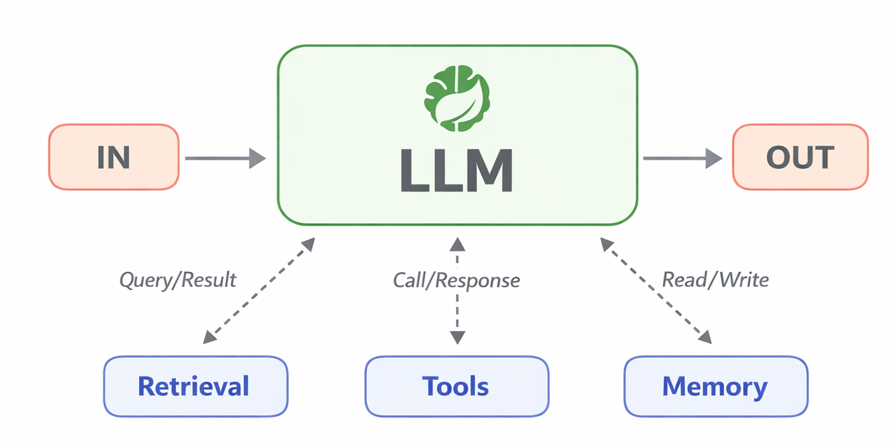
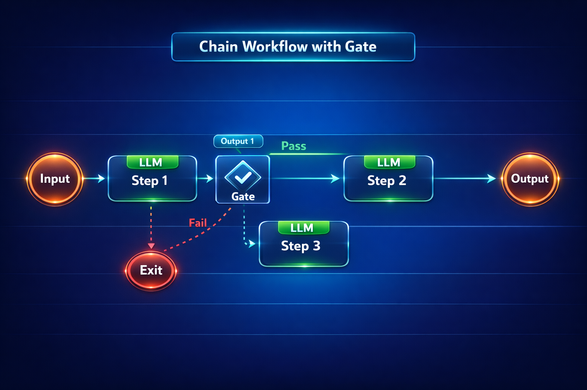
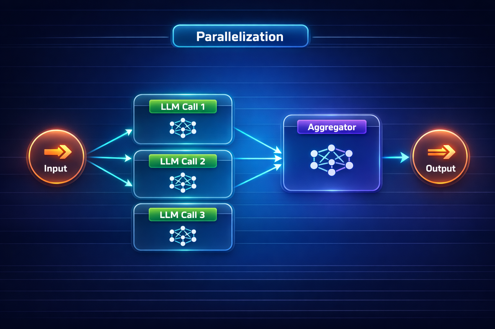
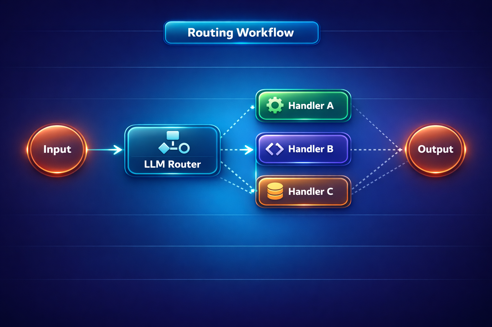
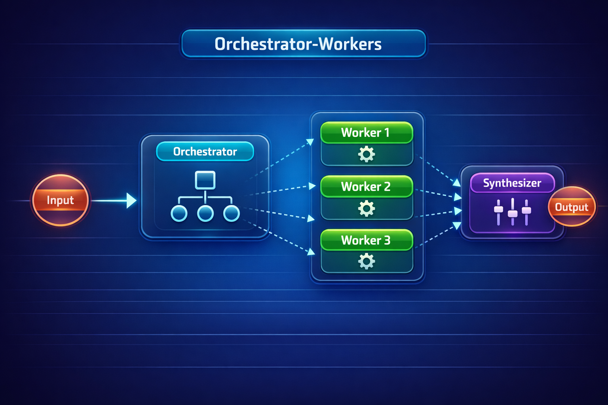
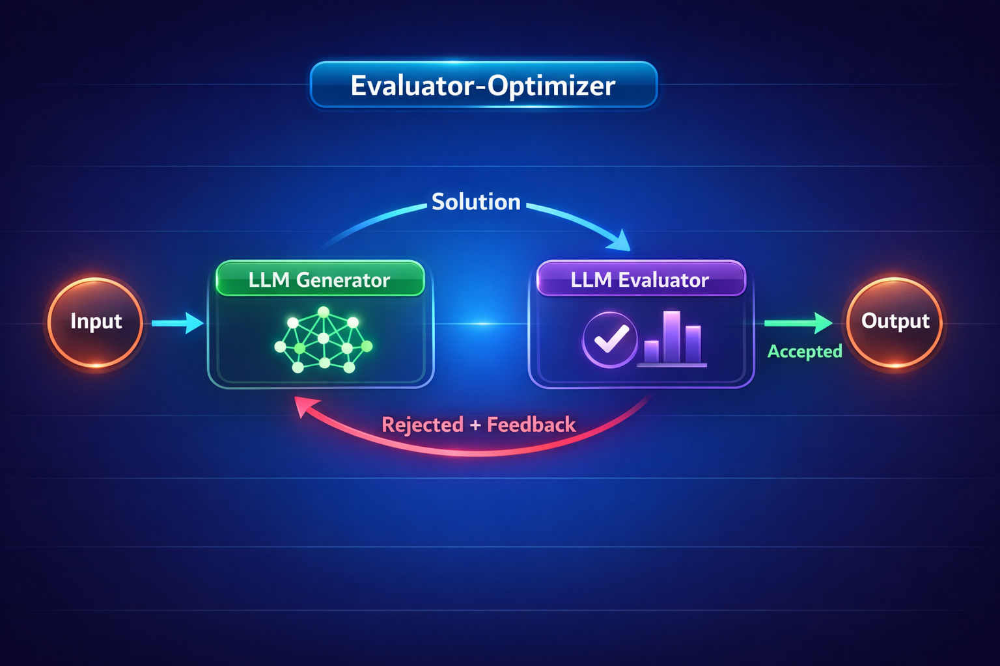

# 06 - Agentic Patterns

This module demonstrates five fundamental **agentic workflow patterns** for building effective LLM-based systems using Spring AI. Each pattern is implemented as an interactive demo you can run and explore in a web UI.

## What Are Agents?

In previous modules, every interaction with the LLM followed the same pattern: **you send one prompt, you get one response**. That works for simple tasks — answering a question, classifying sentiment, generating a summary. But real-world problems are rarely that simple.

Consider these tasks:
- "Analyze this quarterly report and produce a formatted summary" — requires **multiple sequential steps** (extract data → normalize → sort → format)
- "Translate this document into French, Spanish, and German" — requires **parallel processing** of independent subtasks
- "Handle this customer support ticket" — requires **classifying** the issue first, then routing to a specialized handler
- "Write production-ready code for a thread-safe counter" — requires **iterative refinement** with quality checks

No single LLM call can reliably handle these. You need to **orchestrate multiple LLM calls** — chaining them, running them in parallel, routing between them, or looping until quality criteria are met. This orchestration is what makes a system "agentic."

### From Single Calls to Agentic Systems

Think of it as a progression:

| Level | What It Does | Example |
|-------|-------------|---------|
| **Single LLM call** | One prompt → one response | "Summarize this text" |
| **Augmented LLM** | LLM enhanced with retrieval, tools, memory | "Search the docs and answer my question" (RAG, Module 03) |
| **Workflow** | Multiple LLM calls orchestrated through **predefined code paths** | "Extract → standardize → sort → format" (this module) |
| **Autonomous Agent** | LLM **dynamically decides** its own next steps and tool usage | "Figure out how to complete this task on your own" |

In [Module 01](../01-introduction/README.md) you built stateless and stateful chat. In [Module 02](../02-prompt-engineering/README.md) you learned prompt engineering. In [Module 03](../03-rag/README.md) you added retrieval. In [Module 04](../04-tools/README.md) you gave the LLM tools. Each module added a new capability. **This module combines them into orchestrated workflows** — the final step before fully autonomous agents.

### The Augmented LLM

The basic building block of any agentic system is an **augmented LLM** — a language model enhanced with capabilities like retrieval, tools, and memory:



An augmented LLM can:
- **Retrieve** information from external data sources (RAG — covered in [Module 03](../03-rag/README.md))
- **Call tools** to take actions in the real world (APIs, databases, code execution — covered in [Module 04](../04-tools/README.md))
- **Remember** context across conversations (chat memory — covered in [Module 01](../01-introduction/README.md))

On its own, an augmented LLM handles single-turn tasks well. But when you need **multi-step reasoning** — where the output of one LLM call feeds into the next, or multiple calls run in parallel, or an evaluator reviews and refines output — you need to orchestrate multiple augmented LLMs together. That's what agentic patterns provide.

This module implements **five workflow patterns**, each serving specific use cases. These are the building blocks you'll combine when building production agentic systems.

## Patterns

| # | Pattern | Description | Key Benefit |
|---|---------|-------------|-------------|
| 1 | **Chain Workflow** | Sequential LLM calls — each step transforms the previous output | High accuracy via decomposition |
| 2 | **Parallelization** | Concurrent LLM calls for independent subtasks or voting | Throughput & multi-perspective |
| 3 | **Routing Workflow** | Classifies input and routes to the best-fit handler | Specialization |
| 4 | **Orchestrator-Workers** | Central LLM decomposes tasks, delegates to workers | Adaptive problem-solving |
| 5 | **Evaluator-Optimizer** | Iterative generate → evaluate → refine loop | Best quality via refinement |

## Prerequisites

- Java 21+
- Maven 3.6+
- Azure OpenAI endpoint (or any OpenAI-compatible API)

## Quick Start

1. **Set environment variables** in the root `.env` file:
   ```
   AZURE_OPENAI_ENDPOINT=https://your-endpoint.openai.azure.com/
   AZURE_OPENAI_API_KEY=your-api-key
   AZURE_OPENAI_DEPLOYMENT=your-deployment-name
   ```

2. **Build and run:**
   ```bash
   # From this directory
   ./start.sh        # Linux/Mac
   .\start.ps1       # Windows PowerShell
   ```

3. **Open the dashboard:** [http://localhost:8086](http://localhost:8086)

## Project Structure

```
06-agents/
├── pom.xml
├── start.sh / start.ps1
├── stop.sh / stop.ps1
├── src/main/java/com/example/springai/agents/
│   ├── app/Application.java              # Spring Boot entry point
│   ├── config/SpringAiConfig.java         # Azure OpenAI + ChatClient config
│   ├── controller/
│   │   ├── DemoWebController.java         # Thymeleaf web routes
│   │   └── AgentPatternsController.java   # REST API endpoints
│   ├── patterns/                          # Core workflow implementations
│   │   ├── ChainWorkflow.java
│   │   ├── ParallelizationWorkflow.java
│   │   ├── RoutingWorkflow.java
│   │   ├── OrchestratorWorkers.java
│   │   └── EvaluatorOptimizer.java
│   └── service/
│       └── AgentPatternsService.java      # Orchestrates all patterns
├── src/main/resources/
│   ├── application.yaml
│   ├── static/css/agent-demo.css
│   ├── static/js/pattern-demo.js
│   └── templates/
│       ├── dashboard.html
│       └── patterns/{chain,parallelization,routing,orchestrator,evaluator}.html
└── src/test/java/.../SimpleAgentPatternsTest.java
```

## API Endpoints

| Method | Endpoint | Description |
|--------|----------|-------------|
| POST | `/api/agents/chain` | Run chain workflow |
| POST | `/api/agents/parallelization` | Run parallelization workflow |
| POST | `/api/agents/routing` | Run routing workflow |
| POST | `/api/agents/orchestrator` | Run orchestrator-workers workflow |
| POST | `/api/agents/evaluator` | Run evaluator-optimizer workflow |

## How Each Pattern Works

### 1. Chain Workflow



Processes input through a 4-step pipeline: **Extract → Standardize → Sort → Format**. Each LLM call receives the previous step's output and transforms it further.

**When to use:** Tasks with clear sequential steps where you want to trade latency for higher accuracy, and each step builds on the previous step's output.

### 2. Parallelization Workflow



Sends the same prompt to multiple inputs concurrently using a thread pool. Results are returned in the same order as inputs.

**When to use:** Processing large volumes of similar but independent items, tasks requiring multiple independent perspectives, or when processing time is critical and tasks are parallelizable.

### 3. Routing Workflow



An LLM classifier analyzes the input and selects the best route (billing, technical, or general). The input is then processed by a specialized prompt for that route.

**When to use:** Complex tasks with distinct categories of input that require different handling or specialized processing.

### 4. Orchestrator-Workers



The orchestrator LLM analyzes a complex task and breaks it into subtasks with different approaches (e.g., formal vs. conversational). Workers execute each subtask independently.

**When to use:** Complex tasks where subtasks can't be predicted upfront and require adaptive problem-solving.

### 5. Evaluator-Optimizer



A generator LLM produces a solution, then an evaluator LLM grades it (PASS / NEEDS_IMPROVEMENT / FAIL). If not passing, feedback is incorporated and the cycle repeats.

**When to use:** Tasks with clear evaluation criteria where iterative refinement provides measurable value (e.g., code generation, translation, content creation).

## Best Practices

- **Start simple** — begin with basic workflows before adding complexity. Use the simplest pattern that meets your requirements.
- **Design for reliability** — implement clear error handling, use type-safe responses where possible, and build in validation at each step.
- **Consider trade-offs** — balance latency vs. accuracy, evaluate when to use parallel processing, and choose between fixed workflows and dynamic agents.

## References

- [Building Effective Agents — Spring AI Documentation](https://docs.spring.io/spring-ai/reference/2.0/api/effective-agents.html)
- [Spring AI Agentic Patterns Examples](https://github.com/spring-projects/spring-ai-examples/tree/main/agentic-patterns)
- [Spring AI Documentation](https://docs.spring.io/spring-ai/reference/)
