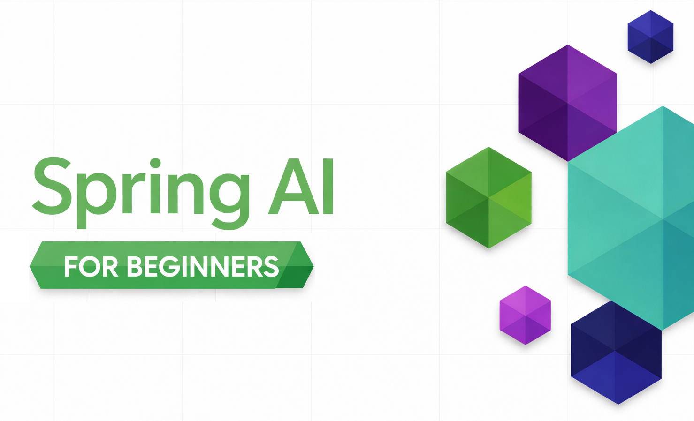

# Spring AI for Beginners

An end-to-end curriculum that takes a Java developer from "hello, LLM" to production-shaped AI patterns (RAG, tools, MCP, agents) on the Spring AI + Azure stack

## Table of Contents

1. [Quick Start](00-quick-start/README.md) - Get started with Spring AI
2. [Introduction](01-introduction/README.md) - Learn the fundamentals of Spring AI
3. [Prompt Engineering](02-prompt-engineering/README.md) - Master effective prompt design
4. [RAG (Retrieval-Augmented Generation)](03-rag/README.md) - Build intelligent knowledge-based systems
5. [Tools](04-tools/README.md) - Integrate external tools
6. [MCP (Model Context Protocol)](05-mcp/README.md) - Work with Model Context Protocol (MCP)
7. [Agents](06-agents/README.md) - Build AI agents

📖 **Reference:** [Glossary](glossary.md) - Key terms and concepts used across all modules

---

## Learning Path

> **Quick Start**

1. Fork this repository to your GitHub account
2. Click **Code** → **Codespaces** tab → **...** → **New with options...**
3. Use the defaults – this will select the Development container created for this course
4. Click **Create codespace**
5. Wait 5-10 minutes for the environment to be ready
6. Jump straight to [Quick Start](./00-quick-start/README.md) to get started!

> **Note:** This training uses both GitHub Models and Microsoft Foundry. The [Quick Start](00-quick-start/README.md) module uses GitHub Models (no Azure subscription required), while modules 1-6 use Microsoft Foundry. Get started with a [FREE Azure account](https://aka.ms/azure-free-account) if you don't have one.

> **Models used:** `azd up` provisions three model deployments — two chat models and one embedding model. Module 02 uses **gpt-5.2** to demonstrate reasoning controls; modules 01, 03, 04, 05, and 06 use **gpt-4o-mini** so demos stay fast and the focus stays on the Spring AI patterns; module 03 also uses **text-embedding-3-small** for RAG. The three deployments are routed via env vars (`AZURE_OPENAI_DEPLOYMENT` / `AZURE_OPENAI_FAST_DEPLOYMENT` / `AZURE_OPENAI_EMBEDDING_DEPLOYMENT`) — see [01-introduction/infra/README.md](01-introduction/infra/README.md) for details.

## Learning with GitHub Copilot

To quickly start coding, open this project in a GitHub Codespace or your local IDE with the provided devcontainer. The devcontainer used in this course comes pre-configured with GitHub Copilot for AI paired programming.

Each code example includes suggested questions you can ask GitHub Copilot to deepen your understanding. Look for the 💡/🤖 prompts in:

- **Java file headers** - Questions specific to each example
- **Module READMEs** - Exploration prompts after code examples

**How to use:** Open any code file and ask Copilot the suggested questions. It has full context of the codebase and can explain, extend, and suggest alternatives.

Want to learn more? Check out [Copilot for AI Paired Programming](https://aka.ms/GitHubCopilotAI).

## Getting Help

If you get stuck or have any questions about building AI apps, join:

If you have product feedback or errors while building visit:

## License

MIT License - See [LICENSE](LICENSE) file for details.
